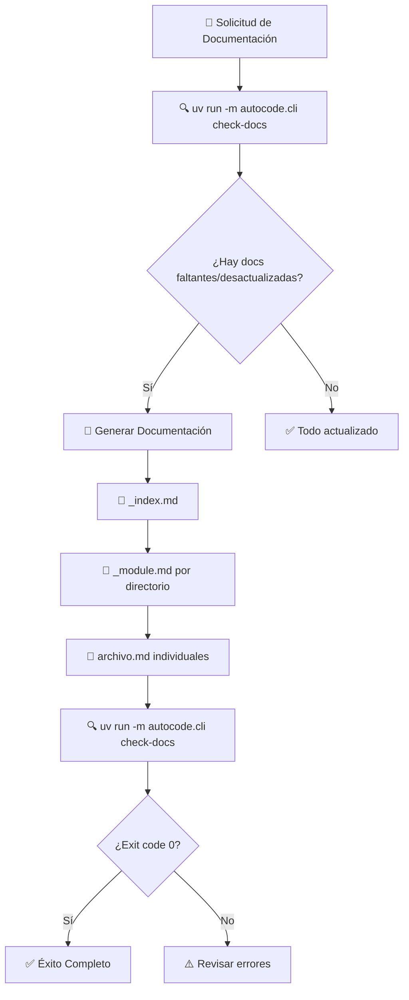

# Workflow: Generación de Documentación Modular

## Descripción
Workflow para generar y mantener documentación estructurada siguiendo el patrón modular: un archivo .md por cada archivo de código relevante, aplicable a cualquier proyecto. Utiliza el sistema autocode para detectar automáticamente documentación faltante o desactualizada.

## Resumen Visual



El flujo comienza detectando automáticamente qué documentación necesita atención, genera solo lo necesario siguiendo la estructura modular establecida, y valida el resultado con el mismo comando inicial.

## Activación del Workflow

### Cuándo Usar
- Cuando se modifiquen archivos de código fuente
- Al añadir nuevos módulos o archivos
- Cuando el usuario solicite: "Genera/actualiza la documentación modular"
- Después de refactorings o cambios estructurales

### Condiciones Previas
- Proyecto con configuración uv (pyproject.toml)
- Estructura de código fuente organizada en directorios
- Acceso al módulo autocode configurado

## Inputs/Entradas
- Proyecto con código fuente en directorio principal (ej. `vidi/`, `src/`, `lib/`)
- Configuración uv para ejecutar autocode
- Estructura de directorios del proyecto

## Proceso

### Paso 1: Detección Automática de Documentación Faltante
```bash
uv run -m autocode.cli check-docs
```

**Propósito**: Identificar automáticamente qué documentación está faltante o desactualizada.

**Salida esperada**: Lista de archivos que requieren documentación o actualización, clasificados por tipo:
- `docs/_index.md` (documentación principal)
- `docs/[módulo]/_module.md` (documentación de módulos)
- `docs/[módulo]/[archivo].md` (documentación de archivos individuales)

### Paso 2: Análisis de Resultados
- **Exit code 0**: No hay documentación pendiente → **Workflow completo**
- **Exit code 1**: Hay documentación faltante → **Continuar con generación**

### Paso 3: Generación de Documentación por Niveles

#### Nivel 1: _index.md (Documentación Principal del Proyecto)

**Proceso de análisis**:
1. **Leer archivo principal** (main.py, index.js, app.py, etc.)
2. **Analizar estructura de directorios** principales
3. **Identificar dependencias** principales del proyecto (pyproject.toml, package.json, etc.)
4. **Determinar flujos de trabajo** principales del código

**Template para _index.md**:
```markdown
# [Nombre del Proyecto] - Documentación Técnica

## 🎯 Visión General
[Descripción concisa del proyecto extraída del código principal]

## 🏗️ Arquitectura de Alto Nivel
```mermaid
graph TB
    [Diagrama mostrando módulos principales y sus relaciones]
```

## 📁 Estructura de Módulos
### `/modulo1` - [Descripción Breve]
[Resumen de 2-3 líneas del propósito del módulo]

### `/modulo2` - [Descripción Breve]
[Resumen de 2-3 líneas del propósito del módulo]

## 🔄 Flujos de Trabajo Principales
### Flujo 1: [Nombre del Flujo Principal]
[Diagrama de secuencia básico del flujo más importante]

## 🔧 Configuración Global
[Variables de entorno principales, dependencias generales]

## 🚀 Inicio Rápido
[Ejemplo mínimo de uso extraído del código]

## 📖 Navegación
- [Módulo 1 Documentation](modulo1/_module.md)
- [Módulo 2 Documentation](modulo2/_module.md)
```

#### Nivel 2: _module.md (Documentación por Cada Directorio)

**Proceso de análisis**:
1. **Listar archivos** del directorio
2. **Leer archivo de inicialización** del módulo (__init__.py, index.js, etc.)
3. **Identificar propósito** del módulo analizando las exportaciones/imports
4. **Mapear dependencias** entre archivos del módulo

**Template para _module.md**:
```markdown
# [Nombre del Módulo] - Documentación

## 🎯 Propósito del Módulo
[Qué resuelve este módulo en el contexto del proyecto]

## 🏗️ Arquitectura del Módulo
```mermaid
graph LR
    [Diagrama mostrando relaciones entre archivos de este módulo]
```

## 📁 Componentes del Módulo
### `archivo1.ext` - [Nombre Descriptivo]
**Propósito**: [Una línea explicando qué hace]
**Documentación**: [archivo1.md](archivo1.md)

### `archivo2.ext` - [Nombre Descriptivo]  
**Propósito**: [Una línea explicando qué hace]
**Documentación**: [archivo2.md](archivo2.md)

### `/submodulo` - [Nombre Descriptivo]
**Propósito**: [Una línea explicando qué contiene]
**Documentación**: [submodulo/_module.md](submodulo/_module.md)

## 🔗 Dependencias del Módulo
### Internas (otros módulos del proyecto)
- [Lista de módulos que este usa]

### Externas
- [Librerías principales que usa todo el módulo]

## 💡 Flujo de Trabajo Típico
[Ejemplo de cómo se usan conjuntamente los archivos de este módulo]

## 🔧 Configuración del Módulo
[Variables de entorno específicas de este módulo]

## ⚠️ Consideraciones Especiales
[Limitaciones, casos especiales, performance, etc.]

## 📖 Navegación Detallada
[Enlaces a cada archivo.md individual del módulo]
```

#### Nivel 3: archivo.md (Documentación de Archivos Individuales)

**Proceso de análisis**:
1. **Leer código fuente** completo
2. **Extraer información clave**:
   - Clases/funciones principales y sus responsabilidades
   - Métodos públicos y parámetros
   - Dependencias/imports
   - Configuración necesaria
   - Patrones de diseño evidentes
3. **Identificar interfaces públicas**
4. **Determinar responsabilidades específicas**

**Template para archivo.md**:
```markdown
# [Nombre del Archivo/Clase Principal]

## 🎯 Propósito
[Una línea que describe exactamente qué hace este archivo]

## 🏗️ Arquitectura
[Diagramas mermaid si es necesario, patrones de diseño utilizados]

## 📋 Responsabilidades
- [Lista específica de responsabilidades]
- [Qué hace y qué NO hace]

## 🔗 Dependencias
### Internas
- [Otros archivos del proyecto que usa]
### Externas  
- [Librerías externas que usa]

## 📊 Interfaces Públicas
[Clases, métodos, funciones que expone]

## 🔧 Configuración
[Variables de entorno, parámetros de inicialización]

## 💡 Patrones de Uso
[Ejemplos de código comunes]

## ⚠️ Consideraciones
[Limitaciones, efectos secundarios, casos especiales]

## 🧪 Testing
[Cómo testear este componente]

## 🔄 Flujo de Datos
[Cómo interactúa con otros componentes]
```

### Paso 4: Verificación Final
```bash
uv run -m autocode.cli check-docs
```

**Resultado esperado**: 
- **Exit code 0**: ✅ Toda la documentación está actualizada
- **Mensaje**: `✅ All documentation is up to date!`

## Outputs/Salidas
- Documentación completa en estructura modular bajo `docs/`
- Archivo `docs/_index.md` con visión general del proyecto
- Archivos `docs/[módulo]/_module.md` para cada directorio de código
- Archivos `docs/[módulo]/[archivo].md` para cada archivo de código individual

## Criterios de Éxito

### Verificación Automática
```bash
uv run -m autocode.cli check-docs
```
- **Exit code 0**: ✅ Éxito completo
- **Exit code 1**: ❌ Documentación pendiente

### Checklist Manual
- [ ] Existe documentación para cada archivo de código relevante
- [ ] Cada directorio tiene su _module.md correspondiente
- [ ] El _index.md refleja la estructura actual del proyecto
- [ ] Los enlaces de navegación funcionan correctamente
- [ ] Los diagramas mermaid renderizan correctamente
- [ ] La terminología es consistente en todo el proyecto

## Estructura de Documentación Target

```
docs/                                   # Directorio de documentación del proyecto
├── _index.md                          # Documentación principal del proyecto
└── [codigo_fuente]/                   # Documentación del directorio de código
    ├── _module.md                     # Documentación del módulo principal
    ├── [modulo1]/
    │   ├── _module.md                 # Documentación del módulo1
    │   ├── archivo1.md                # Documenta [codigo_fuente]/[modulo1]/archivo1.py
    │   └── [submodulo]/
    │       ├── _module.md             # Documentación del submódulo
    │       └── archivo2.md            # Documenta [codigo_fuente]/[modulo1]/[submodulo]/archivo2.py
    └── [modulo2]/
        ├── _module.md
        └── archivo3.md

[codigo_fuente]/                       # Directorio principal del código
├── [modulo1]/                         # Código fuente
│   ├── __init__.py                    # ← NO se documenta NUNCA
│   ├── archivo1.py                    # ← Documentado en docs/[codigo_fuente]/[modulo1]/archivo1.md
│   └── [submodulo]/
│       ├── __init__.py                # ← NO se documenta NUNCA
│       └── archivo2.py                # ← Documentado en docs/[codigo_fuente]/[modulo1]/[submodulo]/archivo2.md
└── [modulo2]/
    ├── __init__.py                    # ← NO se documenta NUNCA
    └── archivo3.py                    # ← Documentado en docs/[codigo_fuente]/[modulo2]/archivo3.md
```

### Tipos de Documentación

1. **_index.md**: Documentación principal del proyecto (ubicado en `docs/_index.md`)
2. **_module.md**: Documentación de cada módulo/directorio (ubicado en `docs/[codigo_fuente]/[ruta]/_module.md`)
3. **archivo.md**: Documentación individual de cada archivo de código (ubicado en `docs/[codigo_fuente]/[ruta]/archivo.md`)

### Regla de Mapeo Exacta

**Código**: `[codigo_fuente]/[ruta]/[archivo].[ext]`  
**Docs**: `docs/[codigo_fuente]/[ruta]/[archivo].md`

**Ejemplos concretos**:
- `vidi/inference/engine.py` → `docs/vidi/inference/engine.md`
- `src/utils/helpers.py` → `docs/src/utils/helpers.md`
- `lib/api/router.js` → `docs/lib/api/router.md`
- `app/models/user.py` → `docs/app/models/user.md`

**NUNCA documentar**:
- `__init__.py` (archivos de inicialización de módulos Python)
- `index.js` (si es solo de exportación/inicialización)
- `test_*.py`, `*_test.*`, `*.test.js` (archivos de prueba)  
- `*.json`, `*.yaml`, `*.toml` (archivos de configuración)
- `*.md` (archivos de documentación existente)

## Casos Especiales por Tipo de Proyecto

### Proyectos Python
- **Enfocar en**: clases, métodos, docstrings
- **Documentar**: imports, dependencias de pyproject.toml
- **Incluir**: ejemplos de uso de la API
- **Estructura típica**: src/, lib/, módulos principales

### Proyectos JavaScript/Node
- **Enfocar en**: funciones, módulos, exports
- **Documentar**: package.json dependencies
- **Incluir**: ejemplos de require/import
- **Estructura típica**: src/, lib/, routes/, controllers/

### Proyectos de Biblioteca/SDK
- **Enfocar en**: API pública, interfaces
- **Documentar**: contratos y especificaciones
- **Incluir**: guías de integración
- **Estructura típica**: public APIs, core/, utils/

### Aplicaciones Web
- **Enfocar en**: controladores, servicios, modelos
- **Documentar**: rutas, middlewares, configuración
- **Incluir**: flujos de trabajo principales
- **Estructura típica**: controllers/, models/, services/

### Aplicaciones CLI
- **Enfocar en**: comandos, parsers, handlers
- **Documentar**: opciones de comandos, configuración
- **Incluir**: ejemplos de uso de comandos
- **Estructura típica**: commands/, cli/, parsers/

## Comandos de Referencia

### Comando Principal
```bash
# Detectar documentación faltante/desactualizada
uv run -m autocode.cli check-docs

# Verificar resultado (debe devolver exit code 0)
echo $?
```

### Comandos de Exploración (para análisis inicial)
```bash
# Explorar estructura del proyecto
list_files [directorio_proyecto]/ --recursive

# Leer archivos principales para contexto
read_file main.py
read_file pyproject.toml
```

## Recordatorios para Cline

### Principios Fundamentales
1. **SIEMPRE** ejecutar `uv run -m autocode check-docs` como primer paso
2. **SIEMPRE** generar _index.md primero (vista general del proyecto)
3. **SIEMPRE** generar _module.md antes que archivos individuales
4. **SIEMPRE** leer código fuente completo antes de generar documentación
5. **SIEMPRE** usar las plantillas definidas consistentemente
6. **SIEMPRE** verificar con el mismo comando al final
7. **NUNCA** sobrescribir customizaciones manuales sin confirmar con el usuario

### Flujo de Trabajo Obligatorio
1. **Detectar necesidades**: `uv run -m autocode.cli check-docs`
2. **Analizar estructura** del proyecto con list_files
3. **Generar _index.md** (vista general)
4. **Generar _module.md** por cada directorio
5. **Generar archivo.md** individuales
6. **Verificar resultado**: `uv run -m autocode.cli check-docs`
7. **Confirmar exit code 0**

### Criterios de Calidad
- **Claridad**: El propósito de cada archivo debe ser evidente
- **Navegabilidad**: Debe ser fácil navegar entre documentos relacionados
- **Completitud**: Todas las interfaces públicas importantes deben estar documentadas
- **Consistencia**: Terminología uniforme en todo el proyecto
- **Actualización**: Mantener sincronización con el código

### Adaptación por Contexto
- **Proyectos grandes**: Priorizar módulos más importantes primero
- **Proyectos pequeños**: Generar documentación completa de una vez
- **Actualizaciones**: Solo regenerar archivos afectados por cambios
- **Primera vez**: Crear estructura completa desde cero

### Manejo de Errores
- **Código no parseable**: Documentar lo que se pueda extraer
- **Archivos muy grandes**: Enfocarse en interfaces públicas principales
- **Dependencias complejas**: Simplificar en la documentación
- **Código legacy**: Documentar funcionalidad actual, no histórica

## Notas Importantes
- Este workflow utiliza el sistema autocode para automatizar la detección de documentación faltante
- Se enfoca en crear documentación técnica útil para desarrolladores
- Prioriza la navegabilidad y mantenibilidad de la documentación
- La verificación final usa el mismo comando que la detección inicial
- La calidad de la documentación depende de la calidad del análisis del código
- Compatible con cualquier proyecto que tenga configuración uv (pyproject.toml)
