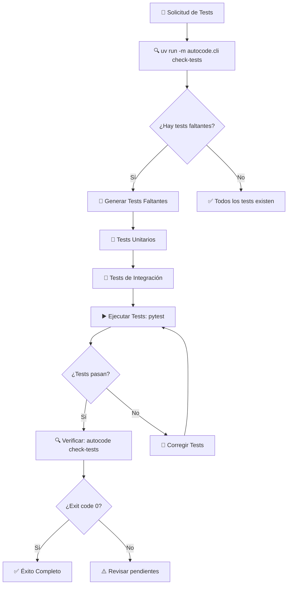

# Workflow: Generación de Tests Modulares

## Descripción
Workflow para generar y mantener tests estructurados siguiendo el patrón modular: tests unitarios para archivos individuales y tests de integración para módulos completos. Utiliza el sistema autocode para detectar automáticamente tests faltantes, generarlos usando pytest, y validar que todos funcionan correctamente.

## Resumen Visual



El flujo comienza detectando automáticamente qué tests necesitan crearse o actualizarse, genera tests modulares usando templates pytest, los ejecuta para verificar funcionalidad, y valida el resultado con el mismo comando inicial.

## Activación del Workflow

### Cuándo Usar
- Cuando se modifiquen archivos de código fuente
- Al añadir nuevos módulos o funcionalidades
- Cuando el usuario solicite: "Genera/actualiza los tests modulares"
- Después de refactorings que requieran actualizar tests
- Para establecer cobertura de testing inicial en el proyecto

### Condiciones Previas
- Proyecto con configuración uv (pyproject.toml)
- Pytest instalado como dependencia de desarrollo
- Estructura de código fuente organizada en directorios
- Acceso al módulo autocode configurado con comando check-tests

## Inputs/Entradas
- Proyecto con código fuente en directorio principal (ej. `vidi/`, `autocode/`, `tools/`)
- Configuración uv para ejecutar autocode y pytest
- Estructura de directorios del proyecto
- Información de tests faltantes proporcionada por autocode

## Proceso

### Paso 1: Detección Automática de Tests Faltantes
**EJECUTAR SIEMPRE COMO PRIMER PASO (Plan Mode y Act Mode)**
```bash
uv run -m autocode.cli check-tests
```

**Propósito**: Identificar automáticamente qué tests están faltantes, desactualizados o no funcionan correctamente.

**Salida esperada**: Lista de tests que requieren atención, clasificados por tipo:
- `test_archivo.py` (tests unitarios para archivos individuales)
- `test_[modulo]_integration.py` (tests de integración para módulos)
- Tests existentes que fallan o están desactualizados

### Paso 2: Análisis de Resultados
- **Exit code 0**: No hay tests pendientes → **Workflow completo**
- **Exit code 1**: Hay tests faltantes o fallando → **Continuar con generación**

### Paso 3: Generación de Tests por Niveles

#### Nivel 1: Tests Unitarios (test_archivo.py)

**Proceso de análisis**:
1. **Leer archivo fuente** completo
2. **Extraer funciones y clases** públicas
3. **Identificar dependencias** y puntos de mock
4. **Determinar casos de prueba** básicos y edge cases

**Template para Tests Unitarios**:
```python
"""
Tests unitarios para [ruta/archivo.py]
"""

import pytest
from unittest.mock import Mock, patch, MagicMock
import sys
from pathlib import Path

# Añadir el directorio raíz al path para imports
sys.path.insert(0, str(Path(__file__).parent.parent))

from [ruta.modulo] import [ClasePrincipal, funcion_principal]


class Test[ClasePrincipal]:
    """Tests unitarios para la clase [ClasePrincipal]"""
    
    def test_init(self):
        """Test inicialización básica"""
        # Arrange
        param1 = "valor_test"
        param2 = 123
        
        # Act
        instance = [ClasePrincipal](param1, param2)
        
        # Assert
        assert instance.param1 == param1
        assert instance.param2 == param2
    
    def test_metodo_principal_caso_exitoso(self):
        """Test método principal con caso exitoso"""
        # Arrange
        instance = [ClasePrincipal]("test", 100)
        input_data = {"key": "value"}
        
        # Act
        result = instance.metodo_principal(input_data)
        
        # Assert
        assert result is not None
        assert isinstance(result, expected_type)
    
    def test_metodo_principal_caso_error(self):
        """Test método principal con caso de error"""
        # Arrange
        instance = [ClasePrincipal]("test", 100)
        
        # Act & Assert
        with pytest.raises(ExpectedError):
            instance.metodo_principal(None)
    
    @patch('[ruta.modulo].dependencia_externa')
    def test_metodo_con_dependencia_externa(self, mock_dependencia):
        """Test método que usa dependencias externas"""
        # Arrange
        mock_dependencia.return_value = "mocked_result"
        instance = [ClasePrincipal]("test", 100)
        
        # Act
        result = instance.metodo_con_dependencia()
        
        # Assert
        assert result == "expected_result"
        mock_dependencia.assert_called_once()


class Test[FuncionPrincipal]:
    """Tests unitarios para funciones independientes"""
    
    def test_funcion_principal_caso_basico(self):
        """Test función principal con entrada válida"""
        # Arrange
        input_param = "test_input"
        expected_output = "expected_result"
        
        # Act
        result = funcion_principal(input_param)
        
        # Assert
        assert result == expected_output
    
    def test_funcion_principal_casos_edge(self):
        """Test función principal con casos edge"""
        # Test con entrada vacía
        assert funcion_principal("") == default_value
        
        # Test con entrada None
        with pytest.raises(ValueError):
            funcion_principal(None)
        
        # Test con entrada muy larga
        long_input = "x" * 1000
        result = funcion_principal(long_input)
        assert len(result) <= expected_max_length


# Fixtures para tests
@pytest.fixture
def sample_[clase_principal]():
    """Fixture para crear instancia de prueba"""
    return [ClasePrincipal]("test_param", 123)


@pytest.fixture
def sample_data():
    """Fixture para datos de prueba"""
    return {
        "key1": "value1",
        "key2": 456,
        "key3": ["item1", "item2"]
    }


# Tests de integración básica dentro del archivo
class TestIntegracion[NombreArchivo]:
    """Tests de integración de componentes dentro del archivo"""
    
    def test_flujo_completo_basico(self, sample_data):
        """Test flujo completo usando múltiples componentes"""
        # Arrange
        instance = [ClasePrincipal]("integration_test", 999)
        
        # Act
        processed_data = funcion_principal(sample_data["key1"])
        result = instance.metodo_principal(processed_data)
        
        # Assert
        assert result is not None
        assert "expected_pattern" in str(result)
```

#### Nivel 2: Tests de Integración (test_[modulo]_integration.py)

**Proceso de análisis**:
1. **Identificar archivos** del módulo
2. **Mapear interacciones** entre componentes
3. **Definir flujos de trabajo** principales del módulo
4. **Identificar APIs públicas** del módulo

**Template para Tests de Integración**:
```python
"""
Tests de integración para el módulo [nombre_modulo]
"""

import pytest
from unittest.mock import Mock, patch, MagicMock
import sys
from pathlib import Path

# Añadir el directorio raíz al path para imports
sys.path.insert(0, str(Path(__file__).parent.parent))

from [ruta.modulo] import [ComponenteA, ComponenteB, funcion_orchestradora]


class TestIntegracion[NombreModulo]:
    """Tests de integración entre componentes del módulo"""
    
    def test_flujo_principal_completo(self):
        """Test del flujo de trabajo principal del módulo"""
        # Arrange
        componente_a = ComponenteA("config_test")
        componente_b = ComponenteB("param_test")
        
        # Act
        resultado_a = componente_a.procesar_entrada("input_data")
        resultado_final = componente_b.procesar_resultado(resultado_a)
        
        # Assert
        assert resultado_final is not None
        assert resultado_final.status == "success"
        assert "expected_content" in resultado_final.data
    
    def test_orquestacion_completa(self):
        """Test de orquestación completa usando función principal"""
        # Arrange
        config = {"param1": "value1", "param2": 123}
        input_data = {"test": "data"}
        
        # Act
        result = funcion_orchestradora(config, input_data)
        
        # Assert
        assert result.is_valid()
        assert result.components_used == ["ComponenteA", "ComponenteB"]
    
    def test_manejo_errores_entre_componentes(self):
        """Test manejo de errores en interacciones entre componentes"""
        # Arrange
        componente_a = ComponenteA("invalid_config")
        componente_b = ComponenteB("param_test")
        
        # Act & Assert
        with pytest.raises(IntegrationError):
            resultado_a = componente_a.procesar_entrada("invalid_data")
            componente_b.procesar_resultado(resultado_a)
    
    @patch('[ruta.modulo].dependencia_externa')
    def test_integracion_con_dependencias_externas(self, mock_external):
        """Test integración con dependencias externas del módulo"""
        # Arrange
        mock_external.return_value = {"status": "ok", "data": "mocked"}
        
        # Act
        result = funcion_orchestradora({"use_external": True}, {"test": "input"})
        
        # Assert
        assert result.external_data == "mocked"
        mock_external.assert_called_once()


class TestAPIsPublicas[NombreModulo]:
    """Tests de las APIs públicas expuestas por el módulo"""
    
    def test_api_entrada_principal(self):
        """Test de la API de entrada principal del módulo"""
        # Arrange
        api_input = {
            "operation": "process",
            "data": {"key": "value"},
            "options": {"verbose": True}
        }
        
        # Act
        result = [modulo].public_api_function(api_input)
        
        # Assert
        assert result["status"] == "success"
        assert "result" in result
        assert result["metadata"]["processed_by"] == "[NombreModulo]"
    
    def test_configuracion_modulo(self):
        """Test configuración y inicialización del módulo"""
        # Arrange
        config = {
            "debug": True,
            "timeout": 30,
            "retries": 3
        }
        
        # Act
        module_instance = [modulo].initialize(config)
        
        # Assert
        assert module_instance.is_configured()
        assert module_instance.config.debug == True
        assert module_instance.config.timeout == 30


class TestRendimiento[NombreModulo]:
    """Tests de rendimiento y límites del módulo"""
    
    def test_rendimiento_carga_normal(self):
        """Test rendimiento con carga normal"""
        # Arrange
        normal_data = [{"id": i, "data": f"item_{i}"} for i in range(100)]
        
        # Act
        import time
        start = time.time()
        result = [modulo].process_batch(normal_data)
        duration = time.time() - start
        
        # Assert
        assert duration < 5.0  # Debe procesarse en menos de 5 segundos
        assert len(result) == 100
        assert all(item["processed"] for item in result)
    
    def test_limites_entrada_maxima(self):
        """Test límites con entrada máxima"""
        # Arrange
        max_data = [{"id": i, "data": f"item_{i}"} for i in range(1000)]
        
        # Act & Assert
        try:
            result = [modulo].process_batch(max_data)
            assert len(result) <= 1000
        except ResourceLimitError:
            # Es aceptable que tenga límites
            pass


# Fixtures para tests de integración
@pytest.fixture
def configured_module():
    """Fixture para módulo configurado"""
    config = {
        "debug": False,
        "timeout": 10,
        "retries": 1
    }
    return [modulo].initialize(config)


@pytest.fixture
def sample_integration_data():
    """Fixture para datos de integración"""
    return {
        "batch_data": [
            {"id": 1, "type": "test", "content": "sample1"},
            {"id": 2, "type": "test", "content": "sample2"}
        ],
        "metadata": {
            "source": "test_suite",
            "timestamp": "2025-01-01T00:00:00Z"
        }
    }
```

### Paso 4: Ejecución de Tests Generados
```bash
pytest tests/ -v --tb=short
```

**Propósito**: Ejecutar todos los tests generados para verificar que funcionan correctamente.

**Criterios de éxito**:
- Todos los tests pasan (exit code 0)
- No hay errores de sintaxis o imports
- Cobertura básica de funcionalidad principal

### Paso 5: Corrección de Tests (si fallan)
Si pytest reporta errores:
1. **Analizar errores** específicos reportados
2. **Corregir imports** o dependencias faltantes
3. **Ajustar mocks** o fixtures según sea necesario
4. **Revisar lógica** de tests si hay falsos positivos
5. **Volver a ejecutar** pytest hasta que pasen

### Paso 6: Verificación Final
```bash
uv run -m autocode.cli check-tests
```

**Resultado esperado**:
- **Exit code 0**: ✅ Todos los tests existen y pasan
- **Mensaje**: `✅ All tests are complete and passing!`

## Outputs/Salidas
- Tests completos en estructura modular bajo `tests/`
- Tests unitarios `test_archivo.py` para cada archivo de código
- Tests de integración `test_[modulo]_integration.py` para cada módulo
- Todos los tests ejecutándose exitosamente con pytest

## Criterios de Éxito

### Verificación Automática
```bash
uv run -m autocode.cli check-tests
```
- **Exit code 0**: ✅ Éxito completo
- **Exit code 1**: ❌ Tests faltantes o fallando

### Verificación Manual con Pytest
```bash
pytest tests/ -v --tb=short --cov=vidi --cov=autocode
```
- **Todos los tests pasan**: ✅ Funcionalidad correcta
- **Cobertura básica**: ✅ Componentes principales cubiertos

### Checklist Manual
- [ ] Existe test unitario para cada archivo de código relevante
- [ ] Existe test de integración para cada módulo
- [ ] Los tests cubren casos exitosos y casos de error
- [ ] Los mocks están configurados correctamente
- [ ] Los tests son ejecutables y pasan
- [ ] La estructura de tests refleja la estructura del código

## Estructura de Tests Target

```
tests/                                  # Directorio de tests del proyecto
├── test_main.py                       # Test del archivo main.py
├── [codigo_fuente]/                   # Tests del directorio de código fuente
│   ├── test_[codigo_fuente]_integration.py  # Tests de integración del módulo principal
│   ├── [modulo1]/
│   │   ├── test_[modulo1]_integration.py    # Tests de integración del módulo1
│   │   ├── test_archivo1.py                 # Test unitario de archivo1.py
│   │   └── [submodulo]/
│   │       ├── test_[submodulo]_integration.py  # Tests de integración del submódulo
│   │       └── test_archivo2.py             # Test unitario de archivo2.py
│   └── [modulo2]/
│       ├── test_[modulo2]_integration.py    # Tests de integración del módulo2
│       └── test_archivo3.py                 # Test unitario de archivo3.py
├── conftest.py                        # Fixtures y configuración global pytest
└── pytest.ini                        # Configuración pytest
```

### Regla de Mapeo para Tests

**Código**: `[codigo_fuente]/[ruta]/[archivo].[ext]`  
**Test Unitario**: `tests/[codigo_fuente]/[ruta]/test_[archivo].py`  
**Test Integración**: `tests/[codigo_fuente]/[ruta]/test_[modulo]_integration.py`

**Ejemplos concretos**:
- `vidi/inference/engine.py` → `tests/vidi/inference/test_engine.py`
- `vidi/inference/` → `tests/vidi/inference/test_inference_integration.py`
- `autocode/core/doc_checker.py` → `tests/autocode/core/test_doc_checker.py`
- `autocode/core/` → `tests/autocode/core/test_core_integration.py`

### Tipos de Tests por Componente

1. **Tests Unitarios** (`test_archivo.py`):
   - Testean clases y funciones individuales
   - Usan mocks para todas las dependencias externas
   - Verifican casos exitosos y casos de error
   - Incluyen casos edge y validación de entrada

2. **Tests de Integración** (`test_[modulo]_integration.py`):
   - Testean interacción entre componentes del módulo
   - Verifican flujos de trabajo completos
   - Testean APIs públicas del módulo
   - Incluyen tests de rendimiento básico

## Comandos de Referencia

### Comando Principal
```bash
# Detectar tests faltantes y verificar existentes
uv run -m autocode.cli check-tests

# Verificar resultado (debe devolver exit code 0)
echo $?
```

### Comandos de Testing
```bash
# Ejecutar todos los tests
pytest tests/ -v

# Ejecutar tests con cobertura
pytest tests/ --cov=vidi --cov=autocode --cov-report=html

# Ejecutar tests de un módulo específico
pytest tests/vidi/inference/ -v

# Ejecutar solo tests unitarios
pytest tests/ -k "not integration" -v

# Ejecutar solo tests de integración
pytest tests/ -k "integration" -v
```

### Comandos de Exploración (para análisis inicial)
```bash
# Explorar estructura del proyecto
list_files [directorio_proyecto]/ --recursive

# Leer archivos para extraer funciones y clases
read_file [archivo_fuente].py
```

## Necesidades de Implementación en Autocode

### Comando CLI Requerido
```bash
uv run -m autocode.cli check-tests
```

### Funcionalidades Necesarias en Autocode

1. **TestChecker** (similar a DocChecker):
   - Detectar archivos sin tests correspondientes
   - Verificar que tests existentes están actualizados
   - Ejecutar tests y reportar fallos

2. **Configuración en autocode_config.yml**:
   ```yaml
   tests:
     enabled: true
     directories:
       - "vidi/"
       - "autocode/"
       - "tools/"
     exclude:
       - "__pycache__/"
       - "*.pyc"
       - "__init__.py"
     test_frameworks:
       - "pytest"
   ```

3. **Integración con pytest**:
   - Ejecutar pytest programáticamente
   - Capturar resultados y errores
   - Reportar cobertura básica

## Recordatorios para Cline

### Principios Fundamentales
1. **OBLIGATORIO**: Ejecutar `uv run -m autocode.cli check-tests` como primer paso, incluso en plan mode, antes de cualquier análisis
2. **SIEMPRE** generar tests unitarios antes que tests de integración
3. **SIEMPRE** leer código fuente completo antes de generar tests
4. **SIEMPRE** usar los templates definidos consistentemente
5. **SIEMPRE** ejecutar pytest después de generar tests
6. **SIEMPRE** verificar con autocode check-tests al final
7. **NUNCA** generar tests para archivos __init__.py

### Flujo de Trabajo Obligatorio
1. **Detectar necesidades (PRIMER PASO OBLIGATORIO)**: `uv run -m autocode.cli check-tests`
2. **Analizar estructura** del código con list_files
3. **Generar tests unitarios** para archivos individuales
4. **Generar tests de integración** para módulos
5. **Ejecutar tests**: `pytest tests/ -v`
6. **Corregir errores** si hay fallos
7. **Verificar resultado**: `uv run -m autocode.cli check-tests`
8. **Confirmar exit code 0**

### Criterios de Calidad para Tests
- **Cobertura**: Funciones y clases públicas principales cubiertas
- **Casos**: Incluir casos exitosos, errores y edge cases
- **Mocks**: Usar mocks apropiados para dependencias externas
- **Claridad**: Tests legibles y bien documentados
- **Mantenibilidad**: Tests fáciles de actualizar cuando cambie el código
- **Velocidad**: Tests unitarios rápidos, integración moderada

### Patrones de Testing por Tipo de Código

#### APIs y Servicios
- **Mock** llamadas HTTP y bases de datos
- **Test** casos de éxito y códigos de error
- **Validar** serialización/deserialización

#### Procesamiento de Datos
- **Test** con datos válidos e inválidos
- **Verificar** transformaciones y filtros
- **Validar** rendimiento con datasets grandes

#### Clases y Módulos
- **Test** inicialización y configuración
- **Mock** dependencias externas
- **Verificar** interacciones entre métodos

#### Funciones Utilitarias
- **Test** casos edge exhaustivos
- **Verificar** tipos de entrada y salida
- **Validar** comportamiento con None y vacíos

### Manejo de Errores
- **Tests que fallan**: Analizar error específico y corregir
- **Imports faltantes**: Verificar rutas y dependencias
- **Mocks incorrectos**: Ajustar según interfaz real
- **Fixtures complejas**: Simplificar y modularizar

## Notas Importantes
- Este workflow requiere implementar el comando `check-tests` en autocode
- Los tests generados usan pytest como framework principal
- La estructura de tests refleja exactamente la estructura del código
- Se enfoca en cobertura funcional básica más que cobertura exhaustiva
- Los tests de integración verifican flujos de trabajo reales del módulo
- La validación final usa el mismo comando que la detección inicial
- Compatible con proyectos que tengan configuración uv (pyproject.toml)
- Pytest debe estar instalado como dependencia de desarrollo
