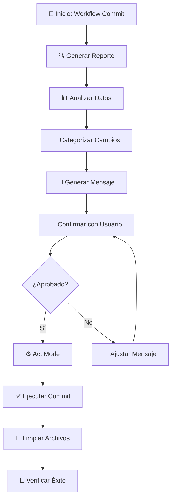

# Workflow: Commit Inteligente con Autocode

## Descripción
Workflow automatizado para generar commits inteligentes usando el CLI de autocode. Analiza cambios automáticamente, genera reportes estructurados y crea mensajes de commit precisos basándose en el análisis completo del repositorio.

## Resumen Visual



**El workflow utiliza el GitAnalyzer de autocode para generar un reporte completo de cambios, luego analiza la información para crear mensajes de commit inteligentes y precisos.**

## Activación del Workflow

### Cuándo Usar
- Después de completar una feature y verificar que funciona
- Cuando se han hecho cambios y se necesita hacer commit
- Al finalizar cualquier modificación de código que requiera versionado
- Para automatizar la creación de mensajes de commit descriptivos

### Condiciones Previas
- ✅ Hay cambios en el repositorio git
- ✅ El entorno uv está configurado
- ✅ Los cambios han sido probados y funcionan correctamente

## Inputs/Entradas
- **Estado del repositorio**: Cambios staged, unstaged o untracked
- **Archivos modificados**: Cualquier archivo con cambios detectables por git
- **Configuración del proyecto**: pyproject.toml y .gitignore para análisis contextual

## Proceso

### FASE 1: PLAN MODE - Análisis Automático

#### Paso 1: Generar Reporte de Cambios
```bash
uv run python -m autocode.cli git-changes --output git_changes.json
```
- Ejecuta el GitAnalyzer para crear reporte completo
- Analiza archivos staged, unstaged y untracked
- Genera estadísticas de adiciones/eliminaciones
- Respeta patrones de .gitignore automáticamente
- Guarda toda la información en formato JSON estructurado

#### Paso 2: Cargar y Procesar Reporte
- **Leer git_changes.json**: Cargar datos estructurados del análisis
- **Extraer información clave**:
  - Lista de archivos modificados
  - Tipos de cambios (added, modified, deleted, untracked)
  - Estadísticas de cambios (additions, deletions)
  - Estado de staging (staged vs unstaged)

#### Paso 3: Categorizar Cambios por Contexto
- **Por ubicación**:
  - `vidi/` → Código fuente principal
  - `docs/` → Documentación
  - `examples/` → Ejemplos y demos
  - `tools/` → Herramientas CLI
  - `autocode/` → Herramientas de desarrollo
  - Raíz → Configuración del proyecto

- **Por tipo de archivo**:
  - `.py` → Código Python
  - `.md` → Documentación Markdown
  - `.json` → Configuración/datos
  - `.toml` → Configuración del proyecto

#### Paso 4: Detectar Tipo de Commit
**Lógica de detección automática**:
- **`feat`**: Si hay nuevos archivos en `vidi/` o nueva funcionalidad
- **`fix`**: Si se modificaron archivos existentes para corregir problemas
- **`docs`**: Si solo se modificaron archivos en `docs/` o `.md`
- **`refactor`**: Si se modificó código sin añadir funcionalidad
- **`chore`**: Si solo se modificaron configuraciones o dependencias
- **`examples`**: Si solo se modificaron archivos en `examples/`

#### Paso 5: Generar Mensaje de Commit Inteligente
- **Línea principal** (máximo 50 caracteres):
  - Usar tipo detectado
  - Descripción concisa basada en archivos más relevantes
  - Formato: `<tipo>: <descripción en presente>`

- **Lista de cambios específicos**:
  - Un bullet por cambio significativo
  - Basado en archivos y contexto del reporte
  - Incluir números de archivos si son relevantes

#### Paso 6: Presentar Plan Completo
- **Mostrar resumen del reporte**:
  - Total de archivos cambiados
  - Breakdown por categoría (modified, added, deleted)
  - Archivos más relevantes

- **Proponer mensaje de commit**:
  - Tipo detectado y justificación
  - Mensaje completo formateado
  - Lista detallada de cambios

- **Solicitar confirmación**:
  - "¿El análisis es correcto?"
  - "¿El mensaje de commit es apropiado?"
  - "¿Estás listo para ejecutar el commit en Act Mode?"

### FASE 2: ACT MODE - Ejecución y Limpieza

#### Paso 7: Verificación Pre-Commit
- **Confirmar estado del repositorio**: `git status`
- **Validar que coincide con el reporte**: Verificar consistencia
- **Última confirmación**: Confirmar mensaje de commit final

#### Paso 8: Ejecución del Commit
```bash
git add .
git commit -m "mensaje acordado en Plan Mode"
```
- **NO replantear**: Usar exactamente el mensaje acordado
- **Manejar errores**: Si falla, mostrar error y sugerir soluciones

#### Paso 9: Limpieza y Verificación
```bash
rm git_changes.json
git status
```
- **Eliminar archivo temporal**: Limpiar `git_changes.json`
- **Verificar estado limpio**: Confirmar que no quedan cambios
- **Mostrar éxito**: Hash del commit y confirmación

## Outputs/Salidas
- **Commit creado**: Nuevo commit con mensaje descriptivo y preciso
- **Repositorio limpio**: Sin archivos temporales ni cambios pendientes
- **Mensaje estructurado**: Siguiendo convenciones del proyecto
- **Hash del commit**: Para referencia y verificación

## Criterios de Éxito

### Éxito en Plan Mode
- ✅ El reporte git_changes.json se generó correctamente
- ✅ Se cargaron y analizaron todos los cambios
- ✅ Se detectó el tipo de commit apropiado
- ✅ Se generó un mensaje de commit descriptivo
- ✅ El usuario confirmó que el análisis es correcto

### Éxito en Act Mode
- ✅ El commit se ejecutó sin errores
- ✅ Se creó un nuevo commit con el mensaje acordado
- ✅ Se eliminó el archivo git_changes.json
- ✅ El repositorio quedó en estado limpio
- ✅ Se mostró el hash del commit creado

### Validación Final
```bash
git log -1 --oneline  # Verificar último commit
git status           # Confirmar estado limpio
ls git_changes.json  # Debe fallar (archivo eliminado)
```

## Comandos de Referencia

### Generación de Reporte
```bash
# Comando principal
uv run python -m autocode.cli git-changes --output git_changes.json

# Con información verbose (opcional)
uv run python -m autocode.cli git-changes --output git_changes.json --verbose
```

### Verificación Git
```bash
git status              # Ver estado actual
git diff               # Ver cambios específicos
git log --oneline -5   # Ver historial reciente
```

### Commit y Limpieza
```bash
git add .                    # Añadir todos los cambios
git commit -m "mensaje"      # Commit con mensaje
rm git_changes.json         # Limpiar archivo temporal
```

## Tipos de Commit y Criterios

### Tipos Disponibles
- **`feat`**: Nueva funcionalidad o característica
- **`fix`**: Corrección de bug o problema
- **`refactor`**: Mejora de código sin cambio funcional
- **`docs`**: Documentación exclusivamente
- **`style`**: Formato, espacios, linting
- **`test`**: Añadir o modificar tests
- **`chore`**: Mantenimiento, dependencias, configuración
- **`examples`**: Modificaciones en ejemplos o demos

### Lógica de Detección Automática

```
Si archivos nuevos en vidi/ → feat
Si solo docs/ o *.md → docs  
Si solo examples/ → examples
Si solo configuración → chore
Si modificaciones en vidi/ → refactor o fix (según contexto)
```

### Estructura del Mensaje
```
<tipo>: <descripción concisa en presente>

- Cambio específico 1
- Cambio específico 2  
- Cambio específico 3
```

## Manejo de Casos Especiales

### Sin Cambios para Commit
- Verificar `git status`
- Informar que no hay cambios pendientes
- Sugerir verificar si los cambios se guardaron

### Errores en el Reporte
- Si falla `uv run python -m autocode.cli`: verificar configuración uv
- Si no se puede leer git_changes.json: regenerar reporte
- Si git repo no válido: verificar que estamos en proyecto git

### Archivos Grandes o Sensibles
- El GitAnalyzer respeta .gitignore automáticamente
- Advertir si hay archivos inusuales (>1MB)
- Confirmar archivos de configuración si aparecen

### Conflictos de Git
- Si `git add .` falla: mostrar error específico
- Si `git commit` falla: analizar causa (mensaje vacío, hooks, etc.)
- Sugerir soluciones específicas según el error

## Recordatorios para Cline

### Durante Plan Mode
1. **SIEMPRE** usar `uv run python -m autocode.cli git-changes` (no python directo)
2. **SIEMPRE** leer completamente el git_changes.json generado
3. **SIEMPRE** analizar contexto de archivos para determinar tipo de commit
4. **NUNCA** proceder sin confirmación explícita del usuario
5. **VERIFICAR** que el mensaje sigue las convenciones del proyecto

### Durante Act Mode  
1. **USAR** exactamente el mensaje acordado en Plan Mode
2. **NO replantear** o modificar el mensaje sin consultar
3. **SIEMPRE** limpiar git_changes.json después del commit
4. **VERIFICAR** estado final del repositorio
5. **MOSTRAR** hash del commit creado para confirmación

### Principios Importantes
- **Automatización inteligente**: Usar el reporte completo para decisiones
- **Confirmación humana**: Nunca hacer commit sin aprobación
- **Limpieza**: Mantener el proyecto sin archivos temporales
- **Consistencia**: Seguir convenciones de commit establecidas
- **Precisión**: Basar decisiones en análisis real, no asunciones

## Notas Importantes

- **Dependencia de uv**: El comando requiere que uv esté configurado correctamente
- **Archivo temporal**: git_changes.json se elimina automáticamente después del commit
- **Respeta .gitignore**: El GitAnalyzer ignora archivos según .gitignore
- **Análisis completo**: Incluye diffs, estadísticas y metadata de todos los cambios
- **Formato estándar**: Mantiene compatibilidad con convenciones existentes del proyecto
