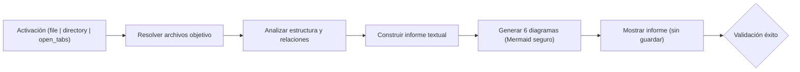
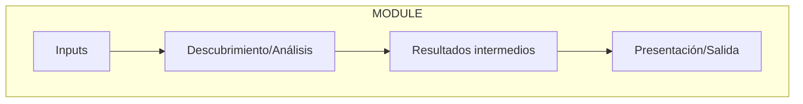
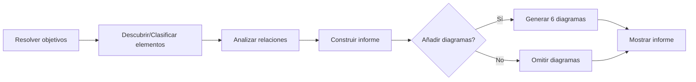
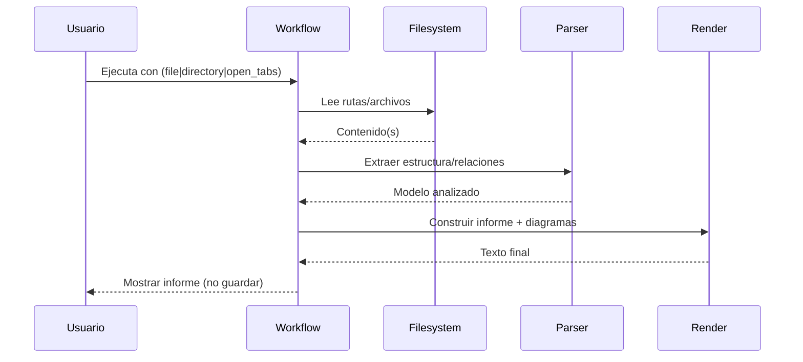
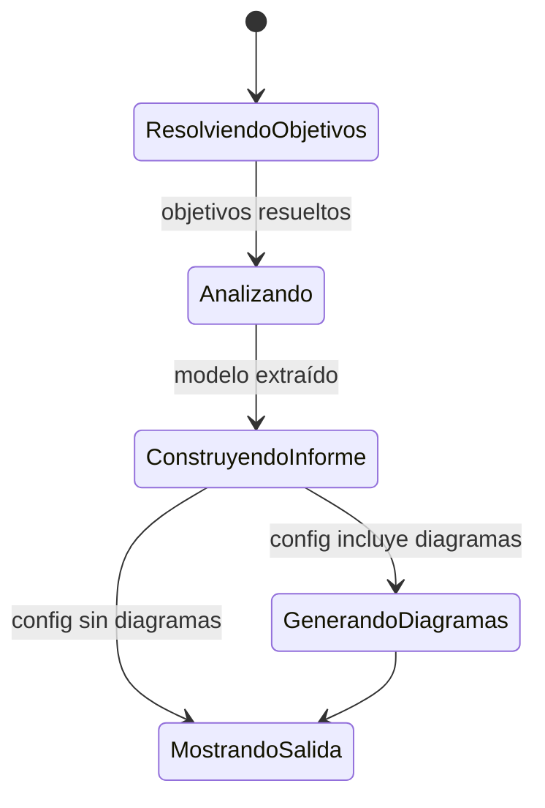
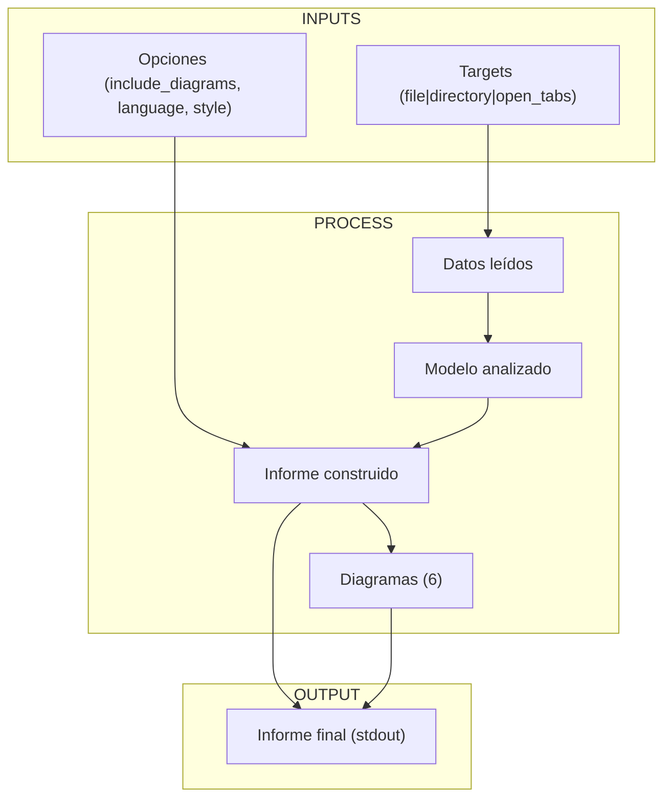
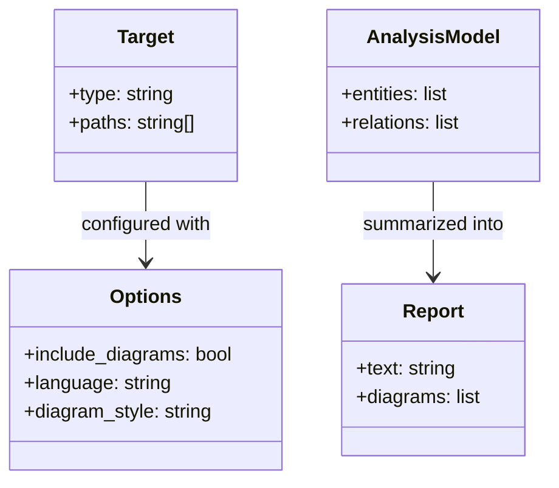

# Workflow: Generar Informe MD con 6 Diagramas (sin persistencia)

## Descripción
Genera un informe en texto (stdout/respuesta) para ayudar a comprender un módulo o conjunto de archivos, incluyendo 6 diagramas Mermaid seguros para su renderizado en Markdown. No guarda archivos ni modifica el proyecto; solo muestra el informe.

## Resumen Visual
Diagrama del flujo del workflow.

Explicación: El workflow recibe el objetivo (archivo, carpeta o pestañas abiertas), determina qué analizar, extrae estructura/relaciones relevantes, compone un informe textual y añade 6 diagramas Mermaid pensados para evitar errores de parseo. Finalmente, imprime el informe sin persistir nada.

## Activación del Workflow

### Cuándo Usar
- Necesitas un informe de comprensión rápido sin escribir archivos.
- Quieres visualizar arquitectura, flujo, secuencia, estados, artefactos y clases del objetivo.
- Útil en revisiones previas a “congelación” del módulo.

### Condiciones Previas
- Acceso de lectura a los ficheros objetivo.
- Si el objetivo es carpeta: asegurar que el volumen es manejable o definir filtros.

## Inputs/Entradas
- target_type: string. Valores: `file` | `directory` | `open_tabs`
- target_paths: string[] (ruta(s) a archivo/carpeta o lista de pestañas abiertas)
- options (opcional):
  - include_diagrams: boolean (default: true)
  - language: string (default: "es")
  - diagram_style: string (default: "safe")

## Proceso

### Paso 1: Resolver Objetivos
- Si `target_type == file`: usar esa ruta.
- Si `target_type == directory`: listar archivos relevantes con filtros por extensión (p.ej., `.py`, `.md`) y límites de profundidad si procede.
- Si `target_type == open_tabs`: usar la lista proporcionada.

### Paso 2: Descubrir/Clasificar Elementos
- Identificar tipos de archivos (código, docs).
- Extraer señales de estructura (p.ej., clases, funciones, módulos, capas).
- Inferir roles (I/O, lógica, presentación) cuando sea razonable.

### Paso 3: Analizar Relaciones
- Dependencias entre “bloques” (quién usa a quién).
- Flujos de datos o de llamadas principales.
- Estados (si aplica) y artefactos intermedios.

### Paso 4: Construir Informe
- Redactar resumen y secciones explicativas (estructura, flujo, dependencias, estados, artefactos).
- Estructurar el informe para lectura rápida.

### Paso 5: Generar 6 Diagramas Mermaid (modo seguro)
Reglas anti-errores:
- Evitar comas en relaciones: usar líneas separadas.
- Usar nombres de subgraph sin espacios (p.ej., MODULE, INPUTS, OUTPUT).
- Etiquetas entre comillas si contienen espacios.
- Usar tipos correctos: `flowchart`, `sequenceDiagram`, `stateDiagram-v2`, `classDiagram`.

Diagramas generados (plantillas, el contenido se adapta a cada caso):

1) Componentes (flowchart TD)

Uso: Visión macro de bloques lógicos y sus relaciones.

2) Flujo/Pipeline (flowchart LR)

Uso: Secuencia de etapas del proceso y bifurcación según opciones.

3) Secuencia (sequenceDiagram)

Uso: Interacciones entre usuarios y componentes del workflow.

4) Estados (stateDiagram-v2)

Uso: Estados del workflow y transiciones típicas.

5) Artefactos I/O (flowchart TB)

Uso: Mapa de entradas, artefactos intermedios y salida.

6) Clases (classDiagram)

Uso: Modelo mínimo de datos para representar entrada, opciones, análisis y reporte.

### Paso 6: Mostrar Informe (sin guardar)
- Imprimir en consola/retornar en API el informe con las 6 secciones y sus diagramas.

## Outputs/Salidas
- Informe textual con:
  - Resumen del análisis
  - 6 diagramas Mermaid listos para pegar en Markdown
- Sin creación de archivos.

## Criterios de Éxito
- Genera el informe sin errores.
- Los 6 diagramas Mermaid renderizan correctamente.
- El informe proporciona contexto útil para la comprensión.
- No se escribe en disco.

## Validación
- Probar con:
  - Un archivo Python (`.py`) simple
  - Una carpeta de módulo con varios archivos
  - Varios archivos abiertos como entrada
- Confirmar que todos los diagramas se renderizan en el entorno de visualización Markdown (VSCode/CI/visor).

## Comandos de Referencia
No aplica (workflow conceptual/MD). Implementaciones pueden integrarse en CLI o UI del proyecto.

## Integración con Otros Workflows
- Puede invocarse antes de flujos de “congelación” o generación de documentación formal para tener una vista rápida.

## Recordatorios para Cline
- Mantener el modo “Mermaid seguro”: sin comas en relaciones, subgraph con identificadores simples, etiquetas entre comillas si hay espacios, tipos de diagrama correctos.
- No persistir archivos.
- Adaptar el contenido de diagramas según el dominio detectado, pero respetar la sintaxis robusta.

## Notas Importantes
- Este workflow es agnóstico al lenguaje; las heurísticas de análisis deben ser conservadoras y priorizar claridad sobre exhaustividad.
- El output está optimizado para Markdown (copiar/pegar).
