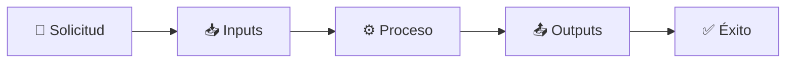
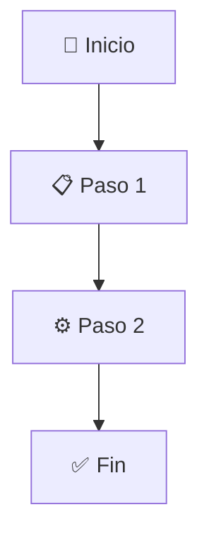

# Meta Workflow: Creador de Workflows

## Descripción
Meta workflow para crear nuevos workflows de forma estructurada y consistente. Utiliza un proceso de descubrimiento colaborativo en Plan Mode para recopilar información, y genera el archivo .md completo en Act Mode.

## Definición de Workflow
**Un workflow es un proceso estructurado y repetible que transforma un estado inicial en un estado final deseado, con criterios claros de éxito.**

### Componentes Esenciales de Todo Workflow:
1. **TRIGGER/ACTIVACIÓN** - Cuándo se ejecuta
2. **INPUTS/ENTRADAS** - Qué necesita para empezar  
3. **PROCESO** - Qué hace paso a paso
4. **OUTPUTS/SALIDAS** - Qué produce
5. **CRITERIOS DE ÉXITO** - Cómo verificar que funcionó
6. **RESUMEN VISUAL** - Diagrama Mermaid que ilustra el flujo

## Resumen Visual



## Activación del Meta Workflow

### Cuándo Usar
- Cuando el usuario solicite: "Crea un workflow para [tarea]"
- Cuando se identifique un proceso repetitivo que necesita automatización
- Cuando se requiera documentar un procedimiento estándar
- Para sistematizar tareas complejas o multi-paso

## FASE 1: DESCUBRIMIENTO (Plan Mode)

### Instrucciones para Cline en Plan Mode

**SIEMPRE** usar `ask_followup_question` para hacer las preguntas secuencialmente. **NO** hacer múltiples preguntas a la vez.

#### Paso 1: Identificación Básica
**Pregunta inicial:**
"¿Qué tarea o proceso quieres automatizar con este workflow? Describe brevemente qué problema resuelve."

#### Paso 2: Definir TRIGGER/ACTIVACIÓN
**Preguntas sobre activación:**
- "¿Cuándo se debería ejecutar este workflow?"
- "¿Qué comando específico o situación lo activaría?"
- "¿Hay condiciones previas que deben cumplirse?"

#### Paso 3: Identificar INPUTS/ENTRADAS
**Preguntas sobre entradas:**
- "¿Qué información necesita el workflow para empezar?"
- "¿Requiere archivos específicos, configuración previa, o datos del usuario?"
- "¿Hay dependencias o herramientas que deben estar disponibles?"

#### Paso 4: Definir PROCESO
**Preguntas sobre el proceso:**
- "¿Cuáles son los pasos principales que debe seguir el workflow?"
- "¿Hay decisiones importantes o validaciones que debe hacer?"
- "¿Existen comandos específicos o herramientas que debe usar?"
- "¿Hay casos especiales o errores que debe manejar?"

#### Paso 5: Especificar OUTPUTS/SALIDAS
**Preguntas sobre salidas:**
- "¿Qué debe producir o crear este workflow?"
- "¿Qué archivos, cambios o información debe generar?"
- "¿Cómo cambia el estado del proyecto después de ejecutarse?"

#### Paso 6: Establecer CRITERIOS DE ÉXITO
**Preguntas sobre verificación:**
- "¿Cómo sabríamos que el workflow terminó correctamente?"
- "¿Qué se puede verificar para confirmar el éxito?"
- "¿Hay comandos o comprobaciones específicas para validar el resultado?"

#### Paso 7: Información Adicional
**Preguntas complementarias:**
- "¿Este workflow se relaciona o depende de otros workflows existentes?"
- "¿Hay recordatorios especiales o consideraciones importantes para Cline?"
- "¿Qué nombre quieres darle al workflow?"

#### Paso 8: Validación y Refinamiento
**Presentar resumen completo:**
- Mostrar todos los componentes recopilados
- Confirmar que la información es correcta
- Preguntar si hay algo que ajustar o añadir
- **Solicitar cambio a Act Mode:** "¿Todo correcto? Por favor, cambia a Act Mode para generar el archivo del workflow."

## FASE 2: GENERACIÓN (Act Mode)

### Instrucciones para Cline en Act Mode

#### Paso 1: Crear Archivo
Crear el archivo en `.clinerules/workflows/[nombre-workflow].md` usando el template universal.

#### Paso 2: Template Universal Adaptativo

```markdown
# Workflow: [Nombre del Workflow]

## Descripción
[Descripción del propósito y qué problema resuelve]

## Resumen Visual
[OBLIGATORIO: Diagrama Mermaid que ilustre el flujo del workflow]



[Explicación del diagrama y elementos clave del flujo]

## Activación del Workflow

### Cuándo Usar
[Triggers y situaciones específicas]

### Condiciones Previas
[Dependencias o requisitos necesarios]

## Inputs/Entradas
[Qué información, archivos o estado necesita para empezar]

## Proceso

### [Paso 1: Nombre del Paso]
[Descripción detallada del primer paso]

### [Paso 2: Nombre del Paso]
[Descripción detallada del segundo paso]

[Continuar con todos los pasos necesarios]

### Manejo de Casos Especiales
[Si aplica: errores, situaciones especiales, validaciones]

## Outputs/Salidas
[Qué produce: archivos, cambios, información generada]

## Criterios de Éxito
[Cómo verificar que el workflow funcionó correctamente]

### Validación
[Comandos o comprobaciones específicas para confirmar éxito]

## Comandos de Referencia
[Si aplica: comandos importantes usados en el workflow]

## Integración con Otros Workflows
[Si aplica: relación con otros workflows existentes]

## Recordatorios para Cline
[Consideraciones especiales, principios importantes, errores a evitar]

## Notas Importantes
[Información adicional relevante]
```

#### Paso 3: Adaptación del Template
**Incluir solo las secciones relevantes según la información recopilada:**
- Si no hay comandos específicos, omitir "Comandos de Referencia"
- Si no se relaciona con otros workflows, omitir "Integración con Otros Workflows"
- Si no hay casos especiales, omitir "Manejo de Casos Especiales"
- Añadir secciones adicionales si son necesarias para el workflow específico

#### Paso 4: Validación Final
- Verificar que el archivo se creó correctamente
- Confirmar que todas las secciones tienen contenido relevante
- Asegurar que el workflow es completo y ejecutable

## Patrones Comunes Identificados

### Workflows de Memoria/Referencia
- Mantienen documentos de referencia actualizados
- Tienen triggers de actualización específicos
- Incluyen validaciones de consistencia

### Workflows de Generación
- Crean documentación o archivos estructurados
- Siguen templates y patrones definidos
- Incluyen verificaciones de completitud

### Workflows de Implementación
- Desarrollan funcionalidades o características
- Evalúan complejidad y dividen tareas
- Incluyen validación funcional

### Workflows de Proceso
- Manejan procesos técnicos específicos
- Tienen fases distintas (Plan/Act)
- Incluyen manejo de errores

### Workflows Interactivos
- Usan descubrimiento colaborativo
- Hacen preguntas secuenciales
- Generan outputs comprehensivos

### Workflows de Setup
- Inicializan entornos o configuraciones
- Verifican prerrequisitos
- Proporcionan información post-setup

### Workflows Post-Proceso
- Se ejecutan después de otros workflows
- Mantienen consistencia del proyecto
- Tienen mapeo automático de cambios

## Principios de Diseño de Workflows

### Claridad
- Cada paso debe ser específico y accionable
- Los criterios de éxito deben ser verificables
- La documentación debe ser auto-explicativa

### Consistencia
- Seguir patrones establecidos en workflows existentes
- Usar terminología consistente
- Mantener estructura similar entre workflows

### Completitud
- Incluir todos los componentes esenciales
- Manejar casos especiales y errores
- Proporcionar validación adecuada

### Flexibilidad
- Adaptarse a diferentes tipos de tareas
- Permitir customización según necesidades
- Evolucionar con el proyecto

## Recordatorios para Cline

### Durante Plan Mode
1. **SIEMPRE** usar `ask_followup_question` para preguntas individuales
2. **NUNCA** hacer múltiples preguntas simultáneamente
3. **SIEMPRE** recopilar los 6 componentes esenciales
4. **SIEMPRE** validar información antes de proceder a Act Mode
5. **ADAPTAR** preguntas según las respuestas del usuario

### Durante Act Mode
1. **SIEMPRE** usar el template universal como base
2. **OBLIGATORIO** incluir un diagrama Mermaid en la sección "Resumen Visual"
3. **ADAPTAR** el template según la información recopilada
4. **INCLUIR** solo secciones relevantes
5. **VERIFICAR** que el archivo se crea correctamente
6. **CONFIRMAR** que el workflow es completo y ejecutable
7. **VALIDAR** que el diagrama ilustra claramente el flujo del proceso

### Principios Generales
- **Flexibilidad sobre rigidez**: No forzar tipos predefinidos
- **Completitud sobre brevedad**: Mejor demasiada información que insuficiente
- **Claridad sobre complejidad**: Preferir explicaciones claras y directas
- **Consistencia sobre innovación**: Seguir patrones establecidos

## Criterios de Éxito del Meta Workflow

### Éxito en Plan Mode
- ✅ Se recopilaron los 5 componentes esenciales
- ✅ El usuario confirmó que la información es correcta
- ✅ Se identificaron todas las dependencias y consideraciones especiales
- ✅ El concepto del workflow está claro y completo

### Éxito en Act Mode
- ✅ Se creó el archivo `.clinerules/workflows/[nombre].md`
- ✅ El archivo contiene todas las secciones relevantes
- ✅ El workflow documentado es ejecutable y completo
- ✅ Se siguieron los patrones y principios establecidos

### Validación Final
**Comando de verificación:**
```bash
ls -la .clinerules/workflows/[nombre-workflow].md
```

**El workflow creado debe ser:**
- Completo (incluye los 5 componentes esenciales)
- Ejecutable (pasos claros y específicos)
- Verificable (criterios de éxito claros)
- Consistente (sigue patrones establecidos)

## Notas Importantes
- Este meta workflow es recursivo: puede usarse para crear workflows que creen otros workflows
- La flexibilidad es clave: no limitar tipos de workflows futuros
- La consistencia mantiene la calidad: seguir patrones establecidos
- La completitud asegura utilidad: incluir toda la información necesaria
- El proceso colaborativo mejora el resultado: involucrar al usuario en el diseño
