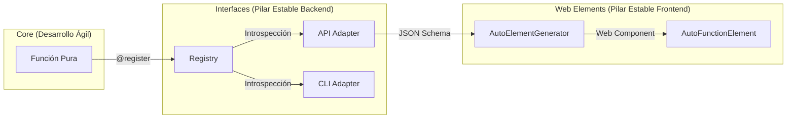

# Arquitectura de Interfaces

Este documento describe la arquitectura del sistema de interfaces de Autocode. Este módulo, junto con `autocode/web/elements/`, conforma el **núcleo de infraestructura estable** del proyecto, permitiendo un desarrollo ágil donde la infraestructura se adapta automáticamente al código.

## 🏛️ Filosofía: El Pilar de Estabilidad

El principio rector de este módulo es la **Estabilidad**.

*   **Infraestructura Inmutable:** Este código no debería cambiar frecuentemente. Provee los rieles estandarizados por los que viajan los datos.
*   **Adaptación Automática:** Si el negocio cambia (se añade una función en Core), la interfaz se adapta sola. No se edita `api.py` para añadir un endpoint.
*   **Simetría Backend/Frontend:**
    *   `autocode/interfaces/` expone automáticamente el Core al mundo (API/CLI).
    *   `autocode/web/elements/` consume esa exposición y genera UI automáticamente.

## 🏗️ Visión General

El sistema utiliza un patrón de **Registry-Driven Architecture**. Las interfaces son "Thin Layers" agnósticas al dominio que orquestan el flujo de datos basándose estrictamente en la metadata del Registry.

### Diagrama de Flujo Completo

## 🧩 Componentes Principales

### 1. `registry.py` (La Fuente de la Verdad)
Es el corazón del framework. Garantiza que la definición de una función en Python sea la única fuente de verdad para:
*   Validación de argumentos (CLI y API).
*   Documentación (Docstrings a Help text).
*   Tipado (Type hints a JSON Schema).

### 2. `models.py` (El Contrato Universal)
Define los protocolos estrictos que aseguran la interoperabilidad.
*   **`GenericOutput`**: El contrato innegociable. Toda función debe retornar éxito, resultado y mensaje. Esto permite que el frontend (`AutoFunctionController`) maneje errores y estados de carga de forma genérica para *cualquier* función.

### 3. `api.py` / `cli.py` / `mcp.py` (Los Adaptadores)
Son traductores universales. No saben *qué* hace la función, solo saben *cómo* invocarla.
*   **Diseño de Código:** Usan metaprogramación y generación dinámica de modelos Pydantic para no requerir mantenimiento manual al agregar funciones.

## 🚫 Guía de "No-Intervención"

A diferencia de otros módulos, aquí **no** se busca extensión constante.

### Cuándo NO tocar este módulo (99% de los casos)
*   ❌ Para agregar una nueva funcionalidad de negocio -> Hazlo en `autocode/core/`.
*   ❌ Para exponer una nueva función -> Solo usa el decorador `@register_function`.
*   ❌ Para cambiar cómo se ve el output -> Hazlo en el frontend o en el `GenericOutput` de la función.

### Cuándo SÍ tocar este módulo (Casos de Infraestructura)
*   ✅ Para corregir un bug de seguridad en la autenticación API.
*   ✅ Para mejorar el sistema de logging global.
*   ✅ Para soportar un nuevo protocolo de transporte fundamental (ej: Websockets o gRPC) que aplique a *todas* las funciones.

## 🔄 Paralelismo con Web Elements

Existe una simetría intencional entre el Backend y el Frontend:

| Concepto | Interfaces (Backend) | Web Elements (Frontend) |
|----------|----------------------|-------------------------|
| **Metadata** | `registry.py` | `/functions/details` (API) |
| **Generador** | `api.py` (Endpoints dinámicos) | `AutoElementGenerator` |
| **Contrato** | `GenericOutput` | `AutoFunctionController.result` |
| **Adaptador** | `ParamSchema` | `renderParam()` |

Esta simetría cierra el ciclo de desarrollo:
1.  Escribes `def my_func(...)` en Python.
2.  `interfaces` la expone automáticamente.
3.  `web/elements` crea el componente `<auto-my-func>` automáticamente.
4.  Tienes una UI funcional en segundos sin tocar infraestructura.
