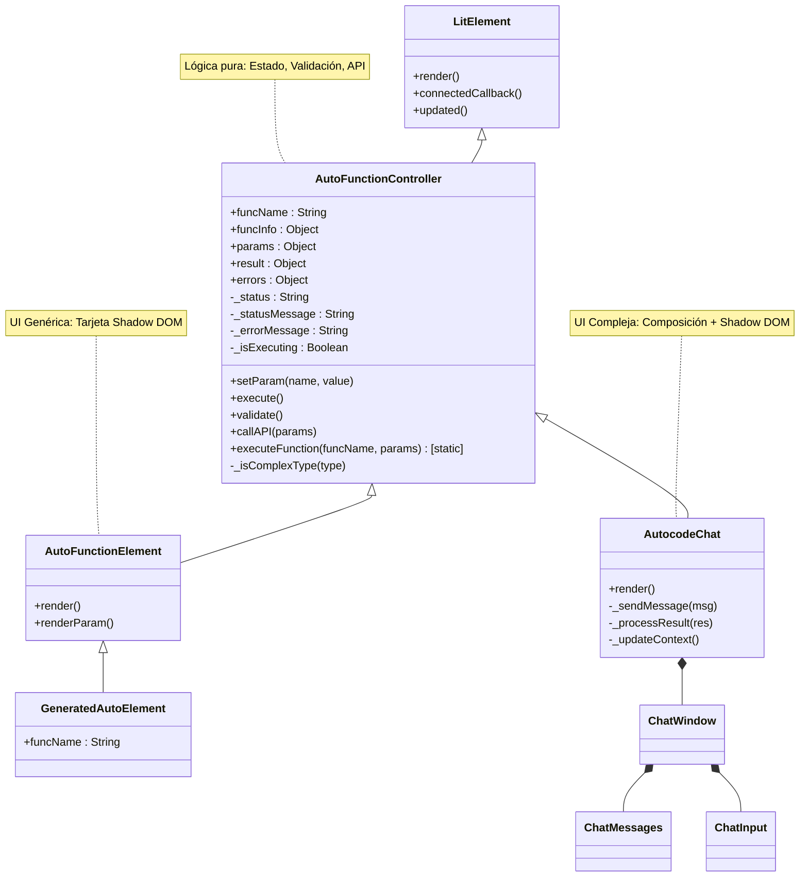

# Arquitectura de Elementos Automáticos

Este documento describe la arquitectura del sistema de generación automática de Web Components en Autocode. El sistema está diseñado siguiendo el patrón **Separation of Concerns (SoC)**, desacoplando la lógica de negocio de la interfaz de usuario.

## 🏗️ Visión General

El objetivo es generar automáticamente componentes web funcionales (`<auto-function>`) a partir de las definiciones de funciones registradas en el backend (Python), permitiendo al mismo tiempo una personalización total de la UI cuando sea necesario (como en el caso del Chat).

### Jerarquía de Clases



## 🧩 Componentes Core

### 1. `AutoFunctionController` (Lógica Pura)
Es la clase base que maneja toda la "inteligencia" del componente. **No tiene UI**.

*   **Responsabilidades**:
    *   Gestión del estado reactivo (`params`, `result`, `status`, `errors`).
    *   Comunicación con la API (`callAPI`). Soporta GET (query params) y POST (JSON body).
    *   Validación de datos (`validate`). Soporta tipos complejos (`dict`, `list`, `json`) via `_isComplexType`.
    *   Gestión de eventos:
        *   `function-connected`: Disparado al cargar la metadata.
        *   `params-changed`: Al modificar un parámetro.
        *   `before-execute`: Antes de llamar a la API (cancelable).
        *   `after-execute`: Al recibir respuesta exitosa.
        *   `execute-error`: Al fallar la ejecución.
    *   **Carga de metadatos**: Si se proporciona el atributo `func-name`, valida y carga automáticamente la información de la función desde el registry.
    *   **Ejecución inter-funciones**: Método estático `executeFunction()` para llamar funciones sin crear elementos DOM.

### 2. `AutoFunctionElement` (UI Genérica)
Es la implementación visual por defecto para los elementos generados automáticamente.

*   **Diseño**: Simple y autocontenido. No usa slots ni variables CSS complejas.
*   **Responsabilidades**:
    *   Proveer una UI estándar tipo "Tarjeta".
    *   Visualizar inputs y resultados.
*   **Nota**: Esta clase **no está diseñada para ser extendida** para personalización. Si necesitas una UI diferente, crea tu propio componente extendiendo `AutoFunctionController`.

### 3. `AutoElementGenerator` (Fábrica)
Es el servicio que consulta el registro de funciones (`/functions/details`) y registra dinámicamente nuevos Custom Elements que extienden `AutoFunctionElement`.

---

## 🛠️ Guía de Desarrollo y Extensión

### Opción A: UI Personalizada Simple
Si necesitas crear un componente con una interfaz específica pero contenida en un solo elemento, extiende el controlador.

```javascript
import { html } from 'lit';
import { AutoFunctionController } from './auto-element-generator.js';

export class MyCustomElement extends AutoFunctionController {
    // ... implementación estándar
}
```

### Opción B: Patrón de Componentes Compuestos (Ejemplo: Chat)
Para interfaces complejas como `AutocodeChat`, se recomienda un enfoque de composición donde el controlador orquesta el estado pero delega la renderización a componentes especializados.

**Características Clave del Chat:**
1.  **Herencia**: Extiende `AutoFunctionController` para heredar la lógica de `execute()`, `params` y `callAPI`.
2.  **Shadow DOM**: Usa Shadow DOM real con CSS puro (sin Tailwind) para encapsulación completa.
3.  **Composición**:
    *   `chat-window`: Contenedor visual (marco).
    *   `chat-messages`: Renderizador de historial y respuestas ricas (Reasoning, Trajectories).
    *   `chat-input`: Manejo de entrada de usuario.
4.  **Flujo de Datos Unidireccional**:
    *   UI (Input) -> `setParam()` -> Controlador
    *   Controlador -> `execute()` -> API
    *   API -> `result` -> `_processResult()` -> Actualización de componentes hijos (Message List).

Este patrón permite mantener la lógica de negocio centralizada en el controlador (reutilizando validaciones y conexión API) mientras se construye una UI rica y modular.

### Opción C: Componentes Standalone (Ejemplo: Screen Recorder)
Para componentes que **no necesitan backend**, el patrón recomendado es extender directamente `LitElement` sin heredar de `AutoFunctionController`.

**Ejemplo: Screen Recorder**
```javascript
import { LitElement, html } from 'lit';

export class ScreenRecorder extends LitElement {
    constructor() {
        super();
        this._service = new RecorderService(); // Lógica pura
    }
    
    render() {
        return html`
            <recorder-controls .isRecording=${this._isRecording}>
            </recorder-controls>
            ${this._showPlayer ? html`
                <video-player .blob=${this._recordingBlob}>
                </video-player>
            ` : ''}
        `;
    }
}
```

**Características Clave:**
1.  **Sin Backend**: No hace llamadas API, toda la lógica está en el navegador.
2.  **Servicios Puros**: La lógica compleja (ej: `RecorderService`) se encapsula en clases separadas.
3.  **Composición**: Usa sub-componentes especializados (similar al chat).
4.  **Reutiliza Estilos**: Importa tokens del sistema de diseño existente.
5.  **API Programática**: Expone métodos públicos para control externo.

**Estructura Típica:**
```
screen-recorder/
├── index.js                 # Orquestador principal (LitElement)
├── recorder-service.js      # Lógica pura (clase vanilla)
├── recorder-controls.js     # UI de controles (LitElement)
├── video-player.js          # UI del reproductor (LitElement)
├── styles/
│   ├── theme.js            # Importa tokens compartidos
│   ├── recorder-controls.styles.js
│   └── video-player.styles.js
```

**Cuándo usar este patrón:**
- ✅ Componentes de UI pura (file explorer, media players)
- ✅ Utilidades del navegador (grabación, clipboard, geolocation)
- ✅ Visualizaciones que no requieren datos del servidor
- ❌ Componentes que necesitan ejecutar funciones del registry

---

## 🔗 Comunicación Inter-Funciones

### Método Estático `executeFunction()`

Para llamar a funciones del registry desde otros componentes sin crear elementos en el DOM:

```javascript
// Ejemplo: El chat calculando uso de contexto
const result = await AutoFunctionController.executeFunction(
    'calculate_context_usage',
    { model: 'gpt-4', messages: [...] }
);
```

**Características**:
- ✅ Reutiliza toda la infraestructura del controller
- ✅ Validación automática de parámetros
- ✅ Error handling estandarizado
- ✅ Emite eventos del ciclo de vida
- ✅ No contamina el DOM

**Casos de Uso**:
1. **Funciones auxiliares**: Calcular tokens, validar datos, etc.
2. **Composición de funcionalidades**: Una función que llama a otra
3. **Background tasks**: Operaciones que no necesitan UI

**Ejemplo Completo**:

```javascript
export class AutocodeChat extends AutoFunctionController {
    async _updateContext() {
        const messages = [...this.conversationHistory];
        
        try {
            // Llamar a otra función sin crear elementos DOM
            const result = await AutoFunctionController.executeFunction(
                'calculate_context_usage',
                { 
                    model: this.getParam('model'),
                    messages 
                }
            );
            
            const { current, max } = result;
            this._contextBar?.update(current, max);
        } catch (e) {
            console.warn('⚠️ Error calculating context:', e);
        }
    }
}
```

---

## ⚠️ Reglas de Oro

1.  **Usa `setParam(key, value)`**: Nunca modifiques `this.params` directamente. Usa `setParam` para asegurar la reactividad.
2.  **Validación State-Driven**: El controlador valida los datos en memoria. La UI solo debe encargarse de reflejar el estado y capturar input.
3.  **FuncInfo**: El controlador necesita `this.funcInfo` para operar. Se carga automáticamente si existe `func-name` en el constructor.
4.  **Inter-Function Calls**: Usa `AutoFunctionController.executeFunction()` en lugar de `fetch` directo para mantener consistencia.
5.  **Hook `updated()`**: Cuando extiendas el controller, usa el hook `updated(changedProperties)` para reaccionar a cambios en `funcInfo` u otras propiedades reactivas.

---

## 📚 Patrones Comunes

### Carga de Metadata Automática

```javascript
export class MyComponent extends AutoFunctionController {
    constructor() {
        super();
        this.funcName = 'my_function'; // ← Activa carga automática
    }
    
    // El controller carga funcInfo automáticamente en connectedCallback()
    
    updated(changedProperties) {
        super.updated(changedProperties);
        
        // Reaccionar cuando funcInfo se cargue
        if (changedProperties.has('funcInfo') && this.funcInfo) {
            console.log('Metadata cargada:', this.funcInfo);
            // Inicializar UI, settings, etc.
        }
    }
}
```

### Sincronización de Settings

```javascript
_handleSettingsChange(e) {
    const settings = e.detail;
    
    // Sincronizar todos los settings con el estado del controller
    Object.entries(settings).forEach(([key, value]) => {
        this.setParam(key, value); // ← Usa API del controller
    });
    
    this.requestUpdate(); // Forzar re-render si es necesario
}
```

### Gestión de Historial (Chat)

```javascript
async _sendMessage(message) {
    // 1. UI optimista
    this._messages.addMessage('user', message);
    
    // 2. Actualizar estado
    this.setParam('message', message);
    this.setParam('conversation_history', this._formatHistory());
    
    // 3. Ejecutar (hereda del controller)
    await this.execute();
    
    // 4. Procesar resultado
    this._processResult(this.result);
}
```

---

## 📦 Comparación de Patrones

| Aspecto | AutoFunctionElement | Compuesto (Chat) | Standalone (Recorder) |
|---------|-------------------|------------------|----------------------|
| **Herencia** | `AutoFunctionController` | `AutoFunctionController` | `LitElement` |
| **Backend** | ✅ Sí (registry) | ✅ Sí (registry) | ❌ No |
| **Composición** | No (monolítico) | Sí (multi-componente) | Sí (multi-componente) |
| **Validación** | Automática | Automática | Manual |
| **Ejemplo** | `<auto-calculator>` | `<autocode-chat>` | `<screen-recorder>` |

---

## 🐛 Debugging Tips

### Inspeccionar Estado del Controller

```javascript
// En la consola del navegador:
const chat = document.querySelector('autocode-chat');
console.log('Params:', chat.params);
console.log('FuncInfo:', chat.funcInfo);
console.log('Result:', chat.result);
console.log('Errors:', chat.errors);
```

### Verificar Carga de Metadata

```javascript
// Escuchar evento de conexión
document.addEventListener('function-connected', (e) => {
    console.log('Function connected:', e.detail);
});
```

### Test de executeFunction()

```javascript
// Test manual en consola
const result = await AutoFunctionController.executeFunction(
    'hello_world',
    { name: 'Test' }
);
console.log(result);
```
