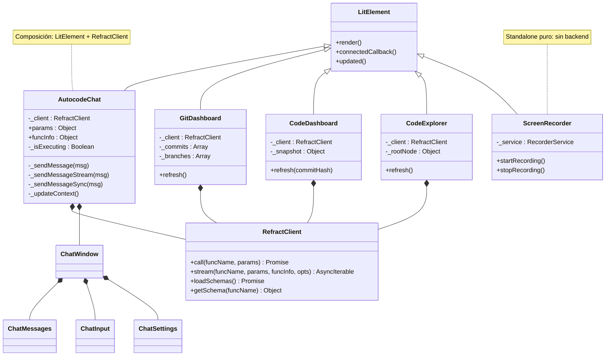
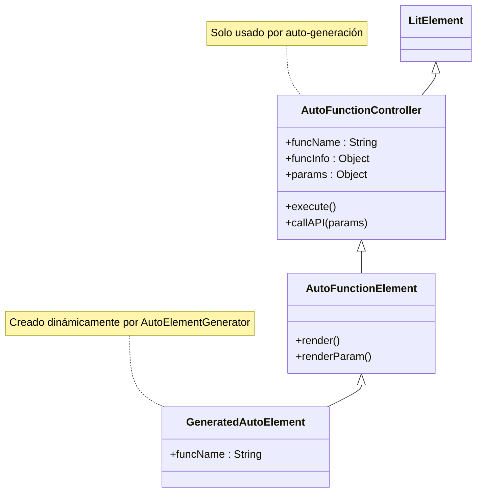

# Arquitectura de Elementos Web

Este documento describe la arquitectura actual del sistema de Web Components en Autocode. El sistema está diseñado siguiendo el patrón **Composición sobre Herencia**: todos los componentes extienden `LitElement` directamente y usan `RefractClient` por composición para la comunicación con el backend.

> **Nota histórica**: Una versión anterior usaba `AutoFunctionController` como clase base heredable. Esa arquitectura fue refactorizada a composición. `AutoFunctionController` sigue existiendo pero **solo** es usado por `AutoFunctionElement` (elementos auto-generados desde el registry). Ningún componente "real" hereda de él.

---

## 🏗️ Visión General

### Patrón Universal

**Todos** los componentes del proyecto siguen el mismo patrón base:

```
extends LitElement
    ↓
this._client = new RefractClient()   ← (solo si necesitan backend)
    ↓
this._client.call('func_name', params)
```

### Jerarquía de Clases


```mermaid
classDiagram
    direction TB

    LitElement <|-- AutocodeChat
    LitElement <|-- GitDashboard
    LitElement <|-- CodeDashboard
    LitElement <|-- CodeExplorer
    LitElement <|-- ScreenRecorder

    AutocodeChat *-- RefractClient
    GitDashboard *-- RefractClient
    CodeDashboard *-- RefractClient
    CodeExplorer *-- RefractClient

    AutocodeChat *-- ChatWindow
    ChatWindow *-- ChatMessages
    ChatWindow *-- ChatInput
    ChatWindow *-- ChatSettings

    class LitElement {
        +render()
        +connectedCallback()
        +updated()
    }

    class RefractClient {
        +call(funcName, params) Promise
        +stream(funcName, params, funcInfo, opts) AsyncIterable
        +loadSchemas() Promise
        +getSchema(funcName) Object
    }

    class AutocodeChat {
        -_client : RefractClient
        +params : Object
        +funcInfo : Object
        -_isExecuting : Boolean
        -_sendMessage(msg)
        -_sendMessageStream(msg)
        -_sendMessageSync(msg)
        -_updateContext()
    }

    class GitDashboard {
        -_client : RefractClient
        -_commits : Array
        -_branches : Array
        +refresh()
    }

    class CodeDashboard {
        -_client : RefractClient
        -_snapshot : Object
        +refresh(commitHash)
    }

    class CodeExplorer {
        -_client : RefractClient
        -_rootNode : Object
        +refresh()
    }

    class ScreenRecorder {
        -_service : RecorderService
        +startRecording()
        +stopRecording()
    }

    note for AutocodeChat "Composición: LitElement + RefractClient"
    note for ScreenRecorder "Standalone puro: sin backend"
```

### Auto-generación (papel actual de AutoFunctionController)


```mermaid
classDiagram
    direction TB

    LitElement <|-- AutoFunctionController
    AutoFunctionController <|-- AutoFunctionElement
    AutoFunctionElement <|-- GeneratedAutoElement

    class AutoFunctionController {
        +funcName : String
        +funcInfo : Object
        +params : Object
        +execute()
        +callAPI(params)
    }

    class AutoFunctionElement {
        +render()
        +renderParam()
    }

    class GeneratedAutoElement {
        +funcName : String
    }

    note for AutoFunctionController "Solo usado por auto-generación"
    note for GeneratedAutoElement "Creado dinámicamente por AutoElementGenerator"
```

---

## 🎨 Sistema de Diseño Compartido

El proyecto utiliza un **sistema de tokens de diseño centralizado** para mantener consistencia visual en todos los componentes. Este sistema está ubicado en `shared/styles/` y es utilizado por todos los componentes.

### Estructura

```
shared/
└── styles/
    ├── theme.js      # Tokens de diseño globales (colores, espaciado, tipografía, etc.)
    └── common.js     # Utilidades CSS reutilizables (badges, botones, spinners)
```

### Tokens Disponibles (`theme.js`)

El sistema exporta más de **100 variables CSS** organizadas en categorías:

#### Colores
- **Principales**: `--design-primary`, `--design-primary-light`, `--design-primary-dark`
- **Texto**: `--design-text-primary`, `--design-text-secondary`, `--design-text-tertiary`
- **Fondos**: `--design-bg-white`, `--design-bg-gray-50`, `--design-bg-gray-100`
- **Estados**: `--design-success`, `--design-warning`, `--design-danger`, `--design-error-*`
- **Dark Mode**: `--dark-bg-primary`, `--dark-bg-secondary`, `--dark-border`, `--dark-text-*`

#### Espaciado
- De `xs` a `3xl`: `--design-spacing-xs` (0.25rem) a `--design-spacing-3xl` (2rem)

#### Border Radius
- De `sm` a `full`: `--design-radius-sm` (0.25rem) a `--design-radius-full` (9999px)

#### Sombras
- 6 niveles: `--design-shadow-xs` a `--design-shadow-2xl`

#### Tipografía
- **Familias**: `--design-font-family`, `--design-font-mono`
- **Tamaños**: `--design-font-size-xs` a `--design-font-size-xl`
- **Pesos**: `--design-font-weight-normal` a `--design-font-weight-bold`
- **Line Height**: `--design-line-height-tight`, `normal`, `relaxed`

#### Transiciones
- `--design-transition-fast` (0.1s), `base` (0.2s), `slow` (0.3s)

#### Z-Index
- `--design-z-dropdown` (50), `--design-z-modal` (100), `--design-z-tooltip` (110)

### Utilidades CSS (`common.js`)

Exporta estilos reutilizables como `css` template literals:

- **`badgeBase`**: Estilos para badges/chips
- **`ghostButton`**: Botón transparente con hover
- **`spinnerStyles`**: Animación de loading circular

### Patrón de Re-exportación

Para mantener compatibilidad con componentes existentes, los módulos de estilos locales re-exportan desde `shared/styles/`:

```javascript
// chat/styles/theme.js
export { themeTokens } from '../../shared/styles/theme.js';

// screen-recorder/styles/theme.js
export { themeTokens } from '../../shared/styles/theme.js';
export { badgeBase, ghostButton } from '../../shared/styles/common.js';
```

### Uso en Componentes

```javascript
import { css } from 'lit';
import { themeTokens } from '../../shared/styles/theme.js';
import { spinnerStyles } from '../../shared/styles/common.js';

export const myStyles = css`
    ${themeTokens}    // ← Inyecta todas las variables CSS
    ${spinnerStyles}  // ← Agrega utilidades específicas

    :host {
        display: block;
        padding: var(--design-spacing-md);
        background: var(--dark-bg-primary);
        border-radius: var(--design-radius-md);
        color: var(--dark-text-primary);
    }

    .my-button {
        padding: var(--design-spacing-sm) var(--design-spacing-lg);
        background: var(--design-primary);
        border-radius: var(--design-radius-sm);
        transition: opacity var(--design-transition-base);
    }
`;
```

---

## 🧩 Componentes Core

### `RefractClient` (Capa de Comunicación)

El cliente HTTP que todos los componentes con backend usan por composición. Se importa desde `/refract/client.js`.

**API principal:**

```javascript
// Llamada síncrona — devuelve el resultado directamente
const result = await this._client.call('func_name', { param1: value1 });

// Streaming SSE — devuelve un AsyncIterable de eventos
for await (const event of this._client.stream('func_stream', params, funcInfo, { signal })) {
    // event.event: 'token' | 'status' | 'complete' | 'error'
    // event.data: payload del evento
}

// Cargar schemas del registry (con cache interno)
await this._client.loadSchemas();
const funcInfo = this._client.getSchema('func_name'); // null si no existe
```

**Manejo de errores:**
- `call()` lanza excepciones en caso de error HTTP — usar `try/catch`
- `stream()` emite eventos `{ event: 'error', data: {...} }` para errores del servidor

### `AutoFunctionController` + `AutoFunctionElement` (Auto-generación)

Conjunto de clases para generar automáticamente Web Components a partir del registry de funciones del backend.

- **`AutoFunctionController`**: Clase base con lógica de estado, validación y API. No tiene UI propia.
- **`AutoFunctionElement`**: UI genérica tipo "tarjeta" para elementos auto-generados.
- **`AutoElementGenerator`**: Servicio que consulta `/functions/details` y registra dinámicamente nuevos Custom Elements.

> **Cuándo usarlos**: Solo para exponer funciones del registry con una UI genérica (`<auto-calculator>`, etc.). Para componentes con lógica propia, usa el patrón `LitElement` + `RefractClient`.

---

## 🛠️ Guía de Desarrollo: Dos Patrones

### Patrón 1: Componente con Backend (`LitElement` + `RefractClient`)

Para cualquier componente que necesite llamar al backend. Es el patrón estándar del proyecto.

```javascript
import { LitElement, html, css } from 'https://cdn.jsdelivr.net/gh/lit/dist@3/core/lit-core.min.js';
import { RefractClient } from '/refract/client.js';
import { themeTokens } from '../shared/styles/theme.js';
import { spinnerStyles } from '../shared/styles/common.js';

export class MyDashboard extends LitElement {
    static properties = {
        _data: { state: true },
        _loading: { state: true },
        _error: { state: true },
    };

    static styles = [themeTokens, spinnerStyles, css`
        :host {
            display: block;
            padding: var(--design-spacing-md);
        }
    `];

    constructor() {
        super();
        this._client = new RefractClient();  // ← Composición, no herencia
        this._data = null;
        this._loading = false;
        this._error = null;
    }

    async connectedCallback() {
        super.connectedCallback();
        await this.refresh();
    }

    async refresh() {
        this._loading = true;
        this._error = null;
        try {
            this._data = await this._client.call('my_function', { param: 'value' });
        } catch (e) {
            this._error = e.message;
        } finally {
            this._loading = false;
        }
    }

    render() {
        if (this._loading) return html`<div class="spinner"></div>`;
        if (this._error) return html`<div class="error">${this._error}</div>`;
        return html`<div>${JSON.stringify(this._data)}</div>`;
    }
}

customElements.define('my-dashboard', MyDashboard);
```

**Estructura típica de archivos:**
```
my-component/
├── index.js                 # Orquestador principal (LitElement + RefractClient)
├── sub-component-a.js       # Sub-componente UI (LitElement puro)
├── sub-component-b.js       # Sub-componente UI (LitElement puro)
├── styles/
│   ├── theme.js             # Re-exporta desde shared/styles/theme.js
│   └── my-component.styles.js
```

### Patrón 2: Componente Standalone (`LitElement` puro)

Para componentes que no necesitan backend — toda la lógica está en el navegador.

```javascript
import { LitElement, html } from 'https://cdn.jsdelivr.net/gh/lit/dist@3/core/lit-core.min.js';
import { themeTokens } from '../shared/styles/theme.js';
import { MyService } from './my-service.js';  // Lógica pura (clase vanilla)

export class MyWidget extends LitElement {
    static properties = {
        _active: { state: true },
    };

    static styles = [themeTokens];

    constructor() {
        super();
        this._service = new MyService();  // Lógica encapsulada en clase vanilla
        this._active = false;
    }

    render() {
        return html`
            <button @click=${this._handleToggle}>
                ${this._active ? 'Activo' : 'Inactivo'}
            </button>
        `;
    }

    async _handleToggle() {
        await this._service.toggle();
        this._active = this._service.isActive();
    }
}

customElements.define('my-widget', MyWidget);
```

**Cuándo usar este patrón:**
- ✅ Componentes de UI pura (file explorer, media players)
- ✅ Utilidades del navegador (grabación, clipboard, geolocation)
- ✅ Visualizaciones que no requieren datos del servidor
- ❌ Componentes que necesitan ejecutar funciones del registry → usar Patrón 1

---

## 🔗 Comunicación con el Backend

### Llamada Estándar (`call`)

```javascript
// Dentro de un componente
async _loadData() {
    try {
        const result = await this._client.call('get_git_log', {
            max_count: 50,
            branch: '',
        });
        this._commits = result.commits || [];
    } catch (error) {
        this._error = error.message;
    }
}
```

### Streaming SSE (`stream`)

Para endpoints que emiten eventos SSE durante la ejecución:

```javascript
async _sendMessageStream(message) {
    const abortController = new AbortController();

    for await (const event of this._client.stream(
        'chat_stream',
        this.params,
        this._streamFuncInfo,
        { signal: abortController.signal }
    )) {
        switch (event.event) {
            case 'token':
                // Evento incremental — acumular texto
                fullText += event.data.chunk;
                break;

            case 'status':
                // Actualización de progreso
                this._setStatus('loading', event.data.message);
                break;

            case 'complete':
                // Resultado final
                this._result = event.data;
                break;

            case 'error':
                // Error del servidor
                console.error('Stream error:', event.data.message);
                break;
        }
    }
}
```

### Carga de Schemas del Registry

Para componentes que necesitan los metadatos de una función (parámetros, tipos, defaults):

```javascript
async connectedCallback() {
    super.connectedCallback();
    await this._client.loadSchemas();                    // Cache compartido
    this.funcInfo = this._client.getSchema('chat');      // null si no existe
}
```

### Llamadas Inter-Componente

Para llamar a una función del backend desde cualquier contexto (sin crear elementos DOM):

```javascript
// Antes: AutoFunctionController.executeFunction('func', params) — OBSOLETO
// Ahora: usar una instancia de RefractClient

const client = new RefractClient();
const result = await client.call('calculate_context_usage', {
    model: 'openai/gpt-4o',
    messages: [...]
});
```

---

## ⚠️ Reglas de Oro

1. **Composición, no herencia**: Usa `this._client = new RefractClient()` en el constructor. Nunca extiendas `AutoFunctionController` para nuevos componentes.

2. **Estado inmutable**: Nunca mutes arrays/objetos de estado directamente. Crea nuevas referencias para activar la reactividad de Lit:
   ```javascript
   // ❌ Mal
   this._commits.push(newCommit);
   // ✅ Bien
   this._commits = [...this._commits, newCommit];
   ```

3. **AbortController para streams**: Siempre guarda el `AbortController` de un stream activo y llama a `.abort()` en `disconnectedCallback()` o al iniciar un nuevo stream.

4. **Manejo de errores consistente**: Usa el patrón `_loading` / `_error` / dato con `try/catch/finally` en todos los métodos async que llamen al backend.

5. **Estilos con tokens**: Nunca uses valores hardcodeados para colores, espaciado o tipografía. Siempre usa variables del sistema de diseño (`var(--design-spacing-md)`, etc.).

6. **`updated()` para reaccionar a cambios**: Usa el hook `updated(changedProperties)` para inicializar UI cuando lleguen datos async:
   ```javascript
   updated(changedProperties) {
       if (changedProperties.has('funcInfo') && this.funcInfo) {
           this._settings?.configure(this.funcInfo);
       }
   }
   ```

---

## 📦 Comparación de Componentes Actuales

| Aspecto | `autocode-chat` | `git-dashboard` | `code-dashboard` | `code-explorer` | `screen-recorder` |
|---------|----------------|-----------------|-----------------|-----------------|-------------------|
| **Herencia** | `LitElement` | `LitElement` | `LitElement` | `LitElement` | `LitElement` |
| **Backend** | ✅ `RefractClient` | ✅ `RefractClient` | ✅ `RefractClient` | ✅ `RefractClient` | ❌ No |
| **Streaming** | ✅ SSE | ❌ No | ❌ No | ❌ No | ❌ No |
| **Composición** | Multi-componente | Multi-componente | Multi-componente | Multi-componente | Multi-componente |
| **Sub-componentes** | chat-window, chat-messages, chat-input, chat-settings | commit-node, commit-detail, git-status | treemap-view, dependency-graph, metrics-panel | code-node, code-metrics | recorder-controls, video-player |

---

## 📚 Patrones Comunes

### Carga de Datos al Conectar

```javascript
async connectedCallback() {
    super.connectedCallback();
    await this.refresh();
}

async refresh() {
    this._loading = true;
    this._error = null;
    try {
        const result = await this._client.call('my_function', {});
        this._data = result;
    } catch (e) {
        this._error = e.message;
        console.error('❌ Error loading data:', e);
    } finally {
        this._loading = false;
    }
}
```

### Propagación de Cambios entre Sub-componentes

Usa Custom Events para comunicación hijo → padre, y propiedades (`.prop=${value}`) para padre → hijo:

```javascript
// Sub-componente emite evento
this.dispatchEvent(new CustomEvent('item-selected', {
    detail: { item },
    bubbles: true,
    composed: true,
}));

// Componente padre escucha
connectedCallback() {
    super.connectedCallback();
    this.addEventListener('item-selected', this._handleItemSelected.bind(this));
}

_handleItemSelected(e) {
    this._selectedItem = e.detail.item;
}
```

### Importación de Estilos Compartidos

```javascript
// archivo-de-estilos.styles.js
import { css } from 'lit';
import { themeTokens } from '../../shared/styles/theme.js';
import { spinnerStyles, badgeBase } from '../../shared/styles/common.js';

export const miComponenteStyles = css`
    ${themeTokens}       // ← Variables CSS globales
    ${spinnerStyles}     // ← Animación de spinner (opcional)
    ${badgeBase}         // ← Estilos de badges (opcional)

    :host {
        padding: var(--design-spacing-md);
        background: var(--dark-bg-primary);
        border-radius: var(--design-radius-md);
        color: var(--dark-text-primary);
        font-family: var(--design-font-family);
    }

    .button {
        padding: var(--design-spacing-sm) var(--design-spacing-lg);
        background: var(--design-primary);
        border-radius: var(--design-radius-sm);
        transition: all var(--design-transition-base);
        font-size: var(--design-font-size-base);
        font-weight: var(--design-font-weight-medium);
    }
`;
```

**Recomendaciones:**
- ✅ Siempre importar `themeTokens` como primera línea de estilos
- ✅ Usar variables CSS en lugar de valores hardcodeados
- ✅ Importar solo las utilidades que necesites
- ✅ Mantener un archivo separado para estilos complejos (`component.styles.js`)
- ❌ No redefinir variables que ya existen en el sistema
- ❌ No usar valores absolutos para colores, espaciado o tipografía

---

## 🐛 Debugging Tips

### Inspeccionar Estado de un Componente

```javascript
// En la consola del navegador:
const chat = document.querySelector('autocode-chat');
console.log('Params:', chat.params);
console.log('FuncInfo:', chat.funcInfo);
console.log('Client:', chat._client);

const dashboard = document.querySelector('git-dashboard');
console.log('Commits:', dashboard._commits);
console.log('Error:', dashboard._error);
```

### Test de RefractClient en Consola

```javascript
// Test manual — instanciar cliente directamente
const client = new RefractClient();

// Llamada estándar
const result = await client.call('get_git_log', { max_count: 5 });
console.log(result);

// Ver schemas disponibles
await client.loadSchemas();
console.log(client.getSchema('chat'));
```

### Verificar que el Registry Responde

```javascript
const client = new RefractClient();
await client.loadSchemas();
// Si no lanza error, el registry está disponible
console.log('✅ Registry OK');
```
