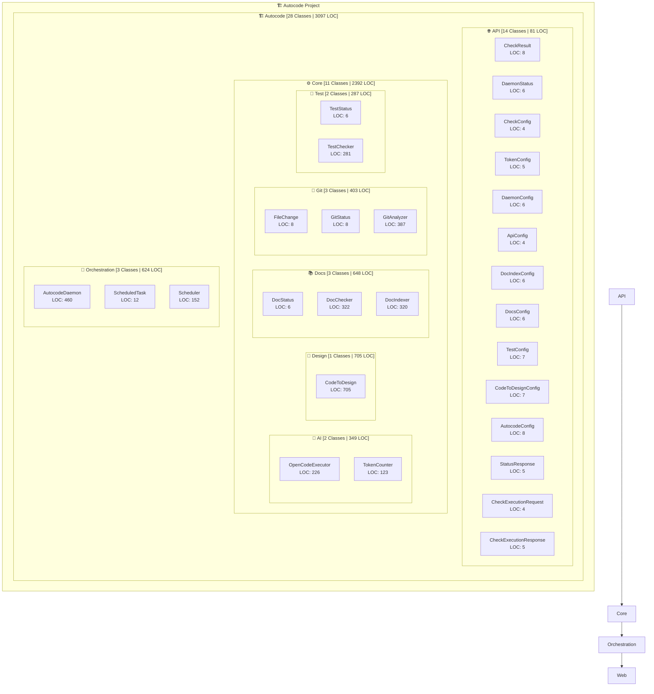

# 🏗️ Autocode Architecture Overview

**Project Summary:** 28 Classes | 3,097 LOC | 11 Modules

## Module Details

### Autocode
- **Classes:** 28
- **Lines of Code:** 3,097
- **Average LOC per Class:** 110
- **Submodules:** 5

### Autocode > Api
- **Classes:** 14
- **Lines of Code:** 81
- **Average LOC per Class:** 5

### Autocode > Core
- **Classes:** 11
- **Lines of Code:** 2,392
- **Average LOC per Class:** 217
- **Submodules:** 5

### Autocode > Core > Ai
- **Classes:** 2
- **Lines of Code:** 349
- **Average LOC per Class:** 174

### Autocode > Core > Design
- **Classes:** 1
- **Lines of Code:** 705
- **Average LOC per Class:** 705

### Autocode > Core > Docs
- **Classes:** 3
- **Lines of Code:** 648
- **Average LOC per Class:** 216

### Autocode > Core > Git
- **Classes:** 3
- **Lines of Code:** 403
- **Average LOC per Class:** 134

### Autocode > Core > Test
- **Classes:** 2
- **Lines of Code:** 287
- **Average LOC per Class:** 143

### Autocode > Orchestration
- **Classes:** 3
- **Lines of Code:** 624
- **Average LOC per Class:** 208

