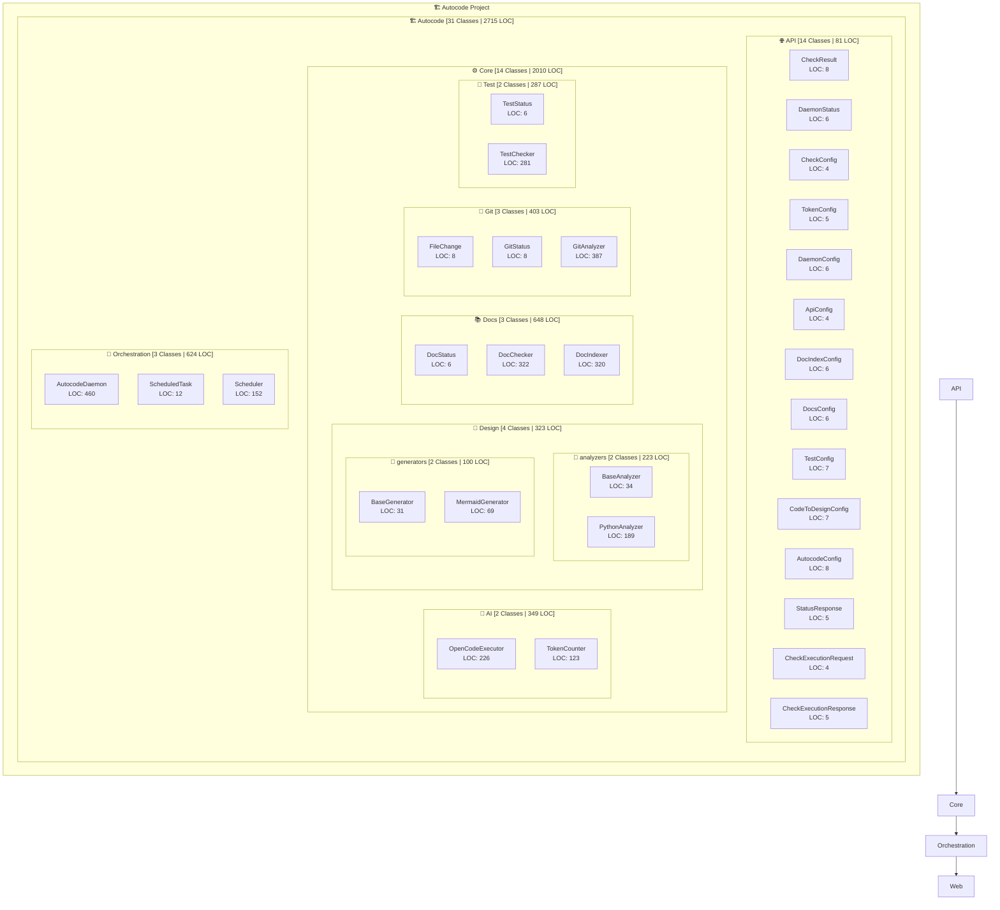

# 🏗️ Autocode Architecture Overview

**Project Summary:** 31 Classes | 2,715 LOC | 13 Modules

## Module Details

### Autocode
- **Classes:** 31
- **Lines of Code:** 2,715
- **Average LOC per Class:** 87
- **Submodules:** 5

### Autocode > Api
- **Classes:** 14
- **Lines of Code:** 81
- **Average LOC per Class:** 5

### Autocode > Core
- **Classes:** 14
- **Lines of Code:** 2,010
- **Average LOC per Class:** 143
- **Submodules:** 5

### Autocode > Core > Ai
- **Classes:** 2
- **Lines of Code:** 349
- **Average LOC per Class:** 174

### Autocode > Core > Design
- **Classes:** 4
- **Lines of Code:** 323
- **Average LOC per Class:** 80
- **Submodules:** 2

### Autocode > Core > Design > Analyzers
- **Classes:** 2
- **Lines of Code:** 223
- **Average LOC per Class:** 111

### Autocode > Core > Design > Generators
- **Classes:** 2
- **Lines of Code:** 100
- **Average LOC per Class:** 50

### Autocode > Core > Docs
- **Classes:** 3
- **Lines of Code:** 648
- **Average LOC per Class:** 216

### Autocode > Core > Git
- **Classes:** 3
- **Lines of Code:** 403
- **Average LOC per Class:** 134

### Autocode > Core > Test
- **Classes:** 2
- **Lines of Code:** 287
- **Average LOC per Class:** 143

### Autocode > Orchestration
- **Classes:** 3
- **Lines of Code:** 624
- **Average LOC per Class:** 208

