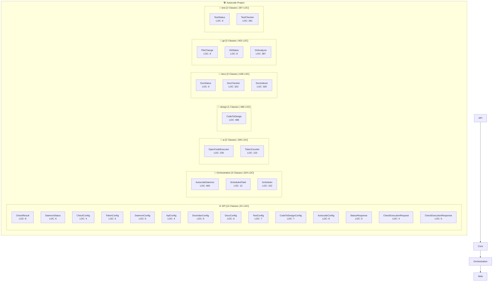

# 🏗️ Autocode Architecture Overview

**Project Summary:** 28 Classes | 2,878 LOC | 11 Modules

## 🧭 Navigation Hub

**Direct links to all classes organized by module:**

### 🌐 API Api (14 Classes | 81 LOC)

- [ApiConfig](autocode/api/models_class.md#apiconfig) - LOC: 4 | Methods: 0
- [AutocodeConfig](autocode/api/models_class.md#autocodeconfig) - LOC: 8 | Methods: 0
- [CheckConfig](autocode/api/models_class.md#checkconfig) - LOC: 4 | Methods: 0
- [CheckExecutionRequest](autocode/api/models_class.md#checkexecutionrequest) - LOC: 4 | Methods: 0
- [CheckExecutionResponse](autocode/api/models_class.md#checkexecutionresponse) - LOC: 5 | Methods: 0
- [CheckResult](autocode/api/models_class.md#checkresult) - LOC: 8 | Methods: 0
- [CodeToDesignConfig](autocode/api/models_class.md#codetodesignconfig) - LOC: 7 | Methods: 0
- [DaemonConfig](autocode/api/models_class.md#daemonconfig) - LOC: 6 | Methods: 0
- [DaemonStatus](autocode/api/models_class.md#daemonstatus) - LOC: 6 | Methods: 0
- [DocIndexConfig](autocode/api/models_class.md#docindexconfig) - LOC: 6 | Methods: 0
- [DocsConfig](autocode/api/models_class.md#docsconfig) - LOC: 6 | Methods: 0
- [StatusResponse](autocode/api/models_class.md#statusresponse) - LOC: 5 | Methods: 0
- [TestConfig](autocode/api/models_class.md#testconfig) - LOC: 7 | Methods: 0
- [TokenConfig](autocode/api/models_class.md#tokenconfig) - LOC: 5 | Methods: 0

### 🔄 Orchestration Orchestration (3 Classes | 624 LOC)

- [AutocodeDaemon](autocode/orchestration/daemon_class.md#autocodedaemon) - LOC: 460 | Methods: 11
- [ScheduledTask](autocode/orchestration/scheduler_class.md#scheduledtask) - LOC: 12 | Methods: 1
- [Scheduler](autocode/orchestration/scheduler_class.md#scheduler) - LOC: 152 | Methods: 10

### 📁 ai Ai (2 Classes | 349 LOC)

- [OpenCodeExecutor](autocode/core/ai/opencode_executor_class.md#opencodeexecutor) - LOC: 226 | Methods: 12
- [TokenCounter](autocode/core/ai/token_counter_class.md#tokencounter) - LOC: 123 | Methods: 6

### 📁 design Design (1 Classes | 486 LOC)

- [CodeToDesign](autocode/core/design/code_to_design_class.md#codetodesign) - LOC: 486 | Methods: 9

### 📁 docs Docs (3 Classes | 648 LOC)

- [DocChecker](autocode/core/docs/doc_checker_class.md#docchecker) - LOC: 322 | Methods: 20
- [DocIndexer](autocode/core/docs/doc_indexer_class.md#docindexer) - LOC: 320 | Methods: 10
- [DocStatus](autocode/core/docs/doc_checker_class.md#docstatus) - LOC: 6 | Methods: 0

### 📁 git Git (3 Classes | 403 LOC)

- [FileChange](autocode/core/git/git_analyzer_class.md#filechange) - LOC: 8 | Methods: 0
- [GitAnalyzer](autocode/core/git/git_analyzer_class.md#gitanalyzer) - LOC: 387 | Methods: 11
- [GitStatus](autocode/core/git/git_analyzer_class.md#gitstatus) - LOC: 8 | Methods: 0

### 📁 test Test (2 Classes | 287 LOC)

- [TestChecker](autocode/core/test/test_checker_class.md#testchecker) - LOC: 281 | Methods: 15
- [TestStatus](autocode/core/test/test_checker_class.md#teststatus) - LOC: 6 | Methods: 0

## Module Details

### Api
- **Classes:** 14
- **Lines of Code:** 81
- **Average LOC per Class:** 5

### Orchestration
- **Classes:** 3
- **Lines of Code:** 624
- **Average LOC per Class:** 208

### Ai
- **Classes:** 2
- **Lines of Code:** 349
- **Average LOC per Class:** 174

### Design
- **Classes:** 1
- **Lines of Code:** 486
- **Average LOC per Class:** 486

### Docs
- **Classes:** 3
- **Lines of Code:** 648
- **Average LOC per Class:** 216

### Git
- **Classes:** 3
- **Lines of Code:** 403
- **Average LOC per Class:** 134

### Test
- **Classes:** 2
- **Lines of Code:** 287
- **Average LOC per Class:** 143

