# 🏗️ Autocode Architecture Overview

**Project Summary:** 33 Classes | 3,633 LOC | 13 Modules

```mermaid
graph TD
    subgraph "🏗️ Autocode Project"
        subgraph "🏗️ Autocode [33 Classes | 3633 LOC]"
            subgraph "🌐 API [14 Classes | 82 LOC]"
                C0["CheckResult<br/>LOC: 8"]
                C1["DaemonStatus<br/>LOC: 6"]
                C2["CheckConfig<br/>LOC: 4"]
                C3["TokenConfig<br/>LOC: 5"]
                C4["DaemonConfig<br/>LOC: 6"]
                C5["ApiConfig<br/>LOC: 4"]
                C6["DocIndexConfig<br/>LOC: 6"]
                C7["DocsConfig<br/>LOC: 6"]
                C8["TestConfig<br/>LOC: 7"]
                C9["CodeToDesignConfig<br/>LOC: 8"]
                C10["AutocodeConfig<br/>LOC: 8"]
                C11["StatusResponse<br/>LOC: 5"]
                C12["CheckExecutionRequest<br/>LOC: 4"]
                C13["CheckExecutionResponse<br/>LOC: 5"]
            end
            subgraph "⚙️ Core [16 Classes | 2927 LOC]"
                subgraph "🤖 AI [2 Classes | 349 LOC]"
                    C14["OpenCodeExecutor<br/>LOC: 226"]
                    C15["TokenCounter<br/>LOC: 123"]
                end
                subgraph "🎨 Design [6 Classes | 1240 LOC]"
                    subgraph "📁 analyzers [3 Classes | 803 LOC]"
                        C16["BaseAnalyzer<br/>LOC: 34"]
                        C17["JavaScriptAnalyzer<br/>LOC: 580"]
                        C18["PythonAnalyzer<br/>LOC: 189"]
                    end
                    subgraph "📁 generators [3 Classes | 437 LOC]"
                        C19["BaseGenerator<br/>LOC: 59"]
                        C20["ComponentTreeGenerator<br/>LOC: 298"]
                        C21["MermaidGenerator<br/>LOC: 80"]
                    end
                end
                subgraph "📚 Docs [3 Classes | 648 LOC]"
                    C22["DocStatus<br/>LOC: 6"]
                    C23["DocChecker<br/>LOC: 322"]
                    C24["DocIndexer<br/>LOC: 320"]
                end
                subgraph "🔧 Git [3 Classes | 403 LOC]"
                    C25["FileChange<br/>LOC: 8"]
                    C26["GitStatus<br/>LOC: 8"]
                    C27["GitAnalyzer<br/>LOC: 387"]
                end
                subgraph "🧪 Test [2 Classes | 287 LOC]"
                    C28["TestStatus<br/>LOC: 6"]
                    C29["TestChecker<br/>LOC: 281"]
                end
            end
            subgraph "🔄 Orchestration [3 Classes | 624 LOC]"
                C30["AutocodeDaemon<br/>LOC: 460"]
                C31["ScheduledTask<br/>LOC: 12"]
                C32["Scheduler<br/>LOC: 152"]
            end
        end
    end

    %% Module relationships
    API --> Core
    Core --> Orchestration
    Orchestration --> Web

    %% Interactive links to class documentation
    click C0 "/design/autocode/api/models_class.md#checkresult" "CheckResult - LOC: 8 | Methods: 0"
    click C1 "/design/autocode/api/models_class.md#daemonstatus" "DaemonStatus - LOC: 6 | Methods: 0"
    click C2 "/design/autocode/api/models_class.md#checkconfig" "CheckConfig - LOC: 4 | Methods: 0"
    click C3 "/design/autocode/api/models_class.md#tokenconfig" "TokenConfig - LOC: 5 | Methods: 0"
    click C4 "/design/autocode/api/models_class.md#daemonconfig" "DaemonConfig - LOC: 6 | Methods: 0"
    click C5 "/design/autocode/api/models_class.md#apiconfig" "ApiConfig - LOC: 4 | Methods: 0"
    click C6 "/design/autocode/api/models_class.md#docindexconfig" "DocIndexConfig - LOC: 6 | Methods: 0"
    click C7 "/design/autocode/api/models_class.md#docsconfig" "DocsConfig - LOC: 6 | Methods: 0"
    click C8 "/design/autocode/api/models_class.md#testconfig" "TestConfig - LOC: 7 | Methods: 0"
    click C9 "/design/autocode/api/models_class.md#codetodesignconfig" "CodeToDesignConfig - LOC: 8 | Methods: 0"
    click C10 "/design/autocode/api/models_class.md#autocodeconfig" "AutocodeConfig - LOC: 8 | Methods: 0"
    click C11 "/design/autocode/api/models_class.md#statusresponse" "StatusResponse - LOC: 5 | Methods: 0"
    click C12 "/design/autocode/api/models_class.md#checkexecutionrequest" "CheckExecutionRequest - LOC: 4 | Methods: 0"
    click C13 "/design/autocode/api/models_class.md#checkexecutionresponse" "CheckExecutionResponse - LOC: 5 | Methods: 0"
    click C14 "/design/autocode/core/ai/opencode_executor_class.md#opencodeexecutor" "OpenCodeExecutor - LOC: 226 | Methods: 12"
    click C15 "/design/autocode/core/ai/token_counter_class.md#tokencounter" "TokenCounter - LOC: 123 | Methods: 6"
    click C16 "/design/autocode/core/design/analyzers/base_analyzer_class.md#baseanalyzer" "BaseAnalyzer - LOC: 34 | Methods: 3"
    click C17 "/design/autocode/core/design/analyzers/javascript_analyzer_class.md#javascriptanalyzer" "JavaScriptAnalyzer - LOC: 580 | Methods: 18"
    click C18 "/design/autocode/core/design/analyzers/python_analyzer_class.md#pythonanalyzer" "PythonAnalyzer - LOC: 189 | Methods: 5"
    click C19 "/design/autocode/core/design/generators/base_generator_class.md#basegenerator" "BaseGenerator - LOC: 59 | Methods: 5"
    click C20 "/design/autocode/core/design/generators/component_tree_generator_class.md#componenttreegenerator" "ComponentTreeGenerator - LOC: 298 | Methods: 6"
    click C21 "/design/autocode/core/design/generators/mermaid_generator_class.md#mermaidgenerator" "MermaidGenerator - LOC: 80 | Methods: 3"
    click C22 "/design/autocode/core/docs/doc_checker_class.md#docstatus" "DocStatus - LOC: 6 | Methods: 0"
    click C23 "/design/autocode/core/docs/doc_checker_class.md#docchecker" "DocChecker - LOC: 322 | Methods: 20"
    click C24 "/design/autocode/core/docs/doc_indexer_class.md#docindexer" "DocIndexer - LOC: 320 | Methods: 10"
    click C25 "/design/autocode/core/git/git_analyzer_class.md#filechange" "FileChange - LOC: 8 | Methods: 0"
    click C26 "/design/autocode/core/git/git_analyzer_class.md#gitstatus" "GitStatus - LOC: 8 | Methods: 0"
    click C27 "/design/autocode/core/git/git_analyzer_class.md#gitanalyzer" "GitAnalyzer - LOC: 387 | Methods: 11"
    click C28 "/design/autocode/core/test/test_checker_class.md#teststatus" "TestStatus - LOC: 6 | Methods: 0"
    click C29 "/design/autocode/core/test/test_checker_class.md#testchecker" "TestChecker - LOC: 281 | Methods: 15"
    click C30 "/design/autocode/orchestration/daemon_class.md#autocodedaemon" "AutocodeDaemon - LOC: 460 | Methods: 11"
    click C31 "/design/autocode/orchestration/scheduler_class.md#scheduledtask" "ScheduledTask - LOC: 12 | Methods: 1"
    click C32 "/design/autocode/orchestration/scheduler_class.md#scheduler" "Scheduler - LOC: 152 | Methods: 10"

```

## Module Details

### Autocode
- **Classes:** 33
- **Lines of Code:** 3,633
- **Average LOC per Class:** 110
- **Submodules:** 5

### Autocode > Api
- **Classes:** 14
- **Lines of Code:** 82
- **Average LOC per Class:** 5

### Autocode > Core
- **Classes:** 16
- **Lines of Code:** 2,927
- **Average LOC per Class:** 182
- **Submodules:** 5

### Autocode > Core > Ai
- **Classes:** 2
- **Lines of Code:** 349
- **Average LOC per Class:** 174

### Autocode > Core > Design
- **Classes:** 6
- **Lines of Code:** 1,240
- **Average LOC per Class:** 206
- **Submodules:** 2

### Autocode > Core > Design > Analyzers
- **Classes:** 3
- **Lines of Code:** 803
- **Average LOC per Class:** 267

### Autocode > Core > Design > Generators
- **Classes:** 3
- **Lines of Code:** 437
- **Average LOC per Class:** 145

### Autocode > Core > Docs
- **Classes:** 3
- **Lines of Code:** 648
- **Average LOC per Class:** 216

### Autocode > Core > Git
- **Classes:** 3
- **Lines of Code:** 403
- **Average LOC per Class:** 134

### Autocode > Core > Test
- **Classes:** 2
- **Lines of Code:** 287
- **Average LOC per Class:** 143

### Autocode > Orchestration
- **Classes:** 3
- **Lines of Code:** 624
- **Average LOC per Class:** 208

