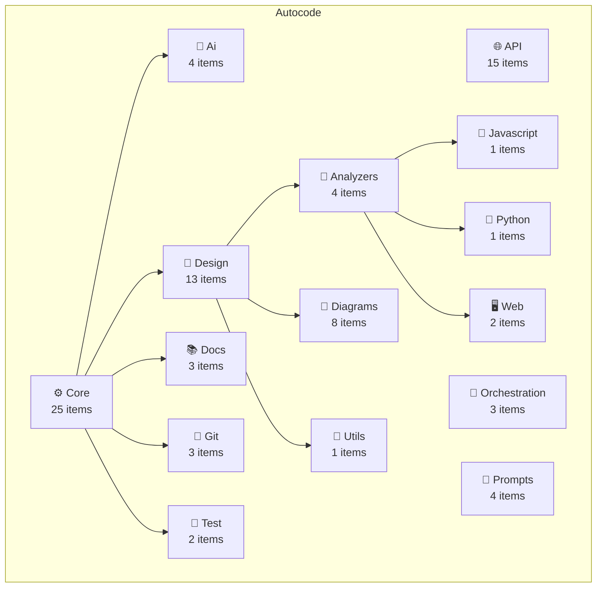

# 🏗️ Autocode Architecture Overview

**Project Summary:** 47 Items | 6,182 LOC | 16 Modules

- **Classes:** 38
- **Functions:** 9

## Module Details

### Api
- **Total Items:** 15
- **Files:** 3
- **Lines of Code:** 634
- **Classes:** 14
- **Functions:** 1

### Core
- **Total Items:** 25
- **Files:** 24
- **Lines of Code:** 4,814
- **Classes:** 21
- **Functions:** 4
- **Submodules:** 5

#### Core > Ai
- **Total Items:** 4
- **Files:** 3
- **Lines of Code:** 444
- **Classes:** 2
- **Functions:** 2

#### Core > Design
- **Total Items:** 13
- **Files:** 14
- **Lines of Code:** 2,936
- **Classes:** 11
- **Functions:** 2
- **Submodules:** 3

##### Core > Design > Analyzers
- **Total Items:** 4
- **Files:** 6
- **Lines of Code:** 1,356
- **Classes:** 4
- **Submodules:** 3

###### Core > Design > Analyzers > Javascript
- **Total Items:** 1
- **Files:** 2
- **Lines of Code:** 311
- **Classes:** 1

###### Core > Design > Analyzers > Python
- **Total Items:** 1
- **Files:** 1
- **Lines of Code:** 323
- **Classes:** 1

###### Core > Design > Analyzers > Web
- **Total Items:** 2
- **Files:** 3
- **Lines of Code:** 722
- **Classes:** 2

##### Core > Design > Diagrams
- **Total Items:** 8
- **Files:** 6
- **Lines of Code:** 1,183
- **Classes:** 6
- **Functions:** 2

##### Core > Design > Utils
- **Total Items:** 1
- **Files:** 2
- **Lines of Code:** 397
- **Classes:** 1

#### Core > Docs
- **Total Items:** 3
- **Files:** 3
- **Lines of Code:** 688
- **Classes:** 3

#### Core > Git
- **Total Items:** 3
- **Files:** 2
- **Lines of Code:** 432
- **Classes:** 3

#### Core > Test
- **Total Items:** 2
- **Files:** 2
- **Lines of Code:** 314
- **Classes:** 2

### Orchestration
- **Total Items:** 3
- **Files:** 3
- **Lines of Code:** 668
- **Classes:** 3

### Prompts
- **Total Items:** 4
- **Files:** 1
- **Lines of Code:** 63
- **Functions:** 4

