# Items from models.py

**Source:** `C:\Users\bruno\Desktop\autocode\autocode\api\models.py`  
**Type:** python

**Metrics:**
- Total Classes: 15
- Total Functions: 0
- Total Imports: 3
- Total Loc: 129
- Average Methods Per Class: 0.0

## Classes

### CheckResult

**Line:** 10  
**LOC:** 8  

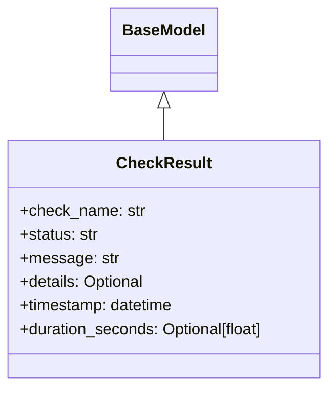

### DaemonStatus

**Line:** 20  
**LOC:** 6  

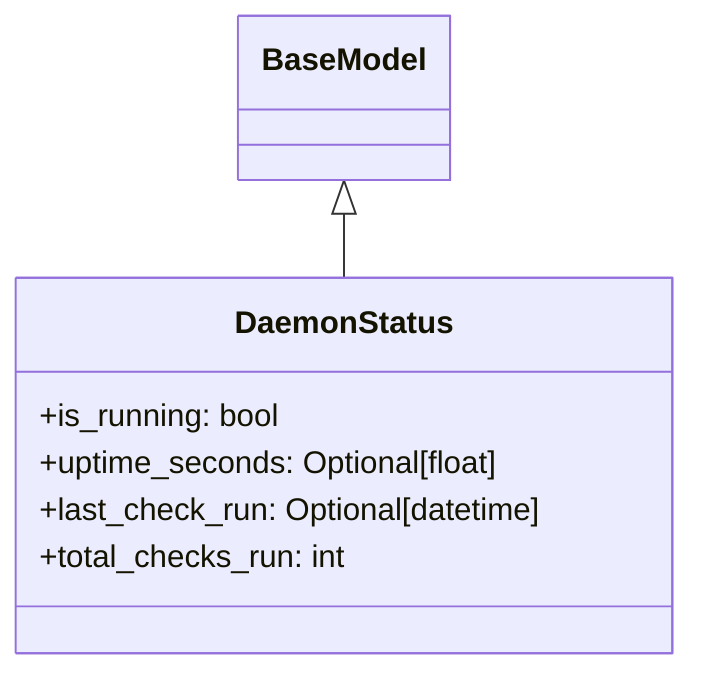

### CheckConfig

**Line:** 28  
**LOC:** 4  

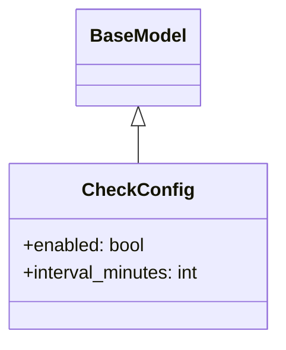

### TokenConfig

**Line:** 34  
**LOC:** 5  

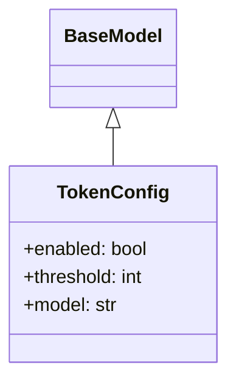

### DaemonConfig

**Line:** 41  
**LOC:** 6  

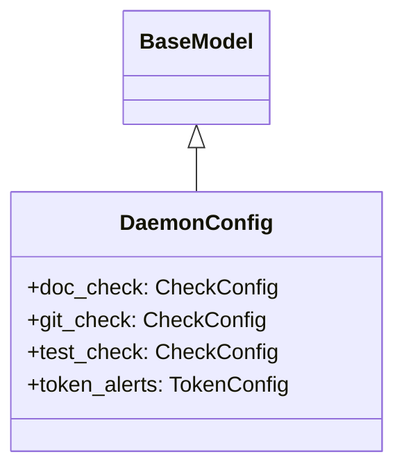

### ApiConfig

**Line:** 49  
**LOC:** 4  

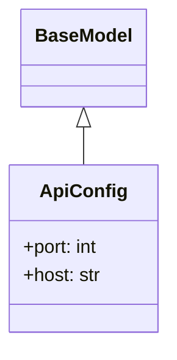

### DocIndexConfig

**Line:** 55  
**LOC:** 6  

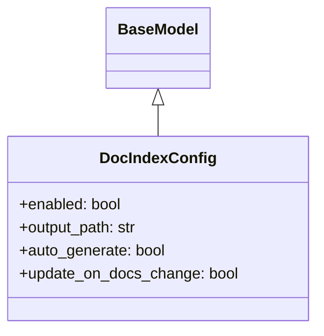

### DocsConfig

**Line:** 63  
**LOC:** 6  

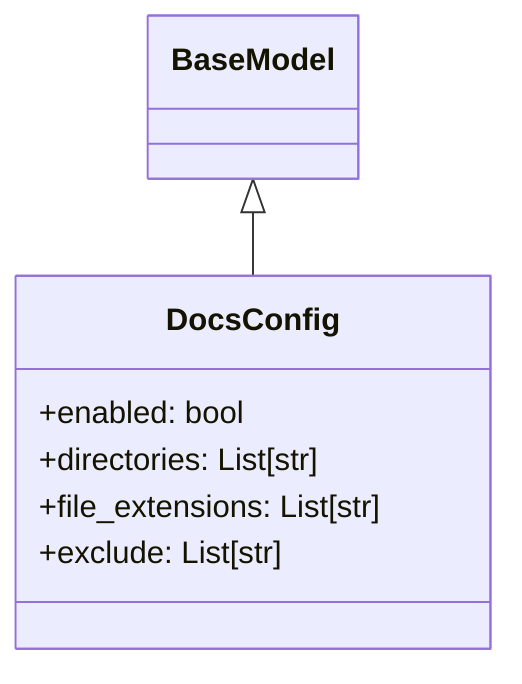

### TestConfig

**Line:** 71  
**LOC:** 7  

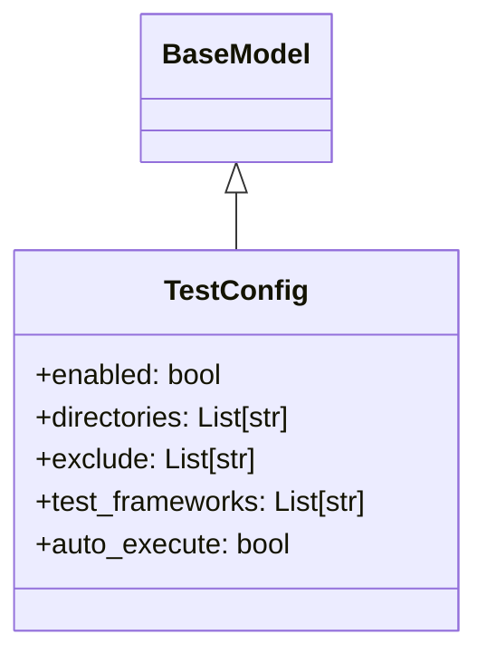

### OpenCodeConfig

**Line:** 80  
**LOC:** 9  

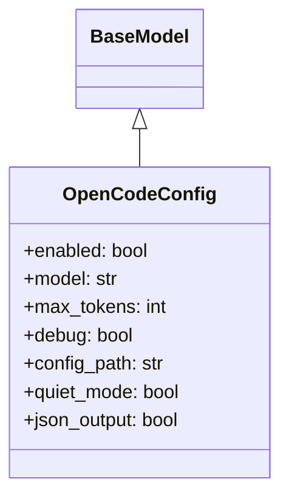

### CodeToDesignConfig

**Line:** 91  
**LOC:** 8  

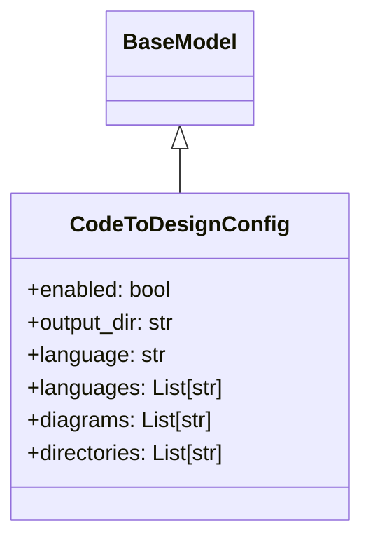

### AutocodeConfig

**Line:** 101  
**LOC:** 9  

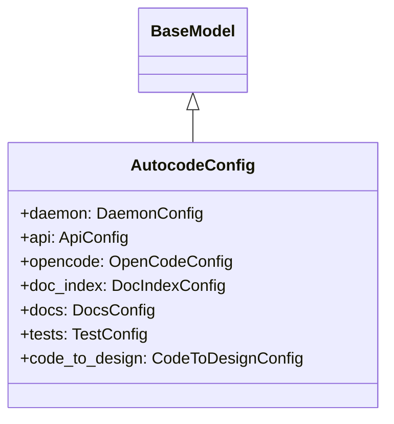

### StatusResponse

**Line:** 112  
**LOC:** 5  

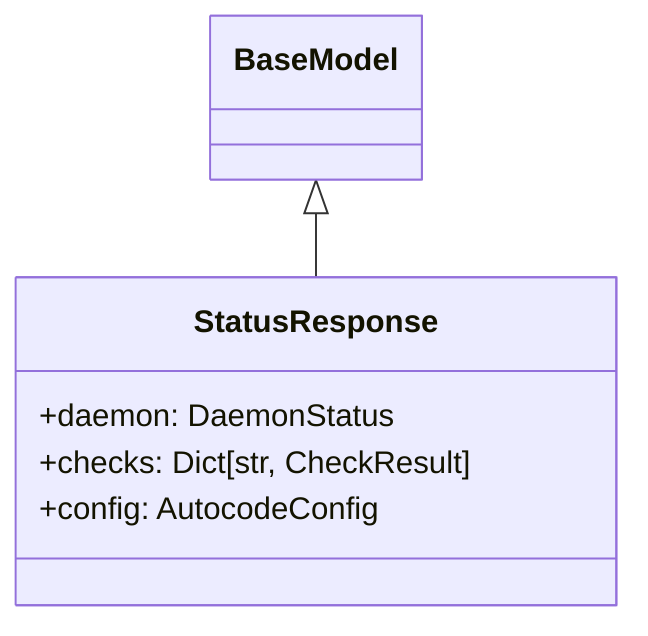

### CheckExecutionRequest

**Line:** 119  
**LOC:** 4  

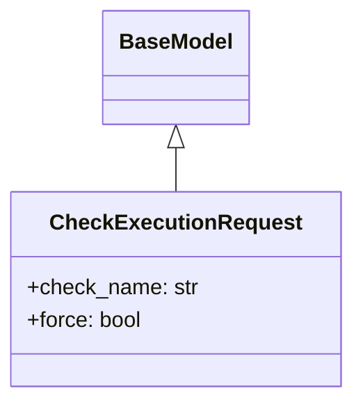

### CheckExecutionResponse

**Line:** 125  
**LOC:** 5  

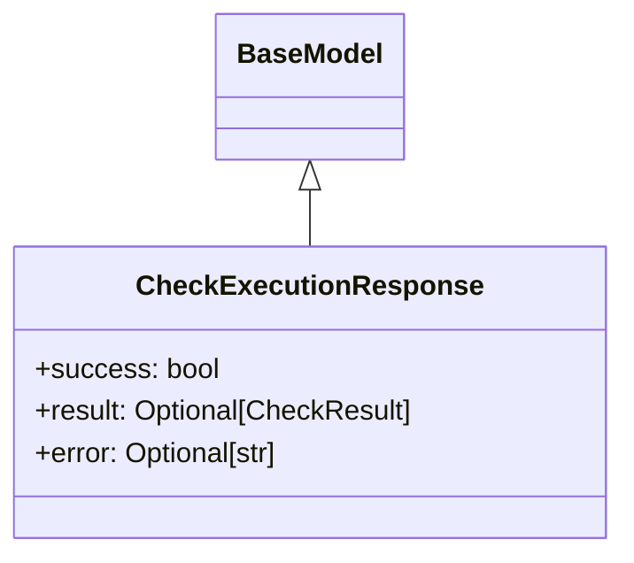

