# 🏗️ Autocode Architecture Overview

**Project Summary:** 23 Items | 4,015 LOC | 10 Modules

- **Classes:** 19
- **Functions:** 4

```mermaid
graph TD
    subgraph "Autocode"
        M0["📁 Ai\n4 items"]
        M1["📁 Design\n11 items"]
        M2["📁 Analyzers\n3 items"]
        M1 --> M2
            M3["📁 Javascript\n1 items"]
            M2 --> M3
            M4["🖥️ Web\n2 items"]
            M2 --> M4
        M5["📁 Generators\n7 items"]
        M1 --> M5
        M6["🔧 Utils\n1 items"]
        M1 --> M6
        M7["📚 Docs\n3 items"]
        M8["📁 Git\n3 items"]
        M9["🧪 Test\n2 items"]
    end

```

## Module Details

### Ai
- **Total Items:** 4
- **Files:** 3
- **Lines of Code:** 444
- **Classes:** 2
- **Functions:** 2

### Design
- **Total Items:** 11
- **Files:** 12
- **Lines of Code:** 2,137
- **Classes:** 9
- **Functions:** 2
- **Submodules:** 3

#### Design > Analyzers
- **Total Items:** 3
- **Files:** 5
- **Lines of Code:** 1,033
- **Classes:** 3
- **Submodules:** 2

##### Design > Analyzers > Javascript
- **Total Items:** 1
- **Files:** 2
- **Lines of Code:** 311
- **Classes:** 1

##### Design > Analyzers > Web
- **Total Items:** 2
- **Files:** 3
- **Lines of Code:** 722
- **Classes:** 2

#### Design > Generators
- **Total Items:** 7
- **Files:** 5
- **Lines of Code:** 707
- **Classes:** 5
- **Functions:** 2

#### Design > Utils
- **Total Items:** 1
- **Files:** 2
- **Lines of Code:** 397
- **Classes:** 1

### Docs
- **Total Items:** 3
- **Files:** 3
- **Lines of Code:** 688
- **Classes:** 3

### Git
- **Total Items:** 3
- **Files:** 2
- **Lines of Code:** 432
- **Classes:** 3

### Test
- **Total Items:** 2
- **Files:** 2
- **Lines of Code:** 314
- **Classes:** 2

