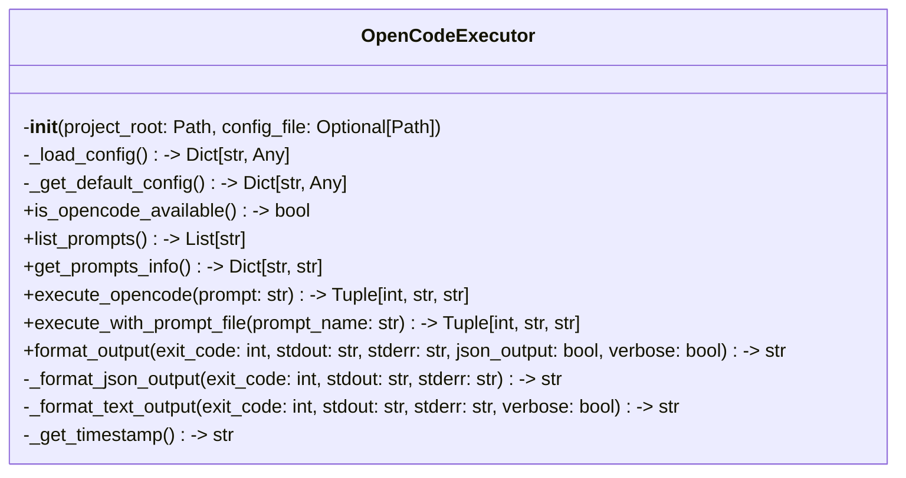

# Classes from opencode_executor.py

Source: `autocode\core\ai\opencode_executor.py`

## OpenCodeExecutor

**Metrics:** LOC: 226 | Methods: 12

```mermaid
classDiagram
    class OpenCodeExecutor {
        -__init__(project_root: Path, config_file: Optional[Path])
        -_load_config() -> Dict[str, Any]
        -_get_default_config() -> Dict[str, Any]
        +is_opencode_available() -> bool
        +list_prompts() -> List[str]
        +get_prompts_info() -> Dict[str, str]
        +execute_opencode(prompt: str) -> Tuple[int, str, str]
        +execute_with_prompt_file(prompt_name: str) -> Tuple[int, str, str]
        +format_output(exit_code: int, stdout: str, stderr: str, json_output: bool, verbose: bool) -> str
        -_format_json_output(exit_code: int, stdout: str, stderr: str) -> str
        -_format_text_output(exit_code: int, stdout: str, stderr: str, verbose: bool) -> str
        -_get_timestamp() -> str
    }

```

