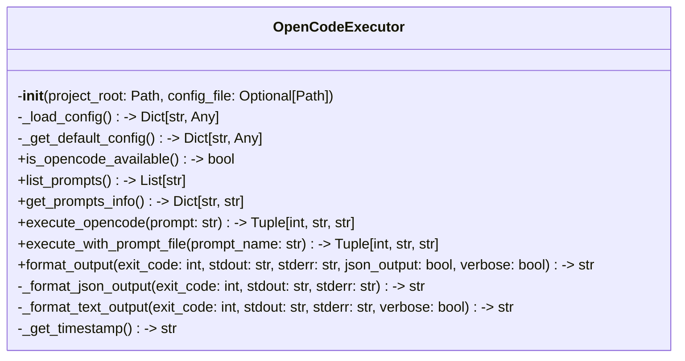

# Items from opencode_executor.py

**Source:** `C:\Users\bruno\Desktop\autocode\autocode\core\ai\opencode_executor.py`  
**Type:** python

**Metrics:**
- Total Classes: 1
- Total Functions: 1
- Total Imports: 8
- Total Loc: 267
- Average Methods Per Class: 12.0

## Classes

### OpenCodeExecutor

**Line:** 15  
**LOC:** 226  

## Functions

### validate_opencode_setup

**Line:** 243  
**LOC:** 25  
**Parameters:** project_root  
**Returns:** Tuple[bool, str]  

