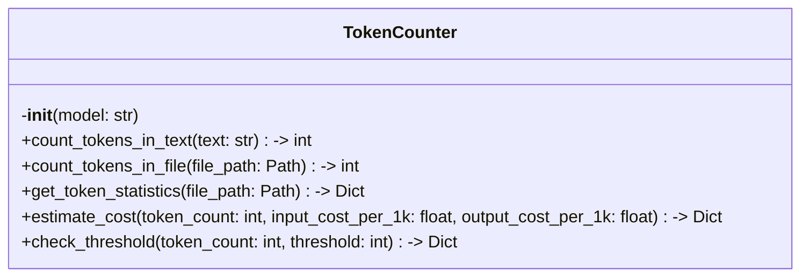

# Items from token_counter.py

**Source:** `C:\Users\bruno\Desktop\autocode\autocode\core\ai\token_counter.py`  
**Type:** python

**Metrics:**
- Total Classes: 1
- Total Functions: 1
- Total Imports: 3
- Total Loc: 162
- Average Methods Per Class: 6.0

## Classes

### TokenCounter

**Line:** 11  
**LOC:** 123  

## Functions

### count_tokens_in_multiple_files

**Line:** 136  
**LOC:** 27  
**Parameters:** file_paths, model  
**Returns:** Dict  

