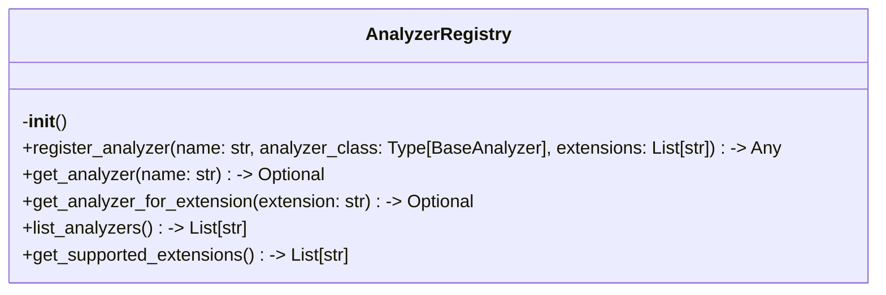
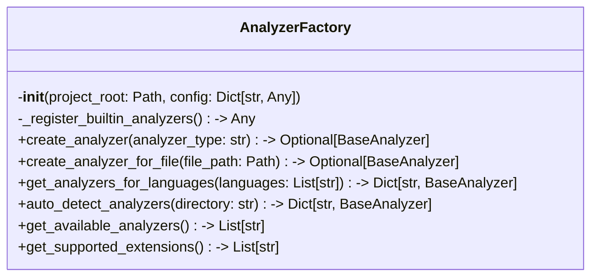

# Items from analyzer_factory.py

**Source:** `C:\Users\bruno\Desktop\autocode\autocode\core\design\analyzers\analyzer_factory.py`  
**Type:** python

**Metrics:**
- Total Classes: 2
- Total Functions: 2
- Total Imports: 9
- Total Loc: 204
- Average Methods Per Class: 7.0

## Classes

### AnalyzerRegistry

**Line:** 17  
**LOC:** 36  

### AnalyzerFactory

**Line:** 70  
**LOC:** 135  

## Functions

### register_analyzer

**Line:** 59  
**LOC:** 4  
**Parameters:** name, analyzer_class, extensions  
**Returns:** Any  

### get_registry

**Line:** 65  
**LOC:** 3  
**Returns:** AnalyzerRegistry  

