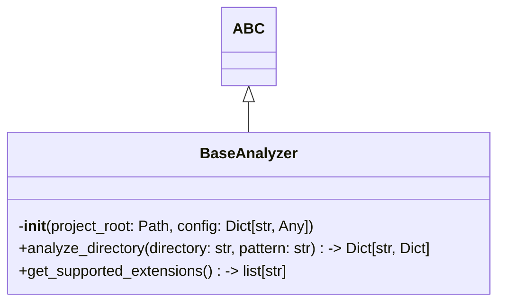

# Classes from base_analyzer.py

Source: `autocode\core\design\analyzers\base_analyzer.py`

## BaseAnalyzer

**Metrics:** LOC: 34 | Methods: 3

```mermaid
classDiagram
    class BaseAnalyzer {
        -__init__(project_root: Path, config: Dict[str, Any])
        +analyze_directory(directory: str, pattern: str) -> Dict[str, Dict]
        +get_supported_extensions() -> list[str]
    }
    ABC <|-- BaseAnalyzer

```

