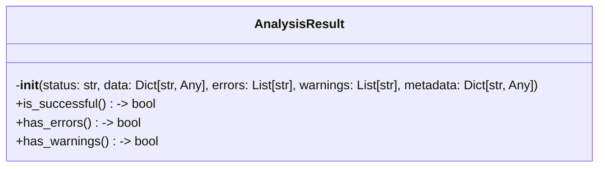
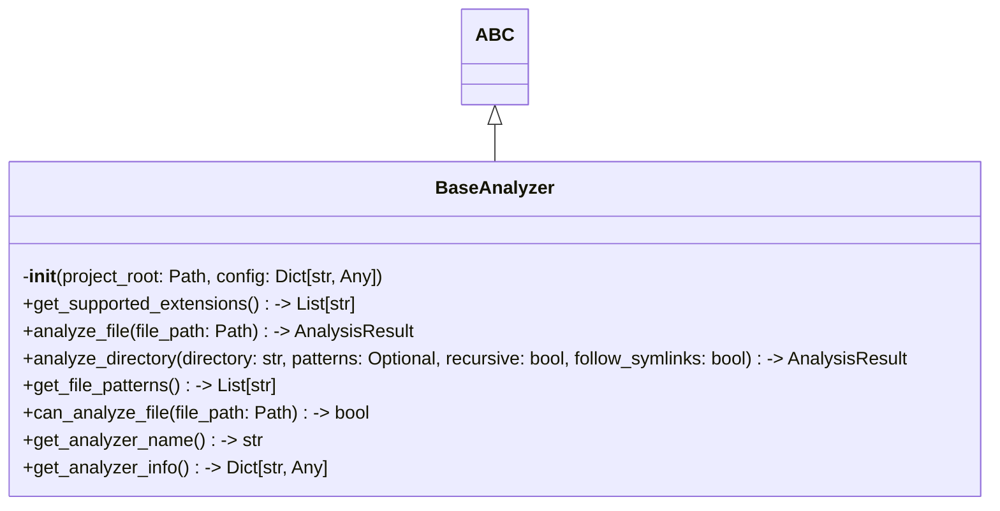

# Items from base_analyzer.py

**Source:** `C:\Users\bruno\Desktop\autocode\autocode\core\design\analyzers\base_analyzer.py`  
**Type:** python

**Metrics:**
- Total Classes: 2
- Total Functions: 0
- Total Imports: 4
- Total Loc: 233
- Average Methods Per Class: 6.0

## Classes

### AnalysisResult

**Line:** 14  
**LOC:** 35  

### BaseAnalyzer

**Line:** 51  
**LOC:** 183  

