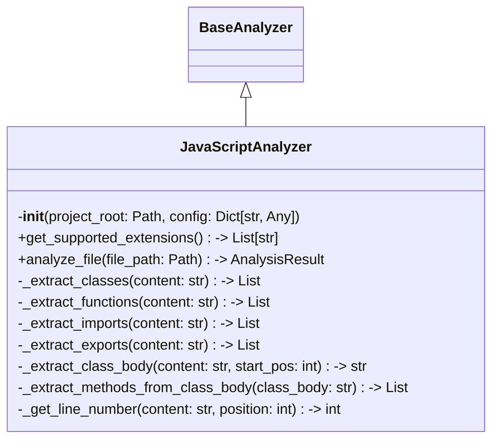

# Items from analyzer.py

**Source:** `C:\Users\bruno\Desktop\autocode\autocode\core\design\analyzers\javascript\analyzer.py`  
**Type:** python

**Metrics:**
- Total Classes: 1
- Total Functions: 0
- Total Imports: 4
- Total Loc: 303
- Average Methods Per Class: 10.0

## Classes

### JavaScriptAnalyzer

**Line:** 14  
**LOC:** 290  

