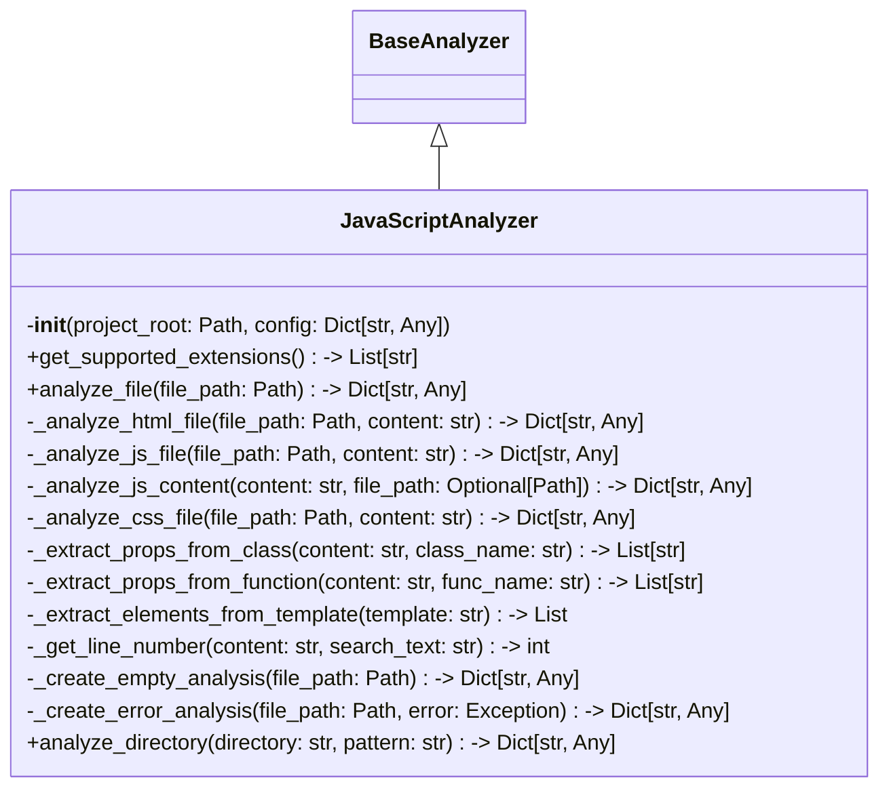

# Classes from javascript_analyzer.py

Source: `autocode\core\design\analyzers\javascript_analyzer.py`

## JavaScriptAnalyzer

**Metrics:** LOC: 418 | Methods: 14

```mermaid
classDiagram
    class JavaScriptAnalyzer {
        -__init__(project_root: Path, config: Dict[str, Any])
        +get_supported_extensions() -> List[str]
        +analyze_file(file_path: Path) -> Dict[str, Any]
        -_analyze_html_file(file_path: Path, content: str) -> Dict[str, Any]
        -_analyze_js_file(file_path: Path, content: str) -> Dict[str, Any]
        -_analyze_js_content(content: str, file_path: Optional[Path]) -> Dict[str, Any]
        -_analyze_css_file(file_path: Path, content: str) -> Dict[str, Any]
        -_extract_props_from_class(content: str, class_name: str) -> List[str]
        -_extract_props_from_function(content: str, func_name: str) -> List[str]
        -_extract_elements_from_template(template: str) -> List
        -_get_line_number(content: str, search_text: str) -> int
        -_create_empty_analysis(file_path: Path) -> Dict[str, Any]
        -_create_error_analysis(file_path: Path, error: Exception) -> Dict[str, Any]
        +analyze_directory(directory: str, pattern: str) -> Dict[str, Any]
    }
    BaseAnalyzer <|-- JavaScriptAnalyzer

```

