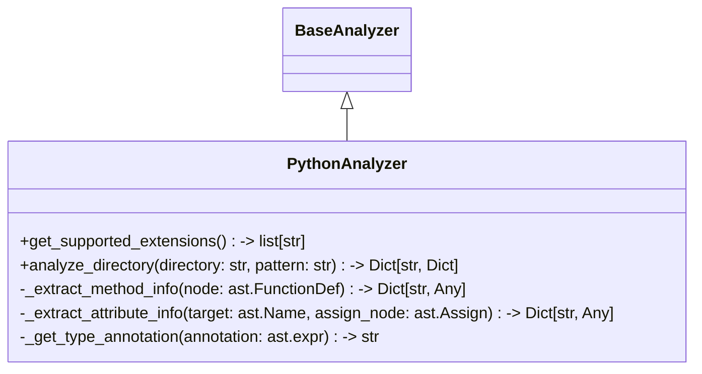

# Classes from python_analyzer.py

Source: `autocode\core\design\analyzers\python_analyzer.py`

## PythonAnalyzer

**Metrics:** LOC: 189 | Methods: 5

```mermaid
classDiagram
    class PythonAnalyzer {
        +get_supported_extensions() -> list[str]
        +analyze_directory(directory: str, pattern: str) -> Dict[str, Dict]
        -_extract_method_info(node: ast.FunctionDef) -> Dict[str, Any]
        -_extract_attribute_info(target: ast.Name, assign_node: ast.Assign) -> Dict[str, Any]
        -_get_type_annotation(annotation: ast.expr) -> str
    }
    BaseAnalyzer <|-- PythonAnalyzer

```

