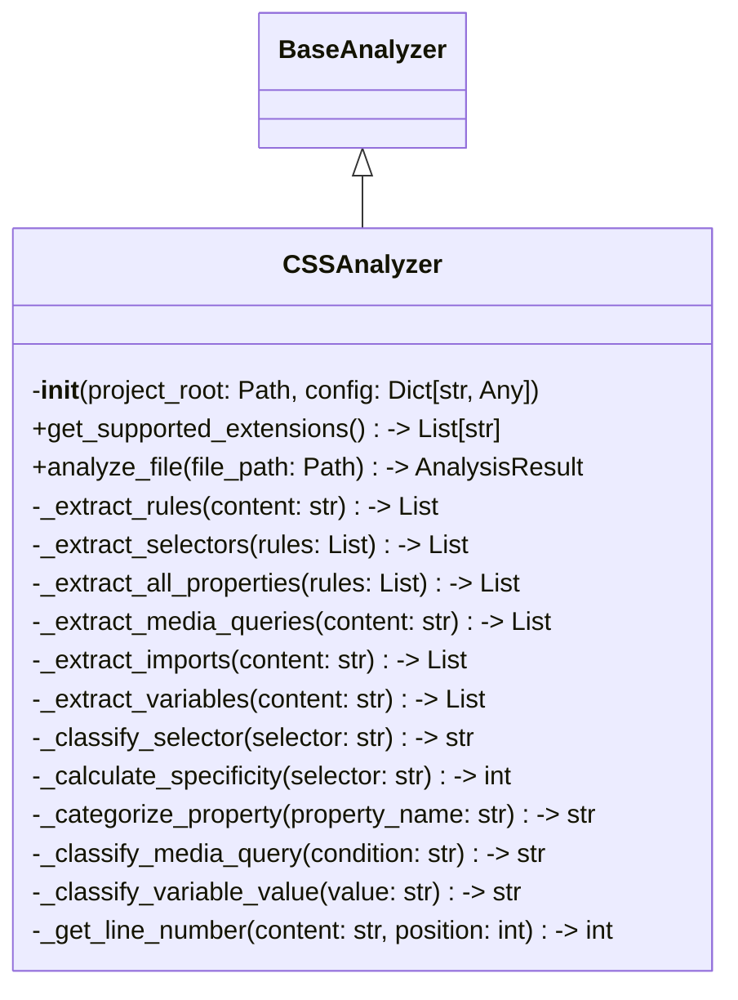

# Items from css_analyzer.py

**Source:** `C:\Users\bruno\Desktop\autocode\autocode\core\design\analyzers\web\css_analyzer.py`  
**Type:** python

**Metrics:**
- Total Classes: 1
- Total Functions: 0
- Total Imports: 4
- Total Loc: 412
- Average Methods Per Class: 15.0

## Classes

### CSSAnalyzer

**Line:** 14  
**LOC:** 399  

