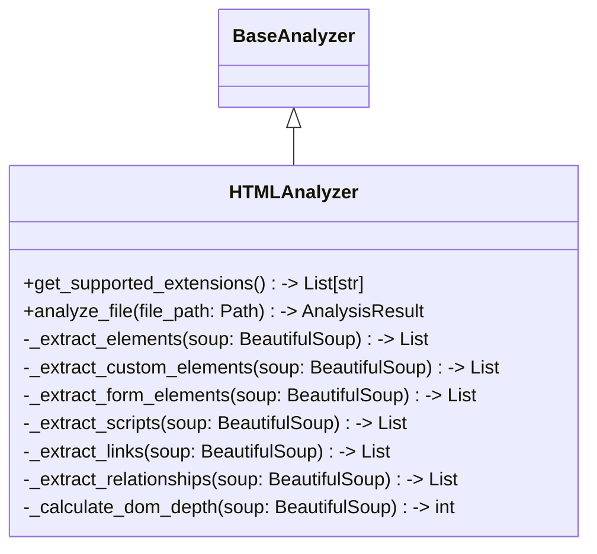

# Items from html_analyzer.py

**Source:** `C:\Users\bruno\Desktop\autocode\autocode\core\design\analyzers\web\html_analyzer.py`  
**Type:** python

**Metrics:**
- Total Classes: 1
- Total Functions: 0
- Total Imports: 5
- Total Loc: 301
- Average Methods Per Class: 9.0

## Classes

### HTMLAnalyzer

**Line:** 15  
**LOC:** 287  

