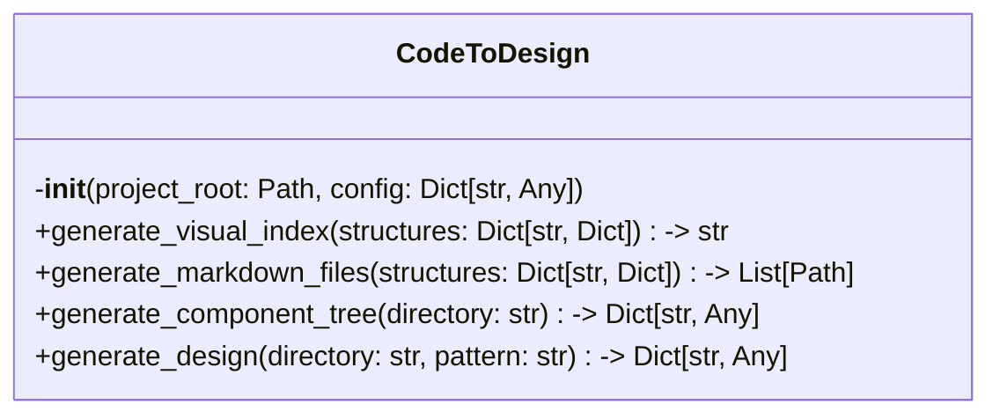

# Classes from code_to_design.py

Source: `autocode\core\design\code_to_design.py`

## CodeToDesign

**Metrics:** LOC: 326 | Methods: 5

```mermaid
classDiagram
    class CodeToDesign {
        -__init__(project_root: Path, config: Dict[str, Any])
        +generate_visual_index(structures: Dict[str, Dict]) -> str
        +generate_markdown_files(structures: Dict[str, Dict]) -> List[Path]
        +generate_component_tree(directory: str) -> Dict[str, Any]
        +generate_design(directory: str, pattern: str) -> Dict[str, Any]
    }

```

