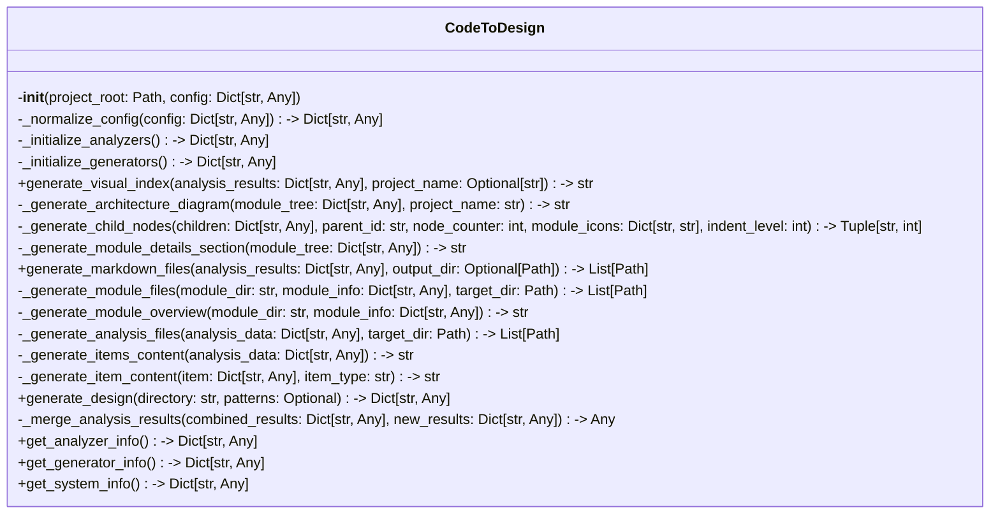

# Items from code_to_design.py

**Source:** `C:\Users\bruno\Desktop\autocode\autocode\core\design\code_to_design.py`  
**Type:** python

**Metrics:**
- Total Classes: 1
- Total Functions: 0
- Total Imports: 7
- Total Loc: 710
- Average Methods Per Class: 19.0

## Classes

### CodeToDesign

**Line:** 19  
**LOC:** 692  

