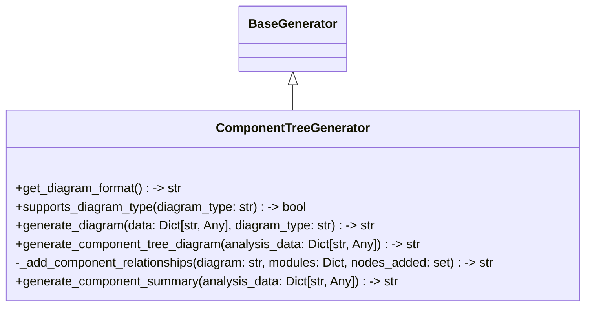

# Items from component_tree_generator.py

**Source:** `C:\Users\bruno\Desktop\autocode\autocode\core\design\diagrams\component_tree_generator.py`  
**Type:** python

**Metrics:**
- Total Classes: 1
- Total Functions: 0
- Total Imports: 2
- Total Loc: 307
- Average Methods Per Class: 6.0

## Classes

### ComponentTreeGenerator

**Line:** 10  
**LOC:** 298  

