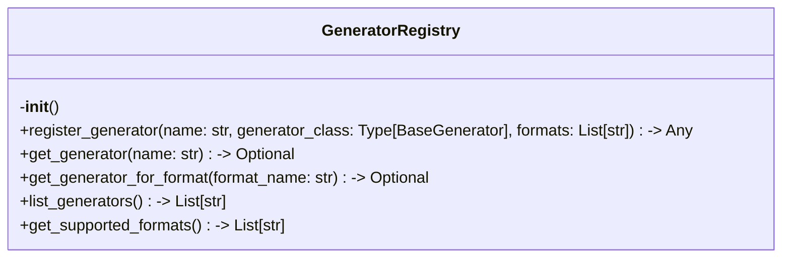
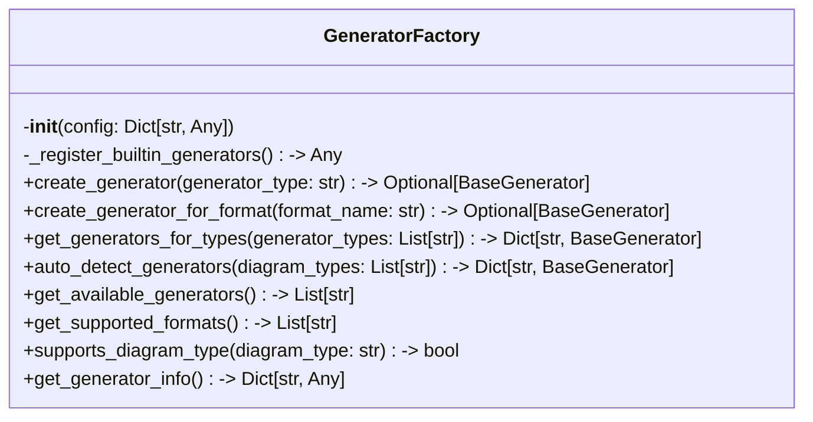

# Items from generator_factory.py

**Source:** `C:\Users\bruno\Desktop\autocode\autocode\core\design\diagrams\generator_factory.py`  
**Type:** python

**Metrics:**
- Total Classes: 2
- Total Functions: 2
- Total Imports: 6
- Total Loc: 231
- Average Methods Per Class: 8.0

## Classes

### GeneratorRegistry

**Line:** 16  
**LOC:** 36  

### GeneratorFactory

**Line:** 69  
**LOC:** 163  

## Functions

### register_generator

**Line:** 58  
**LOC:** 4  
**Parameters:** name, generator_class, formats  
**Returns:** Any  

### get_registry

**Line:** 64  
**LOC:** 3  
**Returns:** GeneratorRegistry  

