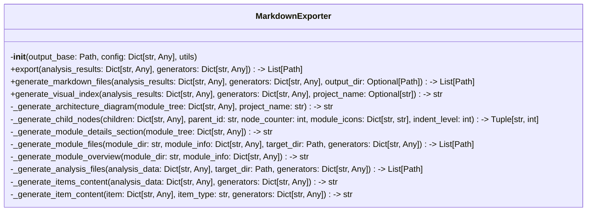

# Items from markdown_exporter.py

**Source:** `C:\Users\bruno\Desktop\autocode\autocode\core\design\diagrams\markdown_exporter.py`  
**Type:** python

**Metrics:**
- Total Classes: 1
- Total Functions: 0
- Total Imports: 3
- Total Loc: 475
- Average Methods Per Class: 12.0

## Classes

### MarkdownExporter

**Line:** 14  
**LOC:** 462  

