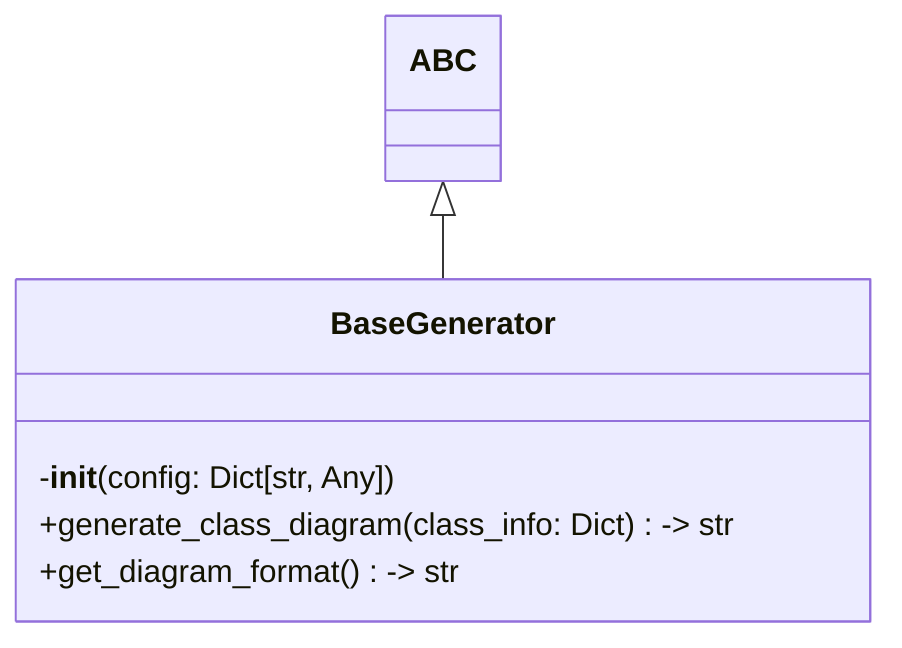

# Classes from base_generator.py

Source: `autocode\core\design\generators\base_generator.py`

## BaseGenerator

**Metrics:** LOC: 31 | Methods: 3

```mermaid
classDiagram
    class BaseGenerator {
        -__init__(config: Dict[str, Any])
        +generate_class_diagram(class_info: Dict) -> str
        +get_diagram_format() -> str
    }
    ABC <|-- BaseGenerator

```

