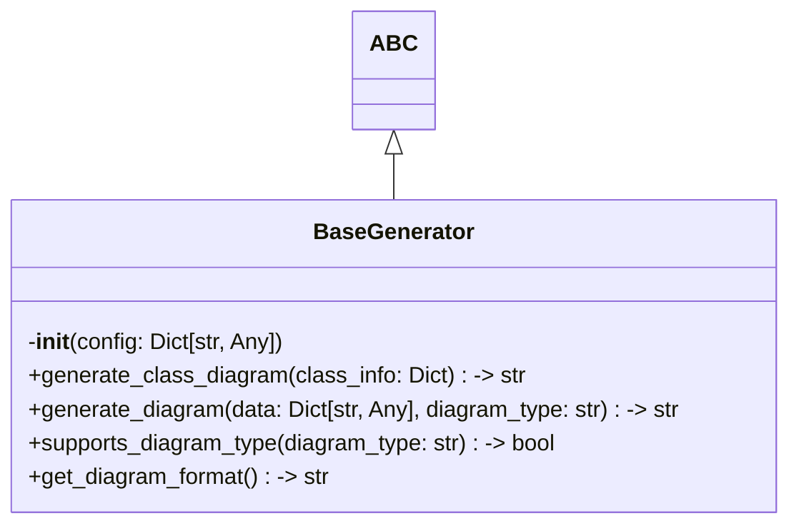

# Items from base_generator.py

**Source:** `C:\Users\bruno\Desktop\autocode\autocode\core\design\generators\base_generator.py`  
**Type:** python

**Metrics:**
- Total Classes: 1
- Total Functions: 0
- Total Imports: 2
- Total Loc: 68
- Average Methods Per Class: 5.0

## Classes

### BaseGenerator

**Line:** 10  
**LOC:** 59  

