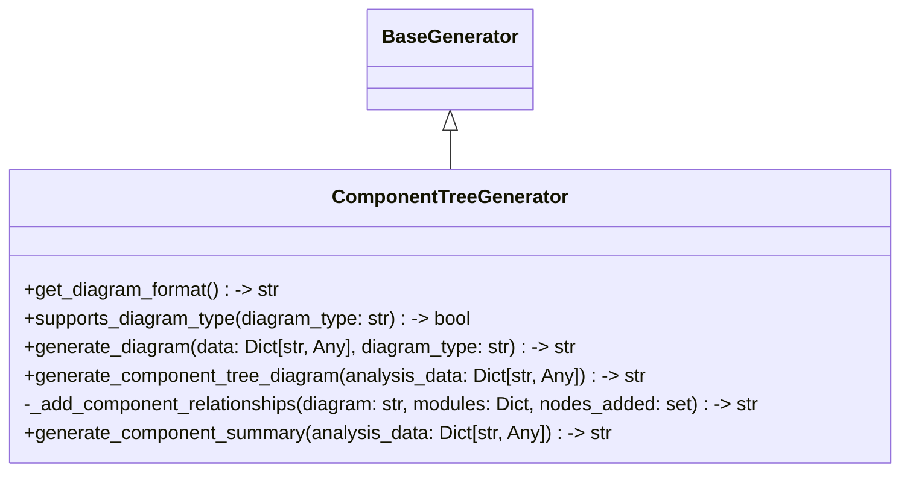

# Classes from component_tree_generator.py

Source: `autocode\core\design\generators\component_tree_generator.py`

## ComponentTreeGenerator

**Metrics:** LOC: 298 | Methods: 6

```mermaid
classDiagram
    class ComponentTreeGenerator {
        +get_diagram_format() -> str
        +supports_diagram_type(diagram_type: str) -> bool
        +generate_diagram(data: Dict[str, Any], diagram_type: str) -> str
        +generate_component_tree_diagram(analysis_data: Dict[str, Any]) -> str
        -_add_component_relationships(diagram: str, modules: Dict, nodes_added: set) -> str
        +generate_component_summary(analysis_data: Dict[str, Any]) -> str
    }
    BaseGenerator <|-- ComponentTreeGenerator

```

