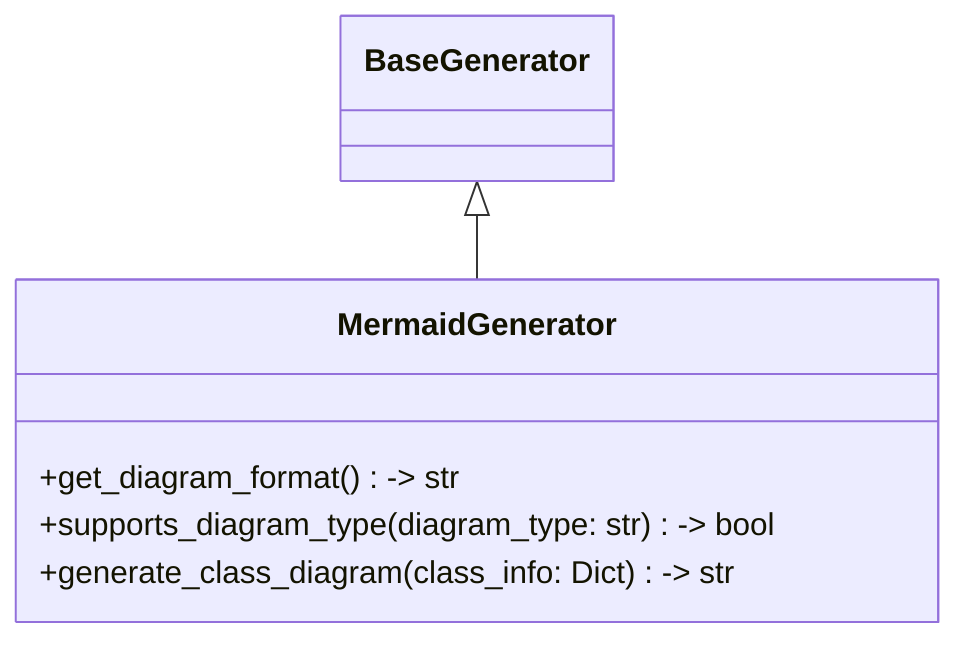

# Classes from mermaid_generator.py

Source: `autocode\core\design\generators\mermaid_generator.py`

## MermaidGenerator

**Metrics:** LOC: 80 | Methods: 3

```mermaid
classDiagram
    class MermaidGenerator {
        +get_diagram_format() -> str
        +supports_diagram_type(diagram_type: str) -> bool
        +generate_class_diagram(class_info: Dict) -> str
    }
    BaseGenerator <|-- MermaidGenerator

```

