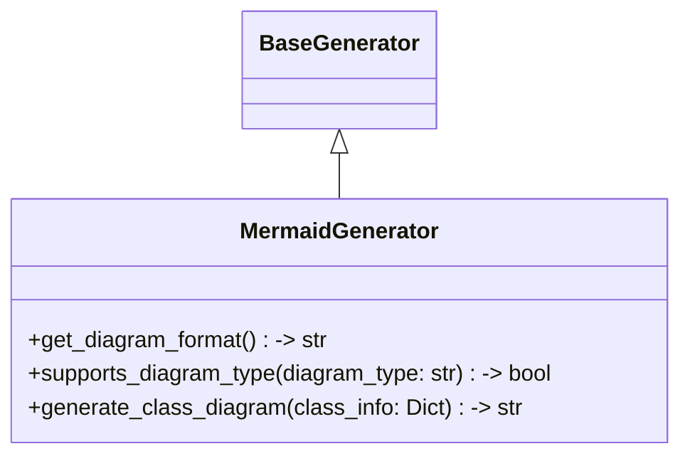

# Items from mermaid_generator.py

**Source:** `C:\Users\bruno\Desktop\autocode\autocode\core\design\generators\mermaid_generator.py`  
**Type:** python

**Metrics:**
- Total Classes: 1
- Total Functions: 0
- Total Imports: 2
- Total Loc: 90
- Average Methods Per Class: 3.0

## Classes

### MermaidGenerator

**Line:** 11  
**LOC:** 80  

