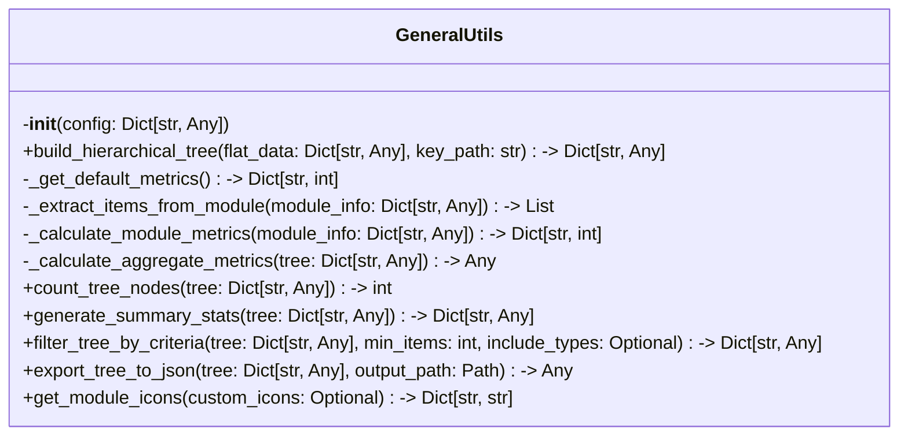

# Items from general_utils.py

**Source:** `C:\Users\bruno\Desktop\autocode\autocode\core\design\utils\general_utils.py`  
**Type:** python

**Metrics:**
- Total Classes: 1
- Total Functions: 0
- Total Imports: 3
- Total Loc: 389
- Average Methods Per Class: 11.0

## Classes

### GeneralUtils

**Line:** 12  
**LOC:** 378  

