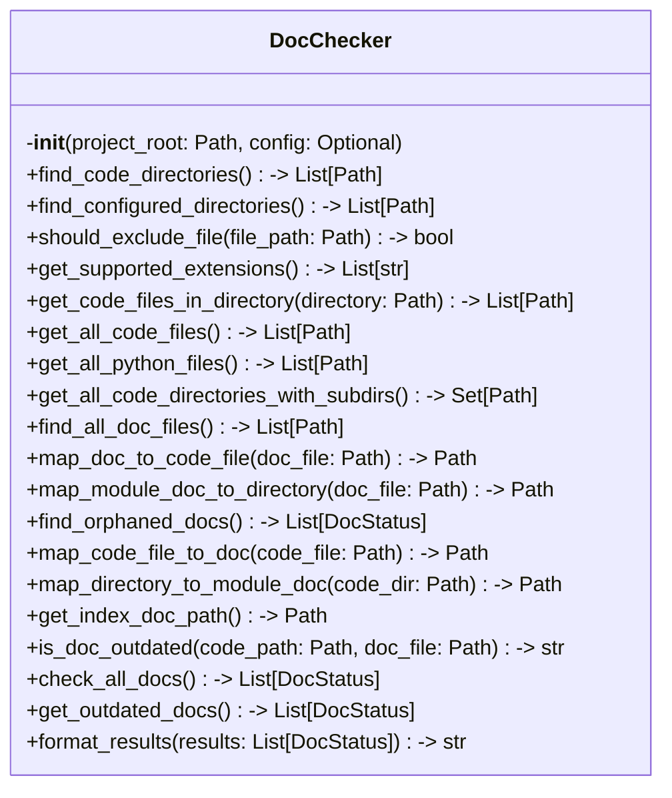

# Items from doc_checker.py

**Source:** `C:\Users\bruno\Desktop\autocode\autocode\core\docs\doc_checker.py`  
**Type:** python

**Metrics:**
- Total Classes: 2
- Total Functions: 0
- Total Imports: 3
- Total Loc: 341
- Average Methods Per Class: 10.0

## Classes

### DocStatus

**Line:** 12  
**LOC:** 6  

### DocChecker

**Line:** 20  
**LOC:** 322  

