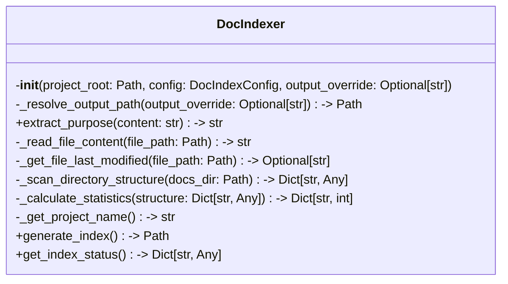

# Classes from doc_indexer.py

Source: `autocode\core\docs\doc_indexer.py`

## DocIndexer

**Metrics:** LOC: 320 | Methods: 10

```mermaid
classDiagram
    class DocIndexer {
        -__init__(project_root: Path, config: DocIndexConfig, output_override: Optional[str])
        -_resolve_output_path(output_override: Optional[str]) -> Path
        +extract_purpose(content: str) -> str
        -_read_file_content(file_path: Path) -> str
        -_get_file_last_modified(file_path: Path) -> Optional[str]
        -_scan_directory_structure(docs_dir: Path) -> Dict[str, Any]
        -_calculate_statistics(structure: Dict[str, Any]) -> Dict[str, int]
        -_get_project_name() -> str
        +generate_index() -> Path
        +get_index_status() -> Dict[str, Any]
    }

```

