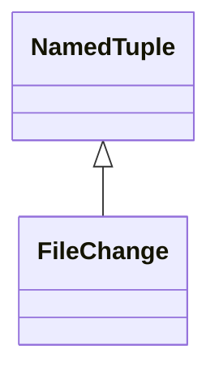
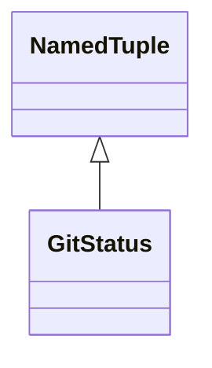
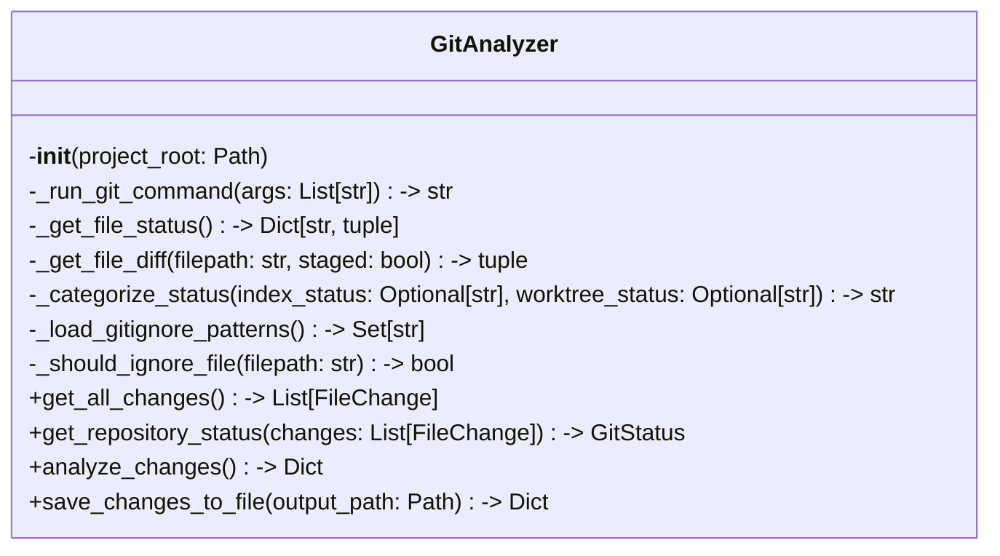

# Classes from git_analyzer.py

Source: `autocode\core\git\git_analyzer.py`

## FileChange

**Metrics:** LOC: 8 | Methods: 0

## GitStatus

**Metrics:** LOC: 8 | Methods: 0

## GitAnalyzer

**Metrics:** LOC: 387 | Methods: 11

