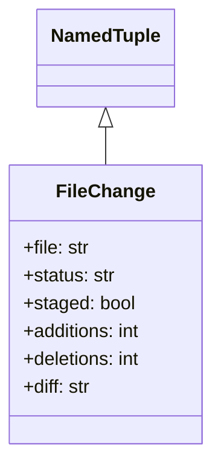
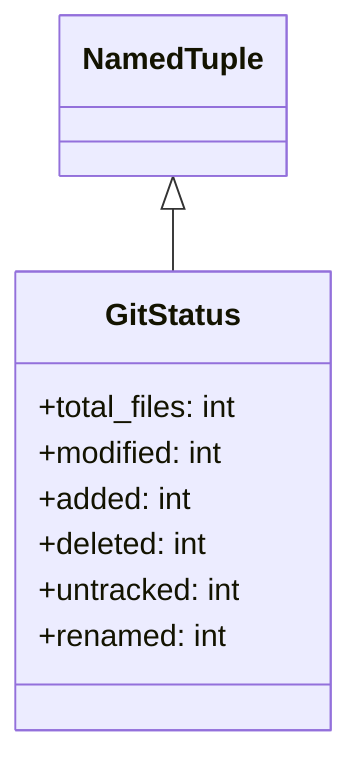
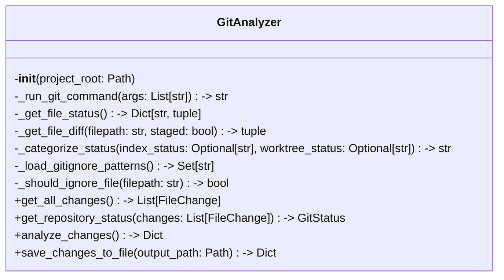

# Items from git_analyzer.py

**Source:** `C:\Users\bruno\Desktop\autocode\autocode\core\git\git_analyzer.py`  
**Type:** python

**Metrics:**
- Total Classes: 3
- Total Functions: 0
- Total Imports: 6
- Total Loc: 419
- Average Methods Per Class: 3.6666666666666665

## Classes

### FileChange

**Line:** 13  
**LOC:** 8  

### GitStatus

**Line:** 23  
**LOC:** 8  

### GitAnalyzer

**Line:** 33  
**LOC:** 387  

