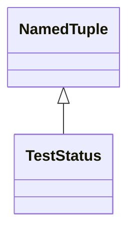
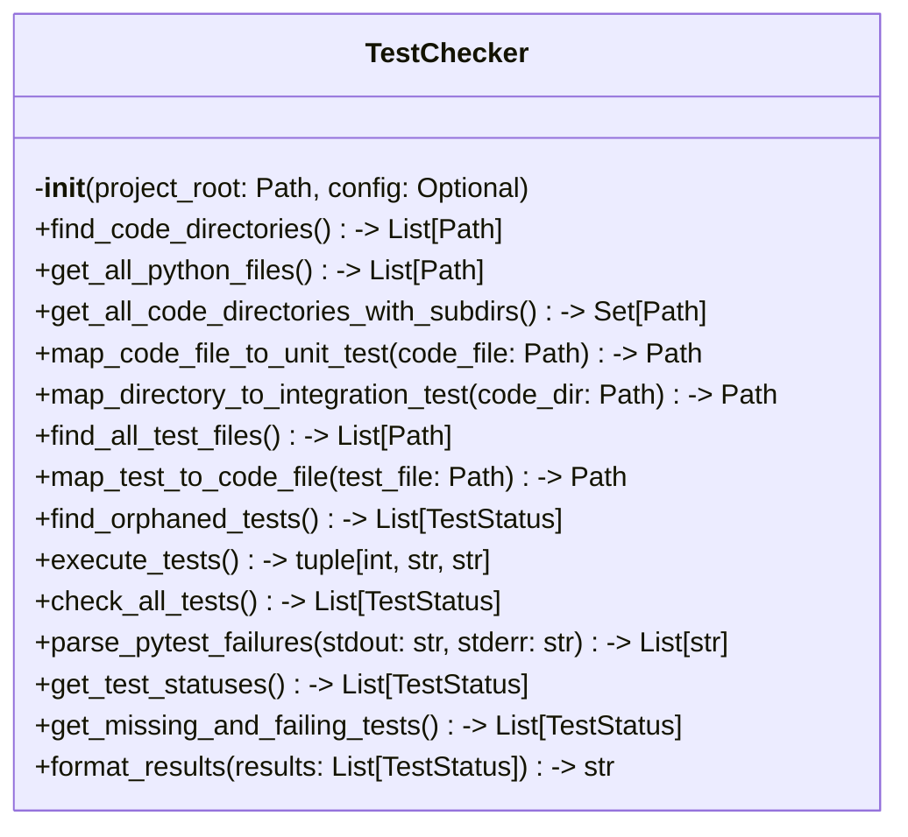

# Classes from test_checker.py

Source: `autocode\core\test\test_checker.py`

## TestStatus

**Metrics:** LOC: 6 | Methods: 0

```mermaid
classDiagram
    class TestStatus {
    }
    NamedTuple <|-- TestStatus

```

## TestChecker

**Metrics:** LOC: 281 | Methods: 15

```mermaid
classDiagram
    class TestChecker {
        -__init__(project_root: Path, config: Optional)
        +find_code_directories() -> List[Path]
        +get_all_python_files() -> List[Path]
        +get_all_code_directories_with_subdirs() -> Set[Path]
        +map_code_file_to_unit_test(code_file: Path) -> Path
        +map_directory_to_integration_test(code_dir: Path) -> Path
        +find_all_test_files() -> List[Path]
        +map_test_to_code_file(test_file: Path) -> Path
        +find_orphaned_tests() -> List[TestStatus]
        +execute_tests() -> tuple[int, str, str]
        +check_all_tests() -> List[TestStatus]
        +parse_pytest_failures(stdout: str, stderr: str) -> List[str]
        +get_test_statuses() -> List[TestStatus]
        +get_missing_and_failing_tests() -> List[TestStatus]
        +format_results(results: List[TestStatus]) -> str
    }

```

