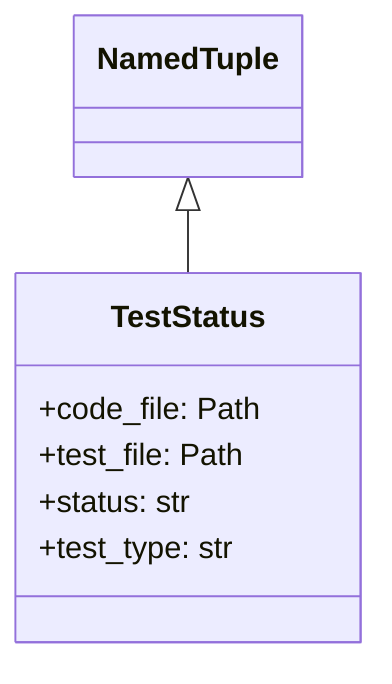
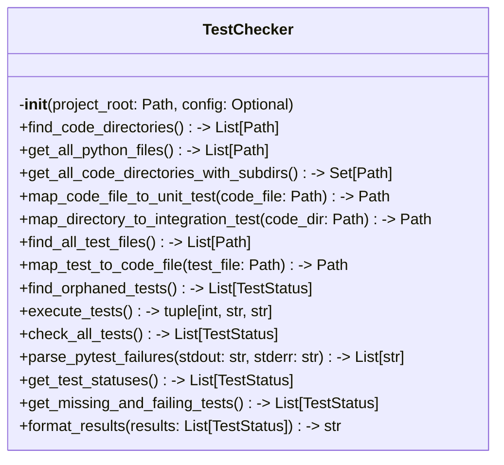

# Items from test_checker.py

**Source:** `C:\Users\bruno\Desktop\autocode\autocode\core\test\test_checker.py`  
**Type:** python

**Metrics:**
- Total Classes: 2
- Total Functions: 0
- Total Imports: 5
- Total Loc: 302
- Average Methods Per Class: 7.5

## Classes

### TestStatus

**Line:** 14  
**LOC:** 6  

### TestChecker

**Line:** 22  
**LOC:** 281  

