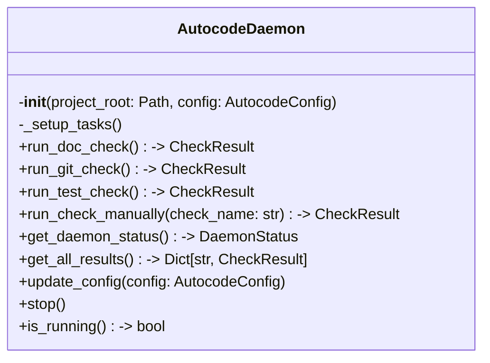

# Classes from daemon.py

Source: `autocode\orchestration\daemon.py`

## AutocodeDaemon

**Metrics:** LOC: 460 | Methods: 11

```mermaid
classDiagram
    class AutocodeDaemon {
        -__init__(project_root: Path, config: AutocodeConfig)
        -_setup_tasks()
        +run_doc_check() -> CheckResult
        +run_git_check() -> CheckResult
        +run_test_check() -> CheckResult
        +run_check_manually(check_name: str) -> CheckResult
        +get_daemon_status() -> DaemonStatus
        +get_all_results() -> Dict[str, CheckResult]
        +update_config(config: AutocodeConfig)
        +stop()
        +is_running() -> bool
    }

```

