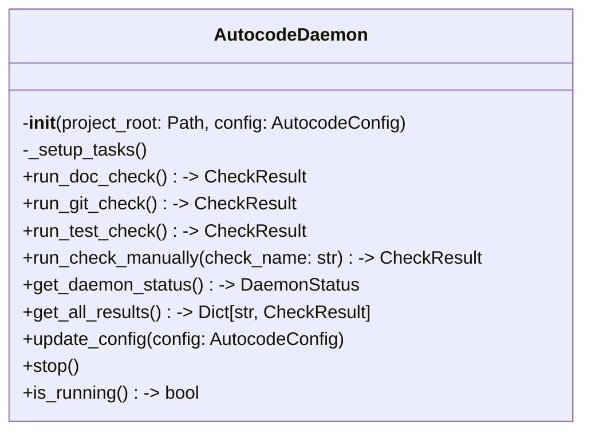

# Items from daemon.py

**Source:** `C:\Users\bruno\Desktop\autocode\autocode\orchestration\daemon.py`  
**Type:** python

**Metrics:**
- Total Classes: 1
- Total Functions: 0
- Total Imports: 15
- Total Loc: 493
- Average Methods Per Class: 11.0

## Classes

### AutocodeDaemon

**Line:** 21  
**LOC:** 473  

