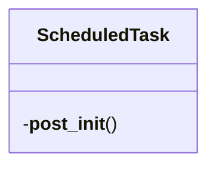
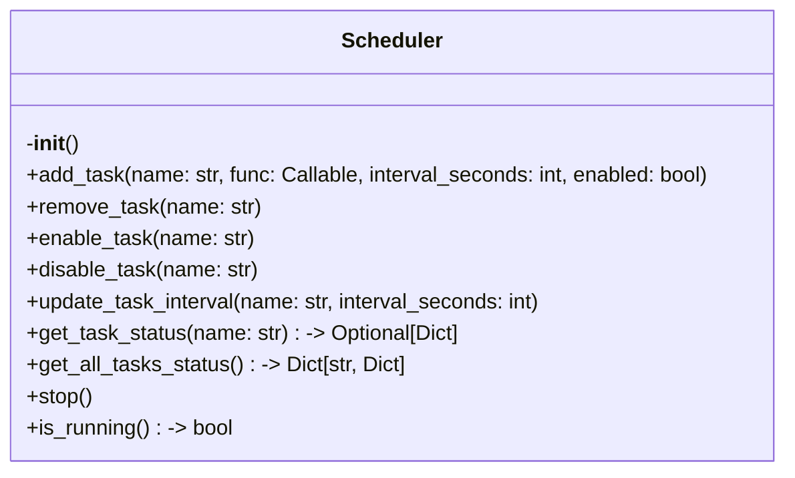

# Items from scheduler.py

**Source:** `C:\Users\bruno\Desktop\autocode\autocode\orchestration\scheduler.py`  
**Type:** python

**Metrics:**
- Total Classes: 2
- Total Functions: 0
- Total Imports: 5
- Total Loc: 178
- Average Methods Per Class: 5.5

## Classes

### ScheduledTask

**Line:** 13  
**LOC:** 12  

### Scheduler

**Line:** 27  
**LOC:** 152  

