# Web Components - autocode/web

## Component Tree

```mermaid
graph TD
    classDef default fill:#f9f9f9,stroke:#333,stroke-width:2px,color:#333
    classDef component fill:#e1f5fe,stroke:#0277bd,stroke-width:2px,color:#0277bd
    classDef element fill:#f3e5f5,stroke:#7b1fa2,stroke-width:2px,color:#7b1fa2
    classDef container fill:#e8f5e8,stroke:#2e7d32,stroke-width:2px,color:#2e7d32

    Root["🎨 UI Components"]:::container
    M1["📁 static"]:::container
    Root --> M1
    F2["⚡ app"]:::element
    M1 --> F2
    E3["🔍 Query: daemon-indicator"]:::element
    F2 --> E3
    E4["🔍 Query: daemon-text"]:::element
    F2 --> E4
    E5["🔍 Query: uptime"]:::element
    F2 --> E5
    E6["🔍 Query: total-checks"]:::element
    F2 --> E6
    E7["🔍 Query: last-check"]:::element
    F2 --> E7
    M8["📁 templates"]:::container
    Root --> M8
    F9["🌐 index"]:::element
    M8 --> F9
    E10["🏷️ .container"]:::element
    F9 --> E10
    E11["🏷️ .header"]:::element
    F9 --> E11
    E12["🎯 #daemon-status"]:::element
    F9 --> E12
    E13["🎯 #daemon-indicator"]:::element
    F9 --> E13
    E14["🎯 #daemon-text"]:::element
    F9 --> E14

```

## Summary

# Component Tree Analysis Summary

- **Total Components:** 0
- **Total Files:** 4
- **Total Modules:** 2

No UI components were found in the analyzed files.

