# 🏗️ Autocode Architecture Overview

**Project Summary:** 28 Classes | 2,877 LOC | 6 Modules

```mermaid
graph TD
    subgraph "🏗️ Autocode Project"
        subgraph "🌐 API [14 Classes | 80 LOC]"
            C0["CheckResult<br/>LOC: 8"]
            C1["DaemonStatus<br/>LOC: 6"]
            C2["CheckConfig<br/>LOC: 4"]
            C3["TokenConfig<br/>LOC: 5"]
            C4["DaemonConfig<br/>LOC: 6"]
            C5["ApiConfig<br/>LOC: 4"]
            C6["DocIndexConfig<br/>LOC: 6"]
            C7["DocsConfig<br/>LOC: 6"]
            C8["TestConfig<br/>LOC: 7"]
            C9["CodeToDesignConfig<br/>LOC: 6"]
            C10["AutocodeConfig<br/>LOC: 8"]
            C11["StatusResponse<br/>LOC: 5"]
            C12["CheckExecutionRequest<br/>LOC: 4"]
            C13["CheckExecutionResponse<br/>LOC: 5"]
        end
        subgraph "⚙️ Core [11 Classes | 2173 LOC]"
            C14["CodeToDesign<br/>LOC: 486"]
            C15["DocStatus<br/>LOC: 6"]
            C16["DocChecker<br/>LOC: 322"]
            C17["DocIndexer<br/>LOC: 320"]
            C18["FileChange<br/>LOC: 8"]
            C19["GitStatus<br/>LOC: 8"]
            C20["GitAnalyzer<br/>LOC: 387"]
            C21["OpenCodeExecutor<br/>LOC: 226"]
            C22["TestStatus<br/>LOC: 6"]
            C23["TestChecker<br/>LOC: 281"]
            C24["TokenCounter<br/>LOC: 123"]
        end
        subgraph "🔄 Orchestration [3 Classes | 624 LOC]"
            C25["AutocodeDaemon<br/>LOC: 460"]
            C26["ScheduledTask<br/>LOC: 12"]
            C27["Scheduler<br/>LOC: 152"]
        end
    end

    %% Module relationships
    API --> Core
    Core --> Orchestration
    Orchestration --> Web

```

## 🧭 Navigation Hub

**Direct links to all classes organized by module:**

### 🌐 API Api (14 Classes | 80 LOC)

- [ApiConfig](autocode/api/models_class.md#apiconfig) - LOC: 4 | Methods: 0
- [AutocodeConfig](autocode/api/models_class.md#autocodeconfig) - LOC: 8 | Methods: 0
- [CheckConfig](autocode/api/models_class.md#checkconfig) - LOC: 4 | Methods: 0
- [CheckExecutionRequest](autocode/api/models_class.md#checkexecutionrequest) - LOC: 4 | Methods: 0
- [CheckExecutionResponse](autocode/api/models_class.md#checkexecutionresponse) - LOC: 5 | Methods: 0
- [CheckResult](autocode/api/models_class.md#checkresult) - LOC: 8 | Methods: 0
- [CodeToDesignConfig](autocode/api/models_class.md#codetodesignconfig) - LOC: 6 | Methods: 0
- [DaemonConfig](autocode/api/models_class.md#daemonconfig) - LOC: 6 | Methods: 0
- [DaemonStatus](autocode/api/models_class.md#daemonstatus) - LOC: 6 | Methods: 0
- [DocIndexConfig](autocode/api/models_class.md#docindexconfig) - LOC: 6 | Methods: 0
- [DocsConfig](autocode/api/models_class.md#docsconfig) - LOC: 6 | Methods: 0
- [StatusResponse](autocode/api/models_class.md#statusresponse) - LOC: 5 | Methods: 0
- [TestConfig](autocode/api/models_class.md#testconfig) - LOC: 7 | Methods: 0
- [TokenConfig](autocode/api/models_class.md#tokenconfig) - LOC: 5 | Methods: 0

### ⚙️ Core Core (11 Classes | 2173 LOC)

- [CodeToDesign](autocode/core/code_to_design_class.md#codetodesign) - LOC: 486 | Methods: 9
- [DocChecker](autocode/core/doc_checker_class.md#docchecker) - LOC: 322 | Methods: 20
- [DocIndexer](autocode/core/doc_indexer_class.md#docindexer) - LOC: 320 | Methods: 10
- [DocStatus](autocode/core/doc_checker_class.md#docstatus) - LOC: 6 | Methods: 0
- [FileChange](autocode/core/git_analyzer_class.md#filechange) - LOC: 8 | Methods: 0
- [GitAnalyzer](autocode/core/git_analyzer_class.md#gitanalyzer) - LOC: 387 | Methods: 11
- [GitStatus](autocode/core/git_analyzer_class.md#gitstatus) - LOC: 8 | Methods: 0
- [OpenCodeExecutor](autocode/core/opencode_executor_class.md#opencodeexecutor) - LOC: 226 | Methods: 12
- [TestChecker](autocode/core/test_checker_class.md#testchecker) - LOC: 281 | Methods: 15
- [TestStatus](autocode/core/test_checker_class.md#teststatus) - LOC: 6 | Methods: 0
- [TokenCounter](autocode/core/token_counter_class.md#tokencounter) - LOC: 123 | Methods: 6

### 🔄 Orchestration Orchestration (3 Classes | 624 LOC)

- [AutocodeDaemon](autocode/orchestration/daemon_class.md#autocodedaemon) - LOC: 460 | Methods: 11
- [ScheduledTask](autocode/orchestration/scheduler_class.md#scheduledtask) - LOC: 12 | Methods: 1
- [Scheduler](autocode/orchestration/scheduler_class.md#scheduler) - LOC: 152 | Methods: 10

## Module Details

### Api
- **Classes:** 14
- **Lines of Code:** 80
- **Average LOC per Class:** 5

### Core
- **Classes:** 11
- **Lines of Code:** 2,173
- **Average LOC per Class:** 197

### Orchestration
- **Classes:** 3
- **Lines of Code:** 624
- **Average LOC per Class:** 208

