# Classes from models.py

Source: `autocode\api\models.py`

## CheckResult

**Metrics:** LOC: 8 | Methods: 0

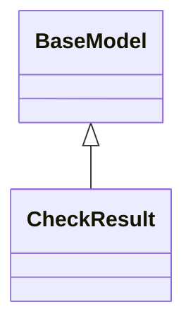

## DaemonStatus

**Metrics:** LOC: 6 | Methods: 0

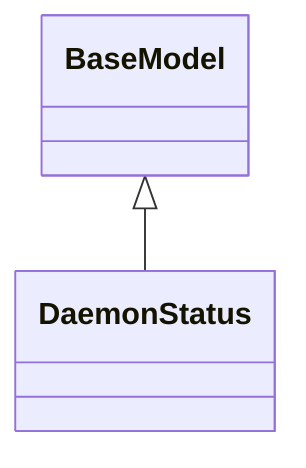

## CheckConfig

**Metrics:** LOC: 4 | Methods: 0

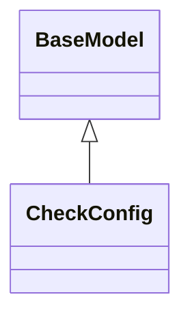

## TokenConfig

**Metrics:** LOC: 5 | Methods: 0

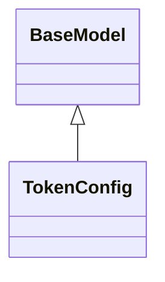

## DaemonConfig

**Metrics:** LOC: 6 | Methods: 0

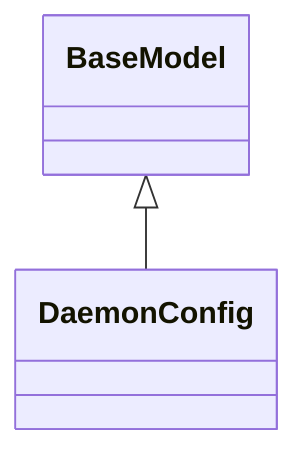

## ApiConfig

**Metrics:** LOC: 4 | Methods: 0

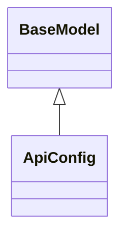

## DocIndexConfig

**Metrics:** LOC: 6 | Methods: 0

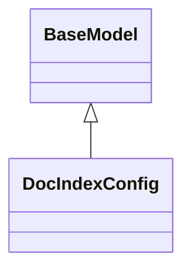

## DocsConfig

**Metrics:** LOC: 6 | Methods: 0

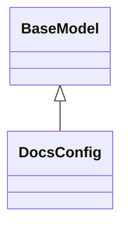

## TestConfig

**Metrics:** LOC: 7 | Methods: 0

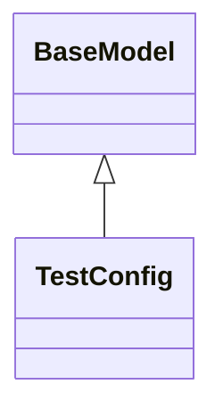

## CodeToDesignConfig

**Metrics:** LOC: 6 | Methods: 0

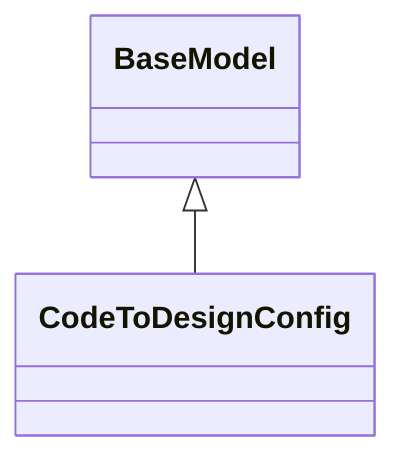

## AutocodeConfig

**Metrics:** LOC: 8 | Methods: 0

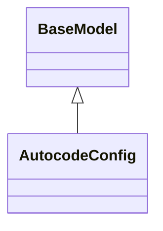

## StatusResponse

**Metrics:** LOC: 5 | Methods: 0

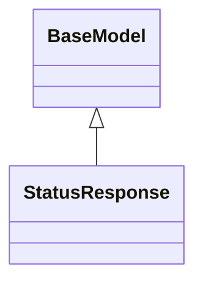

## CheckExecutionRequest

**Metrics:** LOC: 4 | Methods: 0

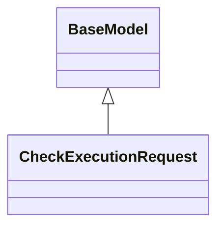

## CheckExecutionResponse

**Metrics:** LOC: 5 | Methods: 0

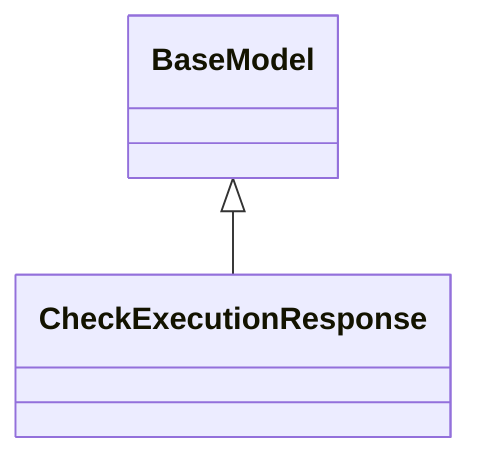

