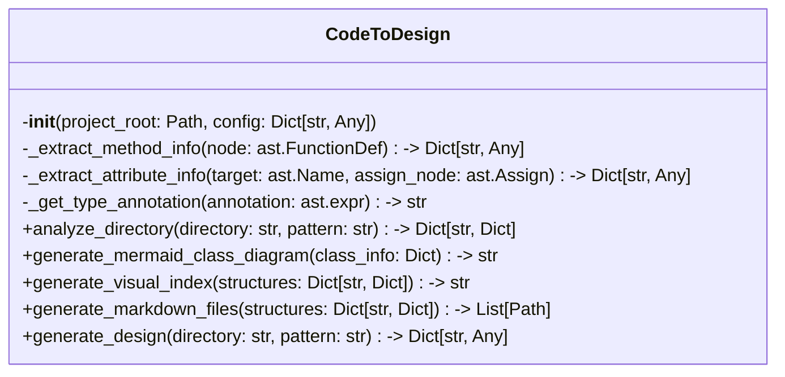

# Classes from code_to_design.py

Source: `autocode\core\code_to_design.py`

## CodeToDesign

**Metrics:** LOC: 486 | Methods: 9

```mermaid
classDiagram
    class CodeToDesign {
        -__init__(project_root: Path, config: Dict[str, Any])
        -_extract_method_info(node: ast.FunctionDef) -> Dict[str, Any]
        -_extract_attribute_info(target: ast.Name, assign_node: ast.Assign) -> Dict[str, Any]
        -_get_type_annotation(annotation: ast.expr) -> str
        +analyze_directory(directory: str, pattern: str) -> Dict[str, Dict]
        +generate_mermaid_class_diagram(class_info: Dict) -> str
        +generate_visual_index(structures: Dict[str, Dict]) -> str
        +generate_markdown_files(structures: Dict[str, Dict]) -> List[Path]
        +generate_design(directory: str, pattern: str) -> Dict[str, Any]
    }

```

